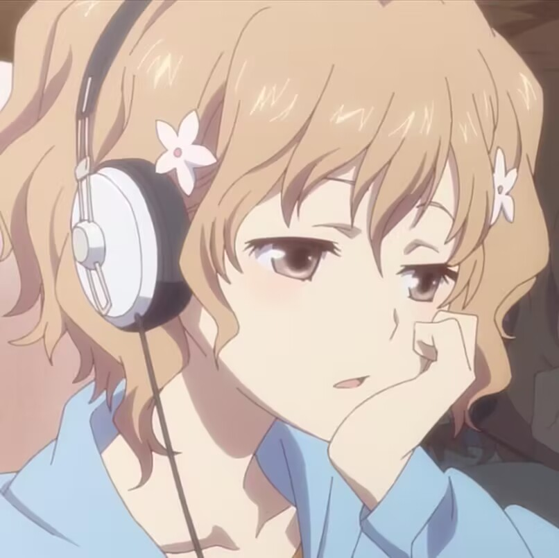

## ⏲️为什么呀
看到一位大佬搭了一个于是自己也很想搭，于是就有了这个博客 
搭了我挺久的，感觉搭了一个晚上加上一个夜晚🛏️ 
主要是右下角可爱的彩彩折腾我太久时间了，调试的时候出了很多问题，但是看到自家的女儿呆在这里还是很幸福啊🥰 
有空要多摸摸彩彩的头啊！！！
## ✍️这里用来干什么
鉴于我是一个不喜欢做笔记的人，也许这里可以放一些平时不敢往QQ空间的玉玉犯病小作文
## ⁉️你是
是一位退役的OIer和即将退役的ACMer 
就读于北京理工大学的信科专业 
不过马上就要变成软工人了😆 
目前还没有想好未来到底要做什么工作或者从事什么样的方向 
不过大体还是CS人罢
## ❓我是谁
我在[GitHub](https://github.com/Ri-Nai/)上的id是**Ri-Nai**，是我用了好几年的id，中文写作**日奈**
关于这个id是怎么来的，有很多人问过很多次，包括且不限于
>**日奈**是来自于“结城明**日奈**”的**日奈**吗 
>**日奈**是你很喜欢的某个**动画角色**的名称吗 
>为什么中文叫做**日奈**，却英文名不是“**hina**”而是“**Ri-Nai**”呢

觉得还是可以稍微解释一下，毕竟以前别人问起的时候只会尴尬的笑笑 
有一次我回答过，**日**就是**日**，**奈**就是**ない**表示**日/无**的意思，取时间消逝的意思，所以是不能被简单的“**hina**”代替  ~~妈呀好幼稚~~ 
**日奈**这一id应该最早出现于[2018年](https://www.luogu.com.cn/user/164323)而广泛运用于2020年

而**日/无**出自于主播另一早期id**无聊之日不可留** 
这个id一直没有人问过，我也没答过，来源其实比较简单 
来自于主播2016年比较喜欢的两个**阴阳师**主播/up主[鸽海成路之日](https://space.bilibili.com/309435)和[无聊到底](https://space.bilibili.com/1683672)~~怎么这位都变成管人了~~ 
**无聊**+**之日**然后加上输入法自动补全的**不可留**，就是我2017~2019的id 
挺怀念的，这种东西在很多地方都给我留下了烙印但是我一直没有好好的去品味他 
譬如**阴阳师**曾经是主播最喜欢的游戏但是已经很久没有玩过了 

后来有一天主播逐渐意识到拼音的名称很蠢，而那时候主播刚好看了《**吹响吧！上低音号**》，这也是我至今**最喜欢**的动画之一，那时候觉得剧中的**高坂丽奈**（Kousaka **Reina**）很**涩**，而**Reina**和**Ri-Nai**很像，**丽奈**和**日奈**很像，于是现在的我诞生了 
京吹3播出后，高坂丽奈的形象急速下滑，已经成为高÷了。但是上了大学之后很多人都叫我**Reina**，现在也不好改了。

顺带一提如果叫我**nnjj**可能是因为**奈奈**变过来的。 
这个称呼其实是大学才有的，虽然还是高中的人起的，对人发电的人终被反噬了。
## 🥰你最喜欢谁呀
### 游戏
Steam上一直在挂的游戏是[蔚蓝（Celeste）](https://store.steampowered.com/app/504230/celeste/) 
平时一般在上课的时候玩[杀戮尖塔（Slay The Spire）](https://store.steampowered.com/app/646570/Slay_the_Spire/) 
最早买的游戏是[泰拉瑞亚（Terraria）](https://store.steampowered.com/app/105600/Terraria/)，同时好像也是游戏时间最长的游戏 
平时会刷很多小中大病区的二创（[逆转裁判](https://store.steampowered.com/app/787480/Phoenix_Wright_Ace_Attorney_Trilogy/)/[弹丸论破](https://store.steampowered.com/app/413420/Danganronpa_2_Goodbye_Despair/)/[女神异闻录5皇家版](https://store.steampowered.com/app/1687950/5/)）（[鬼泣](https://store.steampowered.com/agecheck/app/601150/)正在库里吃灰） 
目前正在玩的是[赛博朋克2077](https://store.steampowered.com/agecheck/app/1091500/)，不过也好久没摸了 
库里的文明6/GTA5之类的游戏也玩了很久但是也好久没玩了
### 动画
感觉自己很重视动画的质感以及主题的方向
#### 氛围比较沉重的
譬如《冰海战记》《进击的巨人》《赛博朋克：边缘行者》《来自深渊》，可以感觉到剧中世界的无力的，对人性和社会产生思考的 
~~简称黑深残吗（？~~ 
《冰海战记》让我感觉是在我心中的某个方面的第一，高质量的制作水平，情感和主题都很到位 
《赛博朋克：边缘行者》真的是当时刚看到PV的时候就觉得会很出色，我对赛博朋克类的主题真的很感兴趣，很久很久以前就很想玩2077了，但是今年才玩上。 
#### 贴近生活的
以前很喜欢P.A.Works的动画，包括且不限于《白箱》《花开伊吕波》《来自风平浪静的明天》，我应该挂了快三年的松前绪花的头像，同时《白箱》也是我至今为止最喜欢的动画之一，主要是因为P.A.Works的动画都很贴近现实，看见她们清新如水的生活会心生愉悦 

 

譬如P.A.Works的樱花任务，虽然剧情很白开水我到最后还是看完了，虽然现在的我肯定看不下去吧 
这种动画可以写的轻飘飘但是得让人对生活充满希望，比起别的题材会更喜欢一些 
《吹响吧！上低音号》《白箱》《强风吹拂》《春宵苦短，少女前进吧！》《四叠半神话大系》这些都是我很喜欢的 
比较轻松的《摇曳露营》也是 
不知道放在那里也放在这里吧《葬送的芙莉莲》《无职转生》这些
#### 剧情构思精妙的
这种就不用多说了，脑子被强健的感觉真的很爽 
《命运石之门》《寒蝉》《死亡笔记》《只有我不在的街道》《重启咲良田》...
#### 制作层面独特的
至今印象深刻的监督主要是，新房昭之和汤浅政明吧 
《物语系列》至今都是我最喜欢的那一梯队 
前段时间看了《乒乓》，虽然里面的有些情节/人物形象的塑造有点不合我胃口，但是孔文革这条线还是挺喜欢的 
然后《乒乓》里的奇幻/意识流的表现方式看着很爽，婆罗门之魂动了 
#### 情感很丰富很靠近我的
《来自风平浪静的明天》这部动画我一直很喜欢，但是他评分不怎么高，我很喜欢这部动画里的浓郁的情感，以及看到每一帧的画面都会让我觉得**像大海一样** 
《BanG Dream! It\'s MyGO!!!!!》今年**最喜欢**的动画，在各个角度完成度都特别高的动画，人物塑造得特别丰满，尤其是里面还有能让我觉得感同身受的形象 

### 角色
自己其实到现在也没有特别喜欢的角色，能让我说出自己喜欢**一辈子**的那种 
可能在17年之前还是能说出这种话的，后来就失去了喜欢一个角色**一辈子**的能力 
就是以前头像一直都在换，只有近一年来间断性得保留了现在这个**久石奏**的头像 

主要是很多角色都很喜欢（ 
自己最近比较喜欢的角色主要是丸山彩/长崎素世/久石奏 
因为现在物语在播，还是很喜欢之前就一直很喜欢的千石抚子的 
自己的xp元素主要是粉毛，但是感觉自己又没喜欢过多少粉毛角色，譬如波奇和爱音自己就没什么感觉 
之前倒是拿《摇曳露营》里的抚子当过头像的

我挺偏向去喜欢那种易黑化的，心思极碎的，可能是因为这种有点人格缺陷的人更像我，也更像人 
例如千石抚子/长崎素世这两位我一直都觉得，简直就是我

