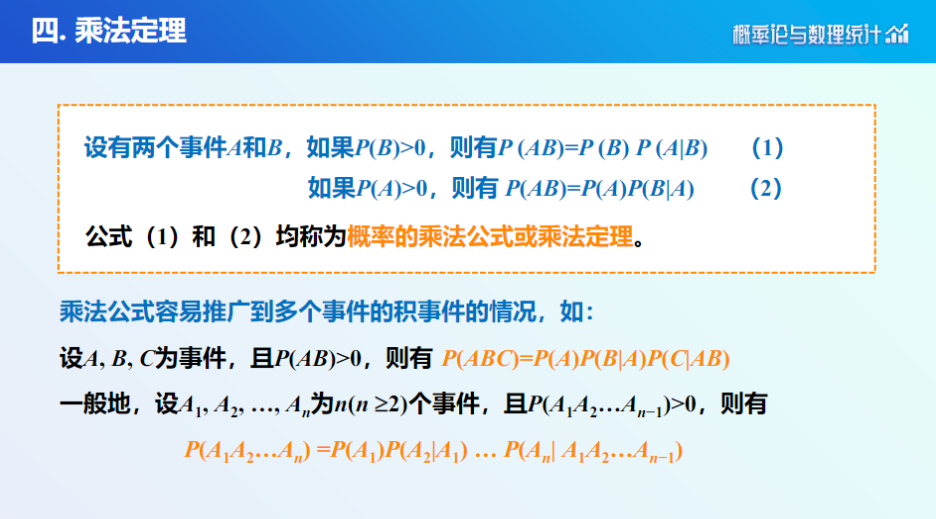

## 随机事件和概率
### 样本空间与随机事件
#### 样本空间
$$S= \lbrace  \omega \ | \ \omega为E的可能结果 \rbrace $$
$$A = \lbrace t \  | \  t \ge 8000 \rbrace $$
$$S_4 = \lbrace 1, 2, 3, 4, 5, 6\rbrace $$

##### 随机事件
**事件的发生**：在一次试验中，事件A发生的含义是，当且仅当A中一个样本点 发生或出现。事件A发生也称为事件A出现

#### 事件的概率
#### 古典概型

##### 几何概型

#### 条件概率与乘法定理
#### 条件概率

##### 乘法定理

#### 独立性
#### 定义
对任意的事件$A$和$B$，若 $P(AB)=P(A)P(B)$，则称事件$A$和$B$是相互独立的。

##### 多个事件的独立性

**相互独立可推出两两独立，反之不行**

#### 全概率
#### 定义
可以形象地把全概率公式看成为 ==“由原因推结果”== ，每个原因对结果的发生有一定的 ==“作用”== ，即结果发生的可能性与各种原因的“作用”大小有关。全概率公式表达了它们之间的关系。

##### 贝叶斯公式
$P(A_{j}\ |\ B)\frac{P(A_{j})P(B\ |\ A_{j})}{\sum\limits_{i=1}^{n}{P(A_{i})P(B\ |\ A_{i})}}$
$P(A_{j})$和$P(A_{j}\ |\ B)$分别称为原因的先验概率和后验概率

## 随机变量及其分布
### 离散型随机变量
#### 单点分布
若随机变量$X$只取一个常数值$c$，即$P\lbrace X=c\rbrace =1$，则称$X$服从**单点分布**，也称为**退化分布**。

#### 0-1分布
若随机变量$X$只可能取$0$和$1$两个值，其分布律为

| X   | 0   | 1   |
| --- | --- | --- |
| P   | q   | p   |

则称$X$服从参数为$p$的$0−1$分布或两点分布。
两点分布又称为 ==伯努利(Bernoulli)== 分布

#### 二项分布
$X \sim b(n, p)$
设在一次伯努利试验中有两个可能的结果，$A$与$S−A$，且有$P(A)=p$。
则在n 重伯努利试验中事件$A$发生的次数$X$是一个离散型随机变量，其分布律为 
$$P\lbrace X = k\rbrace  = C_{n}^{k}p^{k}q^{n - k}, \quad k=0, 1, 2 ,\dots, n$$称$X$服从参数为$n$和$p$的二项分布，记为$X \sim b(n, p)$。 

##### 期望
$E(X) = np$

##### 方差
$D(X) = np(1-p)$

#### 几何分布
$X \sim G(p)$
$$k=1,2,3,…P\lbrace X = k\rbrace  = q^{k-1} p, \quad k = 1, 2, 3, \dots$$

##### 期望
$E(X) = \frac{1}{p}$

##### 方差
$D(X) = \frac{q}{p^2}$

##### 无记忆性
若$X$服从参数为$p$的几何分布，$n$, $m$为任意两 个正整数，则
$$P\lbrace X>n+m\ |\ X>n\rbrace =P\lbrace X>m\rbrace $$
可以理解为：若已经进行了$n$次试验，事件$A$没有发生，则又进行$m$次试验$A$依然没有发生的概率与已知的信息（前$n$次试验$A$没有发生）无关
这就是说， 并不因为已经进行了$n$次试验$A$没有发生，而会使得在第$n+1,n+2,\dots,n+m$次试验中$A$首次发生的概率提高。

#### 超几何分布
$X \sim H(n, M, N)$
$$P\lbrace X = m\rbrace  = \frac{C_{M}^m-C_{N-M}^{n-m}}{C_{N}^n} \quad m = 0, 1 , \dots , l, \ l = min(M, n)$$

##### 期望
$E(x) = n \frac{M}{N}$

##### 性质
$\lim_{ N \to \infty }{ \frac{M}{N} } = p$时，近似于二项分布

#### 泊松分布
$X \sim P(\lambda)$ 或 $X \sim \pi(\lambda)$
$$P\lbrace X = k\rbrace  = \frac{\lambda^k e^{-\lambda}}{k!}, \quad k = 0, 1, 2, \dots$$

##### 期望
$E(X) = \lambda$

##### 方差
$D(X) = \lambda$

##### 性质
##### 泊松分布和二项分布的关系
二项分布在$np = \lambda$ 且$\lim_{ n \to \infty }时$，近似于参数为$\lambda$的泊松分布
理解：$\lambda$ 代表的是一段时间（次数等量纲）内发生稀疏事件的个数

###### 泊松分布的闭合性
**泊松分布的稀疏子事件仍然服从泊松分布**
具体来说，如果一个随机过程中的事件总数服从泊松分布 $\pi(\lambda)$，且每个事件发生时有概率 $p$ 满足某个条件（如遇到红灯），那么满足该条件的事件数目仍然服从泊松分布，参数为 $\lambda p$

###### 泊松分布和指数分布的关系
若 $\lambda$ 代表的是单位时间内的平均发生次数，即事件发生的速率为 $\lambda$ ，那么那么事件之间的时间间隔 $T$（即两次事件之间的时间间隔）将服从**指数分布** $T\sim E(\lambda)$
同理，若 $\lambda$ 代表的是 $t$ 时间内的平均发生次数，即事件发生服从泊松分布$\pi(\lambda t)$ ，那么那么事件之间的时间间隔 $T$ 将服从**指数分布** $T\sim E(\lambda t)$

### 连续型随机变量
#### 均匀分布
$X \sim U(a, b)$

$$
f(x) = \begin{cases}
\frac{1}{b - a}, & \quad a \leq x \leq b \newline
0, & \quad \text{其他}
\end{cases}
$$

##### 期望
$E(X) = \frac{a + b}{2}$
$E(X) = \frac{a + b}{2}$

##### 方差
$D(X) = \frac{(b - a)^2}{12}$

#### 指数分布
$X \sim E(\lambda)$
$$
f(x) = \begin{cases}
\lambda e^{-\lambda x}, & \quad x \geq 0 \newline
0, & \quad \text{其他}
\end{cases}
$$
$$
F(x) = \begin{cases}
1 - e^{-\lambda x}, & \quad x \geq 0 \newline
0, & \quad \text{其他}
\end{cases}
$$

##### 期望
$E(X) = \frac{1}{\lambda}$

##### 方差
$D(X) = \frac{1}{\lambda^2}$

##### 无记忆性
$\forall s, t > 0, P\lbrace X > s + t \ |\  x > s\rbrace  = P\lbrace X > t\rbrace $
如果$X$表示某仪器的工作寿命，无后效性的解释是：当仪器工作了$s$小时后再能继续工作$t$小时的概率等于该仪器刚开始就能工作$t$小时的概率。

#### 正态分布
$X \sim N(\mu, \sigma^2)$
$$f(x) = \frac{1}{\sqrt{2\pi\sigma^2}} e^{-\frac{(x - \mu)^2}{2\sigma^2}}, \quad -\infty < x < \infty$$

##### 期望
$E(X) = \mu$

##### 方差
$D(X) = \sigma^2$

##### 标准正态分布
$$\mu = 0, \sigma = 1$$
$$\varphi(x) = \frac{1}{\sqrt{ 2\pi } } e^{-\frac{x^{2}}{2}}, \quad -\infty < x < \infty$$
$$\phi(x) = \frac{1}{\sqrt{ 2\pi } } \int_{-\infty}^{x}{e^{- \frac{t^{2}}{2}}} \, dt, \quad -\infty < x < \infty$$
$X \sim N(\mu, \sigma^2)$，则$F(x) = \phi(\frac{x - \mu}{\sigma})$

### 随机变量的分布
####  分布函数与密度函数
$$F(x)=P\lbrace X \le x\rbrace $$
$$f(x) = F'(x)$$

##### 连续型随机变量函数的分布
$$F_{Y}(y)=F_{X}(h(y))或1-F_{X}(h(y))$$

## 多维随机变量及其分布
### 二维随机变量及其联合分布
#### 分布函数和密度函数
$$F(x,y)=P\lbrace X \leq x, Y \leq y\rbrace $$
$$F(x,y)=\int_{-\infty}^{x}\int_{-\infty}^{y} f(u,v)  \, du   \, dv $$
$$\frac{\partial^2F(x, y)}{\partial x\partial y}=f(x,y)$$

#### 1. 二维均匀分布
$$f(x, y) = \begin{cases}
\frac{1}{S}, & \quad (x, y) \in D \newline
0, & \quad \text{其他}
\end{cases}$$

#### 2. 二维正态分布
若$(X, Y)$的联合密度函数为
$$
f(x,y) =
\frac{1}{2\pi \sigma_{1}\sigma_{2}\sqrt{1-\rho^2}}
e^{-\frac{1}{2(1-\rho^2)}\left(\frac{(x-\mu_{1})^2}{\sigma_{1}^2} - \frac{2\rho(x-\mu_{1})(y-\mu_{2})}{\sigma_{1}\sigma_{2}} + \frac{(y-\mu_{2})^2}{\sigma_{2}^2}\right)}
$$
称$(X, Y)$服从二维正态分布，记为$(X, Y) \sim N(\mu_{1}, \sigma_{1}^2, \mu_{2}, \sigma_{2}^2, \rho)$

$\rho$: 相关系数，与下文提到的相关系数相同，都是用来衡量两个变量之间的线性相关性的指标
$$\rho = \frac{Cov(X, Y)}{\sqrt{D(X)D(Y)}}$$

#### 二维随机变量注意点
##### 判定连续型随机变量的本质
不论是一维还是二维情形，在定义连续型随机变量时，其实质在于 它的**概率密度函数是否存在**，至于它是否可以在一个区间或区域上**连续取值不是本质的**

##### 两个连续型随机变量不一定构成二维连续型变量
根据二维离散型随机变量的定义，可以认为，如果X和Y都是一维离 散型随机变量，则$\left( X, Y \right)$就是二维离散型随机变量

但是对于二维连续型随机变量类似的结论不成立
即，不能说分量X和Y都是一维连续型随机变量则$\left( X, Y \right)$就是二维连续型变量。
例如：$Y = X^2$时，$(X, Y)$不构成二维随机变量，因为他们只在一条曲线上而非一个区域内
除了完全相关的情况外，部分相关性或奇异分布等情况也可能导致 $\left( X, Y \right)$不具有联合密度函数，从而不能成为二维连续型随机变量。

#### 边缘分布
$$F_{X}\left( x \right)  = F \left(x,  +\infty \right) = \lim_{ y \to +\infty}{F \left( x, y \right) }$$
$$F_{Y}\left( y \right)  = F \left(+\infty , y\right) = \lim_{ x \to +\infty}{F \left( x, y \right) }$$
$$P\lbrace X = x_{i} \rbrace = \sum\limits_{i=1}^{\infty}{p_{ij}} \overset{\triangle}{=} p_{i\cdot}$$
$$P\lbrace  Y = y_{i} \rbrace  = \sum\limits_{i=1}^{\infty}{p_{ij}} \overset{\triangle}{=} p_{\cdot j}$$

$$f_{X}\left( x \right) = \int_{-\infty}^{\infty} f(x, y) \, dy$$
$$f_{Y}\left( y \right) = \int_{-\infty}^{\infty} f(x, y) \, dx$$

由联合分布可以唯一确定边缘分布，但反之，不一定成立。
二维正态分布$(X,Y)$的边缘分布是一维正态分布。
对这个现象的解释是：边缘概率密度只考虑了单个分量的情况，而未涉及$X$与$Y$之间的关系。

### 独立性
那么，当$X$和$Y$之间没有任何关系的时候，自然就可以认为由边缘分布能够唯一确定联合分布，这时，称$X$和$Y$是相互独立。

两事件A, B独立的定义是：若$P(AB)=P(A)P(B)$，则称事件A, B独立。将事件独立性推广到随机变量。

#### 随机变量的独立性
设二维随机变量$(X, Y)$的联合分布函数为$F(x,y)$，$F_X(x)$和$F_Y(y)$分别为其边缘分布函数，若对于任意实数$x, y$，有
$$F(x, y) = F_X(x)F_Y(y)$$
则称随机变量$X$和$Y$相互独立，简称$X$和$Y$独立。
当利用独立性的定义判断两个随机变量不独立时，只需证明存在一对实数 $x_0, y_0$， 使得 $F(x_0, y_0) \neq F_X(x_0)F_Y(y_0)$。
若二维随机变量$(X, Y)$相互独立，则有如下结论：
$$P\left\lbrace a < X \le b, c < Y \le d\right\rbrace  = P\left\lbrace a < X \le b\right\rbrace P\left\lbrace c < Y \le d\right\rbrace $$
$$P\left\lbrace X > a, Y > b\right\rbrace  = P\left\lbrace X > a\right\rbrace P\left\lbrace Y > b\right\rbrace $$

#### 离散型随机变量的独立性
若 $(X, Y)$ 为二维离散型随机变量，且其联合分布律为 $P\lbrace X = x_i, Y = y_j\rbrace  = p_{ij}$

则 $X$ 和 $Y$ 相互独立的充分必要条件是：
对任意的 $x_i, y_j$，都有 $P\lbrace X = x_i, Y = y_j\rbrace  = P\lbrace X = x_i\rbrace P\lbrace Y = y_j\rbrace $。

由此定理可知，当$X$与$Y$独立时，由边缘分布律可以唯一确定联合分布律。
同时，只要存在某个数对 $(x_i, y_j)$ 使得：
$$P\lbrace X = x_i, Y = y_j\rbrace  \neq P\lbrace X = x_i\rbrace P\lbrace Y = y_j\rbrace $$
则可以判定X与Y不独立。

#### 连续型随机变量的独立性

若 $(X, Y)$ 为二维连续型随机变量，联合密度函数为 $f(x, y)$，则 $X$, $Y$ 相互独立的充分必要条件是对任意的实数 $x$ 和 $y$，有

$$f(x, y) = f_X(x) f_Y(y)$$

#### 推广到n维随机变量

若对所有的$x_1, x_2, \dots, x_n$有：
$$F(x_1, x_2, \dots, x_n) = F_{X_1}(x_1) F_{X_2}(x_2) \dots F_{X_n}(x_n)$$
则称$X_1, X_2, \dots, X_n$是相互独立的

### 二维变量函数的分布
#### 二维离散型变量函数的分布

设 $(X, Y)$ 是二维随机变量，$z=g(x, y)$ 是一个已知的二元函数，如果当 $(X, Y)$ 取值为 $(x, y)$ 时，随机变量 $Z$ 取值为 $z=g(x, y)$ ，则称 $Z$ 是二维随机变量 $(X, Y)$ 的函数，记作 $Z=g(X, Y)$ 。

##### 泊松分布具有可加性
$X \sim \pi(\lambda_1)$, $Y \sim \pi(\lambda_2)$, $X$和$Y$相互独立，则$X+Y \sim \pi(\lambda_1 + \lambda_2)$

##### 二项分布具有可加性
$X \sim b(n_1, p)$, $Y \sim b(n_2, p)$, $X$和$Y$相互独立，则$X+Y \sim b(n_1 + n_2, p)$

#### 二维连续型变量函数的分布
设$(X,Y)$是连续型随机变量，其概率密度函数为$f(x,y)$，$Z=g(X,Y)$是$(X,Y)$的函数，一般可以分为以下两种情况讨论。

第一，$Z=g(X,Y)$为离散型随机变量，此时，只需求$Z$的分布律，问题的实质是将$Z$取某个值$z$的概率转化为$(X,Y)$属于某个区域$D$的概率，即有
$$P\lbrace Z=z\rbrace  = P\lbrace (X,Y) \in D\rbrace  = \int\int_{D} f(x,y) \, dx \, dy$$

第二，当$Z$不是离散型随机变量时，采用分布函数法求$Z=g(X,Y)$的分布函数
$$F_{Z}(z) = P\lbrace Z \leq z\rbrace  = P\lbrace g(X,Y) \leq z\rbrace  = \int\int_{D} f(x,y) \, dx \, dy$$

当$Z$为连续型随机变量时，其概率密度函数为
$$f_{Z}(z) = \frac{d}{dz} F_{Z}(z)$$

##### 瑞利分布

##### 最大值和最小值的分布函数
随机变量 $X$ 和 $Y$ 相互独立，其分布函数分别为 $F_X(x)$ 和 $F_Y(y)$ ，现在来求 $M=\max(X,Y)$ 以及 $N=\min(X,Y)$ 的分布函数。
设 $M$ 的分布函数为 $F_M(z)$ 。
$$F_M(z)=P\lbrace M \le z\rbrace  = P\lbrace X \le z, Y \le z\rbrace $$
由于 $X$ 和 $Y$ 相互独立，于是 $M=\max(X, Y)$ 的分布函数为：
$$F_M(z)=P\lbrace X \le z\rbrace P\lbrace Y \le z\rbrace  = F_X(z)F_Y(z)$$
即有：
$$F_M(z)= F_X(z)F_Y(z)$$
$$F_N(z)=1−[1−F_X(z)][1−F_Y(z)] = 1−P\lbrace X > z, Y > z\rbrace $$
$$F_N(z)=P\lbrace N \le z\rbrace  = 1−P\lbrace N > z\rbrace $$
类似的，可求得 $N=\min(X, Y)$ 的分布函数
由于 $X$ 和 $Y$ 相互独立，于是 $N=\min(X,Y)$ 的分布函数为：
$$F_N(z)=1−P\lbrace X > z\rbrace P\lbrace Y > z\rbrace $$

## 随机变量的数字特征
### 数学期望
#### 定义
设$X$是离散型随机变量，其分布律为：$P\lbrace X=x_k\rbrace =p_k , k=1, 2 ,\dots$
如果级数**绝对收敛**，则称它为$X$的数学期望，简称期望，
又称均值，记为$E(X)$。
$$E(X) = \sum_{k=1}^{\infty} x_k p_k$$
若$\sum\limits _{k=1}^{\infty}{|x_k|\cdot p_k}$发散，则称$X$的数学期望不存在。

#### 随机变量函数的数学期望
设X是一个随机变量，Y=g(X)是X的函数。若绝对收敛，则Y的数学期望存在，且
1. 设X为离散型随机变量, 且其分布律为$P \left\lbrace  {X=x_i} \right\rbrace  =p_i，i=1, 2, \dots$
  $$E(Y) = E(g(X)) = \sum_{k=1}^{\infty} g(x_k) p_k$$
  则Y的数学期望存在，且

2. 设X为连续型随机变量, 其概率密度为 f(x)，若绝对收敛，
  $$E(Y) = E(g(X)) = \int_{-\infty}^{+\infty} g(x) f(x) \, dx$$

#### 性质
1. 设$c$是常数，则$E(c)=c$
2. 若随机变量$X$的数学期望存在，$k$为常数，则$E(kX)=kE(X)$
3. 若随机变量$X$和$Y$的数学期望都存在，则$E(X+Y) = E(X) + E(Y)$
4. 设随机变量$X$和$Y$的数学期望都存在，且互相独立，则$E(XY) = E(X)E(Y)$。

### 方差
#### 定义
设随机变量$X$的数学期望为$E(X)$, 若$E((X-E(X))^2)$存在, 则称它为$X$的方差(Variance)，记为$D(X)$或$Var(X)$，即 $D(X)=E((X-E(X))^2)$

#### 性质
$$D(X) = E(X^2) - [E(X)]^2$$

设随机变量$X$的期望和方差都存在，$E(X)= \mu$，$a$为常数，则有 $D(X) \leq E((X - a)^2)$ 等号成立当且仅当$a = \mu$

方差 $X^*$ 称为 $X$ 的**标准化随机变量**。显然标准化的随机变量是无量纲的。引入标准化的随机变量主要是为了消除计量单位的不同给随机变量带来的影响。

设随机变量 $X$ 的方差 $D(X)$ 存在, 且 $D(X) > 0$，令
$$X^* = \frac{X - E(X)}{\sqrt{D(X)}}$$

则 \$X^\*\$ 的数学期望和方差分别为
$$E(X^*) = E\left(\frac{X - E(X)}{\sqrt{D(X)}}\right) = \frac{E(X) - E(X)}{\sqrt{D(X)}} = 0$$

$$
\begin{aligned}
D(X^ * ) &= E\left((X^ * )^2\right) - \left[E(X^ * )\right]^2 \newline
  &= E\left(\left(\frac{X - E(X)}{\sqrt{D(X)}}\right)^2\right) \newline
  &= \frac{E\left((X - E(X))^2\right)}{D(X)} \newline
  &= 1
\end{aligned}
$$

### 协方差
#### 定义
设随机变量$X$和$Y$的数学期望分别为$E(X)$和$E(Y)$，若$E((X-E(X))(Y-E(Y)))$存在，则称它为$X$和$Y$的协方差，记为$Cov(X,Y)$，即
$$Cov(X,Y) = E((X-E(X))(Y-E(Y)))$$

#### 性质
1. $Cov(X,Y) = E(XY) - E(X)E(Y)$
2. $Cov(X,Y) = Cov(Y,X)$
3. $Cov(X,X) = D(X)$
4. 若$X$和$Y$相互独立，则$Cov(X,Y) = 0$
5. $Cov(aX+b, Y) = aCov(X,Y)$
6. $Cov(X \pm Y, Z) = Cov(X,Z) \pm Cov(Y,Z)$
7. $Cov(a_1X + b_1Y, a_2X + b_2Y) = a_1a_2Cov(X, X) + a_1b_2Cov(X, Y) + b_1a_2Cov(Y, X) + b_1b_2Cov(Y, Y)$
8. $(Cov(X, Y))^2 \leq D(X)D(Y)$

#### 与方差的关系
$$D(X \pm Y) = D(X) + D(Y) \pm 2Cov(X,Y)$$

### 相关系数
协方差衡量了X和Y之间协同变化的关系。但它的大小还受X与Y本 身量纲的影响。
为了消除量纲的影响，引入相关系数。

#### 定义
$$\rho_{XY} = Cov(X^{ * },Y^{ * }) = \frac{Cov(X,Y)}{\sqrt{D(X)D(Y)}}$$

#### 性质
$-1 \leq \rho_{XY} \leq 1$，$\left| \rho_{XY} \right|$ 越接近1，X和Y的线性关系越强。
$$\rho_{XY} = \pm 1 \Leftrightarrow Y = aX + b \quad 完全线性相关$$
$$X和Y独立 \Rightarrow \rho_{XY} = 0 $$
反之不一定成立，即$X$和$Y$独立，不一定有$\rho_{XY} = 0$

#### 相关性与独立性的关系
相关性指的是两个变量之间的**线性关系**，独立性指的是两个变量之间的**无关系**。
$$X与Y独立 \Rightarrow X与Y不相关$$
$$X与Y不相关 \Rightarrow X与Y不一定独立$$
$$X与Y相关 \Rightarrow X与Y不独立$$

### 矩
#### 定义

设$X$ 和 $Y$ 是随机变量，$k$是一个正整数。
1. 若$E(X^k)$存在，则称$E(X^k)$为$X$的$k$阶原点矩，简称$k$阶矩，记为$E(X^k)$。
2. 若$E((X-E(X))^k)$存在，则称$E((X-E(X))^k)$为$X$的$k$阶中心矩，简称$k$阶中心矩，记为$E((X-E(X))^k)$。
3. 若$E(X^kY^l)$存在，则称$E(X^kY^l)$为$X$和$Y$的$k+l$阶混合矩，简称$k+l$阶混合矩，记为$E(X^kY^l)$。
4. 若$E((X-E(X))^k(Y-E(Y))^l)$存在，则称$E((X-E(X))^k(Y-E(Y))^l)$为$X$和$Y$的$k+l$阶混合中心矩，简称$k+l$阶混合中心矩，记为$E((X-E(X))^k(Y-E(Y))^l)$。

#### 性质
原点矩和中心矩可以相互转化，即$E(X^k) = E[(X-E(X))^k] + kE(X)^{k-1}E(X)$

## 大数定律和中心极限定理
### 切比雪夫不等式
#### 定理
设随机变量$X$的数学期望$E(X)=\mu$，方差$D(X)=\sigma^2$，则对任意正数$\varepsilon$，有
$$P\lbrace |X-\mu| \geq \varepsilon\rbrace  \leq \frac{\sigma^2}{\varepsilon^2}$$
或等价地写成
$$P\lbrace |X-\mu| < \varepsilon\rbrace  \geq 1 - \frac{\sigma^2}{\varepsilon^2}$$

#### 证明
$$
\begin{aligned}
P\lbrace |X-\mu| \geq \varepsilon\rbrace  &= P\lbrace (X-\mu)^2 \geq \varepsilon^2\rbrace  \newline
&= \int_{|X-\mu| \geq \varepsilon}{f(x) \, dx} \newline
&\leq \int_{|X-\mu| \geq \varepsilon}{\frac{(X-\mu)^2}{\varepsilon^2} \, dx} \newline
&= \frac{\sigma^2}{\varepsilon^2}
\end{aligned}
$$

#### 重要性
不管随机变量的分布类型是什么，且不管其分布是否已知，只要知道它的数学期望和方差，就可以对随机变量落入数学期望附近的区域$(EX-\varepsilon, EX+\varepsilon)$ 或 $(-\infty, EX-\varepsilon) \cup (EX+\varepsilon, +\infty)$ 的概率给出一个**下界** 或 **上界**

### 依概率收敛
#### 定义
设$X_1, X_2, \dots, X_n, \dots$是一列随机变量，$X$是另一随机变量，若对任意正数$\varepsilon$，有
$$\lim_{n \to \infty}{P\lbrace |X_n - X| \geq \varepsilon\rbrace } = 0$$
则称随机变量序列$X_1, X_2, \dots, X_n, \dots$依概率收敛于$X$，记为$X_n \xrightarrow{P} X$

### 大数定律
#### 切比雪夫大数定律
##### 定理
设随机变量序列$\lbrace X_i, i \geq 1\rbrace $相互独立，它们的数学期望和方差都存在，且方差有共同的上界，即存在常数$M>0$，使得$D(X_i) \leq M$，$i=1,2,\dots$，则对任意给定的常数$\varepsilon >0$，有
$$\lim_{n \to \infty} P\left\lbrace \left|\frac{1}{n}\sum_{i=1}^{n} X_i - \frac{1}{n}\sum_{i=1}^{n}E(X_i)\right| < \varepsilon\right\rbrace  = 1$$

###### 特殊情况
设$X_1, X_2, \dots, X_n, \dots$是一列独立的随机变量，它们具有相同的数学期望和方差，$E(X_i)=\mu$，$D(X_i)=\sigma^2$，则对任意正数$\varepsilon$，有
$$\lim_{n \to \infty}{P\left\lbrace \left|\frac{X_1+X_2+\dots+X_n}{n}-\mu\right| < \varepsilon\right\rbrace } = 1$$
即
$$\frac{X_1+X_2+\dots+X_n}{n} \xrightarrow{P} \mu$$

#### 伯努利大数定律
##### 定理
设$S_n$是$n$重伯努利试验中事件$A$发生的次数，$p$是一次试验中事件$A$发生的概率$(0 < p < 1)$，则对任给的常数$\varepsilon > 0$，有
$$\lim_{n \to \infty} P\left\lbrace \left|\frac{S_n}{n} - p\right| < \varepsilon\right\rbrace  = 1$$
即
$$\frac{S_n}{n} \xrightarrow{P} p$$

##### 意义
伯努利大数定律说明，随着试验次数的增加，事件$A$发生的频率将趋于其概率$p$，即频率收敛于概率。

#### 辛钦大数定律
##### 定理
设$X_1, X_2, \dots, X_n, \dots$是一列相互独立的随机变量，且它们具有相同的数学期望$E(X_i)=\mu$，若对任意正数$\varepsilon$，有
$$\lim_{n \to \infty} P\left\lbrace \left|\frac{X_1+X_2+\dots+X_n}{n}-\mu\right| < \varepsilon\right\rbrace  = 1$$
则称随机变量序列$X_1, X_2, \dots, X_n, \dots$依概率收敛于$\mu$，记为$X_n \xrightarrow{P} \mu$

##### 意义
辛钦大数定律说明，随机变量序列的算术平均值依概率收敛于其数学期望。

### 中心极限定理
#### 定理
设$X_1, X_2, \dots, X_n, \dots$是一列独立同分布的随机变量，$E(X_i)=\mu$，$D(X_i)=\sigma^2$，则对任意正数$\varepsilon$，有
$$\lim_{n \to \infty} P\left\lbrace \frac{X_1+X_2+\dots+X_n-n\mu}{\sigma\sqrt{n}} < \varepsilon\right\rbrace  = \Phi(\varepsilon)$$
其中$\Phi(\varepsilon)$是标准正态分布的分布函数。
即
$$\frac{X_1+X_2+\dots+X_n-n\mu}{\sigma\sqrt{n}} \xrightarrow{P} N(0,1)$$

#### 意义
中心极限定理说明，大量独立同分布随机变量的和的分布，当$n$充分大时，近似服从正态分布。
这就是正态分布在概率论中占有重要地位的一个基本原因，也有助于解释为什么很多自然群体的经验频率呈现钟形曲线这一值得注意的事实。

#### De Moivre-Laplace 中心极限定理
设$X_1, X_2, \dots, X_n, \dots$是一列独立同分布的伯努利随机变量，$P\lbrace X_i=1\rbrace =p$，$P\lbrace X_i=0\rbrace =1-p$，则对任意正数$\varepsilon$，有
$$\lim_{n \to \infty} P\left\lbrace \frac{S_n-np}{\sqrt{np(1-p)}} < \varepsilon\right\rbrace  = \Phi(\varepsilon)$$
其中$S_n$是$n$重伯努利试验中事件$A$发生的次数。
即
$$\frac{S_n-np}{\sqrt{np(1-p)}} \xrightarrow{P} N(0,1)$$
即当 $n$ 充分大时，$S_n$ 的分布近似服从正态分布 $N(np, np(1-p))$。
即若 $S_n$ 服从 $b(n, p)$，则近似服从正态分布 $N(np, np(1-p))$。

#### Lyapunov中心极限定理
设$X_1, X_2, \dots, X_n, \dots$是一列独立的随机变量，他们的数学期望和方差都存在，且其数学期望$E(X_i)=\mu_i$，方差$D(X_i)=\sigma_i^2$，记$B_n^2 = \sum_{i=1}^{n} \sigma_i^2$，若存在正数$\delta > 0$，使得Lyapunov条件：
$$\lim_{n \to \infty} \frac{1}{B_n^{2+\delta}} \sum_{i=1}^{n} E\left\lbrace |X_i-\mu_i|^{2+\delta}\right\rbrace  = 0$$
则对任意正数$\varepsilon$，有
$$\lim_{n \to \infty} P\left\lbrace \frac{\sum\limits_{i=1}^{n} X_i - \sum\limits_{i=1}^{n} \mu_i}{B_n} < \varepsilon\right\rbrace  = \Phi(\varepsilon)$$
即
$$\frac{\sum\limits_{i=1}^{n} X_i - \sum\limits_{i=1}^{n} \mu_i}{B_n} \xrightarrow{P} N(0,1)$$

##### Lyapunov条件的意义
$\texttt{Lyapunov}$条件是中心极限定理的一个推广，它要求的条件比中心极限定理的条件更宽松，因此更具有普遍性。
这就是说，无论各个随机变量$X_k$服从什么分布，只要满足定理的条件，那么当$n$充分大时，他们的和$\sum\limits_{k=1}^{n} X_k$近似地服从正态分布。

## 数理统计的基本概念
### 目的
数理统计的目的是根据样本信息对总体的未知参数进行估计或对总体的某些假设进行检验。
数理统计方法具有“局部推断整体”的特点。
概率论是数理统计的基础，数理统计是概率论的重要应用。 它们是两个并列的数学分支学科，并无从属关系。
$$数理统计\left\lbrace \begin{array}{c} 抽样分布 \newline \newline 参数估计 \newline \newline 假设检验\end{array}\right.$$

### 与概率论的关系
概率论研究的是随机现象的规律性，而数理统计研究的是根据样本信息对总体的未知参数进行估计或对总体的某些假设进行检验。

### 基本概念
#### 总体与个体
**总体：** 在一个统计问题中，所研究问题涉及到的研究对象全体组成 的集合。
**个体：** 组成总体的每个元素。

**总体中所包含个体的个数**称为**总体的容量**，容量为有限的总体称为**有限总体**，容量为无限的总体称为**无限总体**。
但是，实际问题中，我们关心的并不是总体或这些个体本身，而是关心与个体性能相联系的某一项(或某几项)**数量指标**以及这些数量指标在总体中的分布情况。表征个体特征的量称为**数量指标**。

一般来说，用$X$表示数量指标(可以是一维也可以是多维)，称数量指标$X$的全体组成的集合称为**总体**，而其中每个数量指标称为**个体**。

#### 抽样与样本
为推断总体分布及其各种特征，按一定规则从总体中抽取若干个体进行观察试验，以获得有关总体的信息，这一抽取过程称为**抽样**，所抽取的部分个体称为**样本**。样本中所包含的个体数目称为**样本容量**。

容量为 $n$ 的样本可以看作 $n$ 维随机变量 $(X_1, X_2, \dots, X_n)$。但是，一旦取定一组样本，得到的是 $n$ 个具体的数 $(x_1, x_2, \dots, x_n)$，称为**样本的观察值**，简称**样本值**

#### 简单随机抽样
##### 要求
1. **代表性**： 总体中的每一个个体 $X_i$ 都有同等机会被抽中，即要求每一个个体 $X_i$ 与总体 $X$ 有相同的分布， 因此每一个 $X_i$ 都能代表总体 $X$，具有代表性。
2. **独立性**： 从总体中抽取的每一个个体 $X_i$ 与其他个体 $X_j$ 之间是相互独立的，即每一个个体 $X_i$ 的抽取不受其他个体 $X_j$ 的影响。 

##### 定义
设有一个总体 $X$，若 $X_1, X_2, \dots, X_n$ 相互独立且每个 $X_i$ ($i=1,2,\dots,n$) 与总体 $X$ 有相同的分布，则称 $X_1, X_2, \dots, X_n$ 为从总体 $X$ 中抽取的容量为 $n$ 的**简单随机样本**，简称**样本**。

#### 样本分布
##### 定义
设 $X_1, X_2, \dots, X_n$ 是从总体 $X$ 中抽取的容量为 $n$ 的简单随机样本，若 $X_1, X_2, \dots, X_n$ 的联合分布函数为 $F_n(x_1, x_2, \dots, x_n)$，则称 $F_n(x_1, x_2, \dots, x_n)$ 为样本 $X_1, X_2, \dots, X_n$ 的**联合分布函数**，简称**样本分布**。
即
$$F_n(x_1, x_2, \dots, x_n) = P\lbrace X_1 \leq x_1, X_2 \leq x_2, \dots, X_n \leq x_n\rbrace $$
$$f_n(x_1, x_2, \dots, x_n) = \frac{\partial^n F_n(x_1, x_2, \dots, x_n)}{\partial x_1 \partial x_2 \dots \partial x_n}$$
称为样本 $X_1, X_2, \dots, X_n$ 的**联合密度函数**，简称**样本密度**。

#### 性质
$$F_n(x_1, x_2, \dots, x_n) = F(x_1)F(x_2) \dots F(x_n)$$
$$f_n(x_1, x_2, \dots, x_n) = f(x_1)f(x_2) \dots f(x_n)$$

### 统计量
#### 定义
设 $X_1, X_2, \dots, X_n$ 为来自总体 $X$ 的样本，$T(X_1, X_2, \dots, X_n)$ 是样本 $X_1, X_2, \dots, X_n$ 的函数，且不含任何未知参数，则称 $T(X_1, X_2, \dots, X_n)$ 是**统计量**。

若 $x_1, x_2, \dots, x_n$ 是相应于样本 $(X_1, X_2, \dots, X_n)$ 的样本值，则称 $T(x_1, x_2, \dots, x_n)$ 是 $T(X_1, X_2, \dots, X_n)$ 的**观察值**。

#### 说明
1. 统计量是不含未知参数的样本的函数。
2. 统计量既然依赖于样本，而后者又是随机变量，即统计量是随机变量的函数，故统计量是随机变量。

#### 常用统计量
1. 样本均值
$$\overline{X} = \frac{1}{n} \sum_{i=1}^{n} X_i$$
反应了总体均值$E(X)$的估计值。
2. 样本方差
$$S^2 = \frac{1}{n-1} \sum_{i=1}^{n} (X_i - \overline{X})^2$$
反应了总体方差$D(X)$的估计值。
3. 样本标准差
$$S = \sqrt{S^2} = \sqrt{\frac{1}{n-1} \sum_{i=1}^{n} (X_i - \overline{X})^2}$$
反应了总体标准差$\sqrt{D(X)}$的估计值。
4. 样本$k$阶(原点)矩
$$A_k = \frac{1}{n} \sum_{i=1}^{n} X_i^k$$
反应了总体$k$阶原点矩$E(X^k)$的估计值。
5. 样本$k$阶中心矩
$$B_k = \frac{1}{n} \sum_{i=1}^{n} (X_i - \overline{X})^k$$
反应了总体$k$阶中心矩$E((X-E(X))^k)$的估计值。
6. 顺序统计量
设 $X_1, X_2, \dots, X_n$ 是来自总体 $X$ 的样本，将 $X_1, X_2, \dots, X_n$ 按照从小到大排列为
$$X_{(1)} \leq X_{(2)} \leq \dots \leq X_{(n)}$$
其中$X_{(1)}$是最小值，$X_{(n)}$是最大值。
$X_{(k)}$称为**第 $k$ 个顺序统计量**。
$R = X_{(n)} - X_{(1)}$称为**极差**。

### 抽样分布
#### 定义
设 $X_1, X_2, \dots, X_n$ 是来自总体 $X$ 的样本，$T(X_1, X_2, \dots, X_n)$ 是样本 $X_1, X_2, \dots, X_n$ 的函数，且不含任何未知参数，则 $T(X_1, X_2, \dots, X_n)$ 的分布称为**抽样分布**。

#### 三大抽样分布
##### chi-square分布
###### 定义
设 $X_1, X_2, \dots, X_n$ 是来自正态总体 $N(0,1)$ 的样本，且相互独立，则称统计量
$$\chi^2 = X_1^2 + X_2^2 + \dots + X_n^2$$
满足自由度为 $n$ 的 $\chi^2$ 分布，记为 $\chi^2 \sim \chi^2(n)$。
其中：$n$ 代表独立随机变量的个数，也称为自由度。

###### 概率密度函数
$$f(x) = \frac{1}{2^{n/2}\Gamma(n/2)}x^{\frac{n}{2}-1}e^{-\frac{x}{2}}, \quad x > 0$$
$\Gamma(n)$ 是 $\Gamma$ 函数，通过积分定义：
$$\Gamma(n) = \int_{0}^{+\infty} x^{n-1}e^{-x} \, dx$$
当 $n$ 为正整数时，$\Gamma(n) = (n-1)!$。
特别的，当 $n=2$ 时，$\chi^2(2)$ 分布的概率密度函数为：
$$f(x) = \frac{1}{2}e^{-x/2}, \quad x > 0$$

###### 性质
1. 设$X_1, X_2, \dots, X_n$相互独立，且满足正态分布$N(\mu, \sigma^2)$，则：
$$\frac{1}{\sigma^2}\sum_{i=1}^{n}(X_i-\mu)^2 \sim \chi^2(n)$$
2. 设$X \sim \chi^2(n)$，则$E(X) = n$，$D(X) = 2n$
3. $X_1 \sim \chi^2(n_1)$，$X_2 \sim \chi^2(n_2)$，且$X_1$与$X_2$相互独立，则$X_1+X_2 \sim \chi^2(n_1+n_2)$，称为$\chi^2$分布的**可加性**。

##### student's t分布
###### 定义
设 $X \sim N(0,1)$，$Y \sim \chi^2(n)$，且 $X$ 与 $Y$ 相互独立，则称统计量
$$t = \frac{X}{\sqrt{Y/n}}$$
满足自由度为 $n$ 的 $t$ 分布，记为 $t \sim t(n)$。
其中：$n$ 代表独立随机变量的个数，也称为自由度。

###### 概率密度函数
$$f(t) = \frac{\Gamma((n+1)/2)}{\sqrt{n\pi}\Gamma(n/2)}(1+\frac{t^2}{n})^{-\frac{n+1}{2}}, \quad -\infty < t < +\infty$$

###### 性质
1. $t$ 分布的密度函数是关于 $t=0$ 对称的。且 $\lim_{|t| \to \infty} f(t) = 0$。
2. $t$ 分布的密度函数形状是中间高，两边低，左右对称，与标准正态分布的概率密度函数图像类似，
$$\lim_{n \to \infty} f(t) = \frac{1}{\sqrt{2\pi}}e^{-\frac{t^2}{2}}$$
即
$$\lim_{n \to \infty} t(n) = N(0,1)$$
3. 设 $T \sim t(n)$， $n > 1$，则对于 $r < n$， $E(T^r)$ 存在，且：
$$E(T^r) = \left\lbrace \begin{array}{ll} 0, & r为奇数 \newline \frac{\Gamma((n+r)/2)}{\Gamma(n/2)\sqrt{n\pi}}2^{r/2}\frac{\Gamma(r/2)}{\Gamma((r+1)/2)}, & r为偶数 \end{array}\right.$$
4. 当$n=1$时，$t(1)$分布即为$Cauchy$分布，即：
$$f(t) = \frac{1}{\pi(1+t^2)}, \quad -\infty < t < +\infty$$
其数学期望和方差均不存在。

##### Fisher分布
###### 定义
设 $X \sim \chi^2(n)$，$Y \sim \chi^2(m)$，且 $X$ 与 $Y$ 相互独立，则称统计量
$$F = \frac{X/n}{Y/m}$$
满足自由度为 $(n, m)$ 的 $F$ 分布，记为 $F \sim F(n, m)$。
其中：$n$ 和 $m$ 代表独立随机变量的个数，也称为自由度。

###### 概率密度函数
$$f(x) = \frac{\Gamma((n+m)/2)}{\Gamma(n/2)\Gamma(m/2)}(n/m)^{n/2}x^{n/2-1}(1+nx/m)^{-(n+m)/2}, \quad x > 0$$

###### 性质
1. 设 $X \sim F(n, m)$，则 $\frac{1}{X} \sim F(m, n)$
2. 设 $T \sim t(n)$，则 $T^2 \sim F(1, n)$

要求随机变量**独立**！

#### 几个重要的抽样分布
##### 引理
设 $X_1, X_2, \dots, X_n$ 是来自任意总体 $X$ 的样本，$E(X)=\mu$ 与 $D(X)=\sigma^2$ 分别是总体的均值与方差，$\overline{X}$ 与 $S^2$ 分别是样本均值与样本方差，即：
$$\overline{X} = \frac{1}{n} \sum_{i=1}^{n} X_i, \quad S^2 = \frac{1}{n-1} \sum_{i=1}^{n} (X_i - \overline{X})^2$$
有：
$$E(\overline{X}) = \mu, \quad D(\overline{X}) = \frac{\sigma^2}{n}, \quad E(S^2) = \sigma^2$$

##### 结论
1. 若 $X_1, X_2, \dots, X_n$ 是来自正态总体 $N(\mu, \sigma^2)$ 的样本，$\overline{X}$代表样本均值则有
$$\overline{X} \sim N(\mu, \sigma^2/n)$$
即
$$\frac{\overline{X}-\mu}{\sigma/\sqrt{n}} \sim N(0,1)$$
2. 若 $X_1, X_2, \dots, X_n$ 是来自正态总体 $N(\mu, \sigma^2)$ 的样本，$S^2$代表样本方差则有
$$\frac{(n-1)S^2}{\sigma^2} \sim \chi^2(n-1)$$
且$\overline{X}$与$S^2$相互独立。
3. 若 $X_1, X_2, \dots, X_n$ 是来自正态总体 $N(\mu, \sigma^2)$ 的样本，$\overline{X}$与$S^2$分别代表样本均值与样本方差，则有
$$\frac{\overline{X}-\mu}{S/\sqrt{n}} \sim t(n-1)$$
4. 若 $X_1, X_2, \dots, X_n$ 是来自正态总体 $N(\mu_1, \sigma^2)$ 的样本，$Y_1, Y_2, \dots, Y_m$ 是来自正态总体 $N(\mu_2, \sigma^2)$ 的样本，且两个样本相互独立，$\overline{X}$与$S_1^2$分别代表第一个样本的样本均值与样本方差，$\overline{Y}$与$S_2^2$分别代表第二个样本的样本均值与样本方差，则有
$$\frac{\overline{X}-\overline{Y}-(\mu_1-\mu_2)}{S_\omega\sqrt{\frac{1}{n}+\frac{1}{m}}} \sim t(n+m-2)$$
其中
$$S_\omega^2 = \frac{(n-1)S_1^2+(m-1)S_2^2}{n+m-2}$$
称为**合并方差**
5. 若 $X_1, X_2, \dots, X_n$ 是来自正态总体 $N(\mu_1, \sigma_1^2)$ 的样本，$Y_1, Y_2, \dots, Y_m$ 是来自正态总体 $N(\mu_2, \sigma_2^2)$ 的样本，且两个样本相互独立，$\overline{X}$与$S_1^2$分别代表第一个样本的样本均值与样本方差，$\overline{Y}$与$S_2^2$分别代表第二个样本的样本均值与样本方差，则有
$$\frac{S_1^2/\sigma_1^2}{S_2^2/\sigma_2^2} \sim F(n-1, m-1)$$

### 分位数
#### 定义
设 $X$ 是连续型随机变量，$F(x)$ 是 $X$ 的分布函数，$0 < \alpha < 1$，若满足
$$P\lbrace X \geq x_\alpha\rbrace  = 1 - F(x_\alpha) = \int_{x_\alpha}^{+\infty} f(x) \, dx = \alpha$$
则称 $x_\alpha$ 为 $X$ 的上 $\alpha$ 分位数。

#### 标准正态分布
标准正态分布的上 $\alpha$ 分位数记为 $z_\alpha$，即
$$P\lbrace Z \geq z_\alpha\rbrace  = 1 - F(z_\alpha) = \alpha$$

##### 性质
1. $\Phi(z_\alpha) = 1 - \alpha$
2. $z_{1 - \alpha} = -z_\alpha$
后面常用到下面两个式子：
$$P\lbrace |Z| > z_{\alpha/2}\rbrace  = \alpha, \quad P\lbrace |Z| \leq z_{\alpha/2}\rbrace  = 1 - \alpha$$
常用数字：
$$z_{0.025} = z_{0.975} = 1.96, \quad z_{0.05} = z_{0.95} = 1.645$$

#### chi-square分布
设 $X \sim \chi^2(n)$，则 $\chi^2(n)$ 的上 $\alpha$ 分位数记为 $\chi^2_{\alpha}(n)$，即
$$P\lbrace X \geq \chi^2_{\alpha}(n)\rbrace  = 1 - F(\chi^2_{\alpha}(n)) = \alpha$$

##### 性质
当 $n$ 充分大时（$n>45$），有
$$\chi^2_{\alpha}(n) \approx \frac{1}{2}\left(z_\alpha+\sqrt{2n-1}\right)^2$$
后面常用到下面两个式子：
$$P\left\lbrace \chi^2 > \chi^2_{\alpha / 2}(n)\right\rbrace  + P\left\lbrace \chi^2 < \chi^2_{1-\alpha / 2}(n)\right\rbrace  = \alpha$$ 
$$P\left\lbrace \chi^2_{\alpha / 2}(n) < \chi^2 < \chi^2_{1-\alpha / 2}(n)\right\rbrace  = 1 - \alpha$$

#### student's t分布
设 $T \sim t(n)$，则 $t(n)$ 的上 $\alpha$ 分位数记为 $t_{\alpha}(n)$，即
$$P\lbrace T \geq t_{\alpha}(n)\rbrace  = 1 - F(t_{\alpha}(n)) = \alpha$$

##### 性质
当 $n$ 充分大时（$n>45$），有
$$t_{\alpha}(n) \approx z_{\alpha}$$
后面常用到下面两个式子：
$$P\lbrace |T| > t_{\alpha/2}(n)\rbrace  = \alpha, \quad P\lbrace |T| \leq t_{\alpha/2}(n)\rbrace  = 1 - \alpha$$

#### Fisher分布
设 $F \sim F(n, m)$，则 $F(n, m)$ 的上 $\alpha$ 分位数记为 $F_{\alpha}(n, m)$，即
$$P\lbrace F \geq F_{\alpha}(n, m)\rbrace  = 1 - F(F_{\alpha}(n, m)) = \alpha$$

##### 性质
后面常用到下面两个式子：
$$P\lbrace F > F_{\alpha/2}(n, m)\rbrace  + P\lbrace F < F_{1-\alpha/2}(n, m)\rbrace  = \alpha$$
$$P\lbrace F_{\alpha/2}(n, m) \leq F \leq F_{1-\alpha/2}(n, m)\rbrace  = 1 - \alpha$$
对称性：
$$F_{\alpha}(n, m) = \frac{1}{F_{1-\alpha}(m, n)}$$

## 参数估计
### 目的
参数估计问题是利用样本 $X_1, X_2, \dots, X_n$ 提供的信息，对总体中的未知参数或参数的函数作出估计。

### 分类
$$参数估计\left\lbrace \begin{array}{c} 点估计 \newline \newline 区间估计\end{array}\right.$$
**点估计**：估计未知参数的一个值。
**区间估计**：根据样本构造出适当的区间，它以一定概率包含未知参数或未知函数参数的真值。

### 点估计
#### 定义
设 $X_1, X_2, \dots, X_n$ 是来自总体 $X$ 的样本，$X_1, X_2, \dots, X_n$ 的联合分布函数为 $F(x_1, x_2, \dots, x_n)$，$T(X_1, X_2, \dots, X_n)$ 是未知参数 $\theta$ 的一个估计，若对每一个 $\theta$ 都有一个确定的估计值 $t$ 与之对应，则称 $T(X_1, X_2, \dots, X_n)$ 为 $\theta$ 的**点估计**，$t$ 为 $\theta$ 的**估计值**，记为 $\hat{\theta}$。

若总体分布中含有 $k$ 个未知参数 $\theta_1, \theta_2, \dots, \theta_k$，则由样本建立 $k$ 个不带任何未知参数的统计量 $\hat{\theta}_i = T_i(X_1, X_2, \dots, X_n)$，$i = 1, 2, \dots, k$，将它们分别作为 $k$ 个未知参数 $\theta_1, \theta_2, \dots, \theta_k$ 的点估计量。

#### 矩估计
##### 思想
设 $X_1, X_2, \dots, X_n$ 是来自总体 $X$ 的样本，$X_1, X_2, \dots, X_n$ 的联合分布函数为 $F(x_1, x_2, \dots, x_n)$，$X_1, X_2, \dots, X_n$ 的 $k$ 阶原点矩为
$$A_k = \frac{1}{n} \sum_{i=1}^{n} X_i^k, \quad k = 1, 2, \dots$$
若总体 $X$ 的 $k$ 阶原点矩 $E(X^k)$ 存在，则由样本 $X_1, X_2, \dots, X_n$ 的 $k$ 阶原点矩 $A_k$ 作为总体 $X$ 的 $k$ 阶原点矩 $E(X^k)$ 的估计，即
$$\hat{\theta}\_k = A\_k = \frac{1}{n} \sum\_{i=1}^{n}{X_i^k}$$
称为总体 $X$ 的 $k$ 阶原点矩的**矩估计**。

##### 步骤

##### 例题

##### 优缺点
**优点**：矩估计法是一种直接的估计方法，不需要解方程，计算简单。
**缺点**：
1. 矩估计法的估计量通常是不唯一的，且有时可能不是有效的。
2. 损失了一些信息，因为矩估计法只利用了总体的前 $k$ 阶矩，而没有利用总体的其他信息。
3. 可能不适用，因为有时总体的某些矩不存在，或者不容易计算。例如**柯西分布**的矩不存在。

#### 最大似然估计
##### 思想
根据样本观测值，选择参数p的值，使得该样本值出现的可能性最大。
哪一个参数使得X1, X2, …, Xn落入x1, x2, …, xn的邻域中的概率 最大，这个参数就是最可能的参数，我们用它作为参数的估计值， 这就是最大似然原理。
##### 似然函数
设 $X_1, X_2, \dots, X_n$ 是来自总体 $X$ 的样本，$X_1, X_2, \dots, X_n$ 的联合分布函数为 $F(x_1, x_2, \dots, x_n)$，$X_1, X_2, \dots, X_n$ 的联合密度函数为 $f(x_1, x_2, \dots, x_n)$，$\theta$ 是总体 $X$ 的未知参数，$L(\theta)$ 是关于 $\theta$ 的函数，称为**似然函数**，定义为
$$\begin{aligned}
L(\theta) &= L(\theta; x_1, x_2, \dots, x_n) \newline
      &= f(x_1, x_2, \dots, x_n; \theta) \newline
      &= \prod_{i=1}^{n} f(x_i; \theta)
\end{aligned}$$

若 $L(\theta)$ 在 $\theta$ 的某个邻域内有极大值 $\hat{\theta}$，则称 $\hat{\theta}$ 为 $\theta$ 的**最大似然估计**，记为 $\hat{\theta}$。

##### 对数似然函数
$$\begin{aligned}
lnL(\theta) &= lnL(\theta; x_1, x_2, \dots, x_n) \newline
            &= lnf(x_1, x_2, \dots, x_n; \theta) \newline
            &= \sum_{i=1}^{n} lnf(x_i; \theta)
\end{aligned}$$
称为**对数似然函数**。
由于对数函数是单调递增的，因此最大似然估计的问题可以转化为对数似然函数的最大值问题。通常对数似然函数的求导计算更方便。

##### 对数似然方程组
若分布中含有多个未知参数 $\theta_1, \theta_2, \dots, \theta_k$，则对数似然函数为
$$lnL(\theta_1, \theta_2, \dots, \theta_k) = \sum_{i=1}^{n} lnf(x_i; \theta_1, \theta_2, \dots, \theta_k)$$
对 $\theta_1, \theta_2, \dots, \theta_k$ 分别求偏导数，令其为0，得到方程组，称为**对数似然方程组**。
即
$$\left\lbrace \begin{array}{l} \frac{\partial lnL}{\partial \theta_1} = 0 \newline \frac{\partial lnL}{\partial \theta_2} = 0 \newline \dots \newline \frac{\partial lnL}{\partial \theta_k} = 0 \end{array}\right.$$

##### 最大似然估计的不变性
设总体X的分布类型已知，其概率密度函数(或分布列)为$f(x, \theta)$，$\theta=(\theta_1, \theta_2, \dots, \theta_k) \in \Theta \subseteq \mathbb{R}^k$为未知参数

$\theta=(\theta_1, \theta_2, \dots, \theta_k)$的已知函数为$g(\theta_1, \theta_2, \dots, \theta_k)$，函数$g$具有单值反函数。
若$\hat{\theta}_1, \hat{\theta}_2, \dots, \hat{\theta}_k$分别为$\theta_1, \theta_2, \dots, \theta_k$的最大似然估计，则$g(\hat{\theta}_1, \hat{\theta}_2, \dots, \hat{\theta}_k)$是$g(\theta_1, \theta_2, \dots, \theta_k)$的最大似然估计。

##### 步骤
1. 写出似然函数
2. 对似然函数取对数
3. 求（偏）导数
4. 令（偏）导数为0，解方程组
5. 检验是否为最大值

### 估计量的评价标准
#### 无偏性
当样本值取不同的观测值时，希望相应的估计值在未知参数真值附近摆动，而它的均值与未知参数的真值的偏差越小越好。当这种偏差为 0 时，就导致无偏性这个标准。

无偏估计量仅在多次重复使用时才能体现其优越性。

##### 定义
设 $\hat{\theta} = \hat{\theta}(X_1, X_2, \dots, X_n)$ 是未知参数 $\theta$ 的一个估计，若对于任意的 $\theta \in \Theta$，有
$$E(\hat{\theta}(X_1, X_2, \dots, X_n)) = \theta$$
则称 $\hat{\theta}$ 是 $\theta$ 的**无偏估计**，否则称 $\hat{\theta}$ 是 $\theta$ 的**有偏估计**。

##### 例子
样本方差
$$S^2 = \frac{1}{n-1} \sum_{i=1}^{n} (X_i - \overline{X})^2$$
是总体方差 $D(X) = \sigma^2$ 的无偏估计。

样本二阶中心矩
$$S_n^2 = \frac{1}{n} \sum_{i=1}^{n} (X_i - \overline{X})^2$$
是总体方差 $D(X) = \sigma^2$ 的有偏估计。

#### 有效性
当两个估计量都是无偏估计时，若一个估计量的方差小于另一个估计量的方差，则称这个估计量是有效的。

##### 定义
若 $$D(\hat{\theta}_1) < D(\hat{\theta}_2)$$
则称 $\hat{\theta}_1$ 比 $\hat{\theta}_2$ **有效**。

#### 相合性
当样本容量 $n$ 增大时，估计值 $\hat{\theta}$ 以概率 1 收敛于未知参数 $\theta$，则称 $\hat{\theta}$ 是 $\theta$ 的**相合估计**。

相合性是对一个估计量的基本要求，若估计量不具有相合性，那么无论样本容量 $n$ 取多大，都不能将 $\theta$ 估计的足够精确，这样的估计量是不 可取的。

##### 定义
设 $\hat{\theta} = \hat{\theta}(X_1, X_2, \dots, X_n)$ 是未知参数 $\theta$ 的一个估计，若对于任意的 $\varepsilon > 0$，有
$$\hat{\theta} \xrightarrow{P} \theta$$
则称 $\hat{\theta}$ 是 $\theta$ 的**相合估计**。

#### 评价标准
无偏性、有效性和相合性是评价估计量的一些基本标准，但不是唯一的标准。

### 区间估计
我们希望给出这样的结果，有多大的可能参数 $\theta$ 落在某一范围内，这个范围一般用区间的形式给出，这种形式的估计称为**区间估计**。  
  
和点估计不同，区间估计给出了包含参数真值的范围以及可靠程度。这样的区间称为**置信区间**。  
  
#### 置信区间  
##### 定义  
设总体 $X$ 的分布为 $f(x; \theta)$，$\theta$ 是未知参数，$X_1, X_2, \dots, X_n$ 是来自总体 $X$ 的样本，若对事先给定的一个参数 $\alpha$，存在两个统计量  
$$\hat{\theta}\_L = \hat{\theta}\_L(X\_1, X\_2, \dots, X\_n)$$  
与   
$$\hat{\theta}\_U = \hat{\theta}\_U(X\_1, X\_2, \dots, X\_n)$$  
使得对于任意的 $\theta \in \Theta$，满足  
$$P\_\theta\lbrace \hat{\theta}\_L \leq \theta \leq \hat{\theta}\_U \rbrace \geq 1 - \alpha$$  
则称 $[\hat{\theta}\_L, \hat{\theta}\_U]$ 为 $\theta$ 的置信水平为 $1 - \alpha$ 的**置信区间**。  
$\alpha$ 称为**显著性水平**，$1 - \alpha$ 称为**置信水平**。  
$\hat{\theta}\_L$ 与 $\hat{\theta}\_U$ 分别称为置信水平为 $1 - \alpha$ 的 $\theta$ 的**置信下限**与**置信上限**。  
  
1. 当 $X$ 连续时，对于给定的 $\alpha$，可以求出置信区间 $[\hat{\theta}\_L, \hat{\theta}\_U]$ 满足：  
$$P\lbrace \hat{\theta}\_L \leq \theta \leq \hat{\theta}\_U \rbrace = 1 - \alpha$$  
2. 当 $X$ 离散时，对于给定的 $\alpha$，常常找不到一个置信区间 $[\hat{\theta}\_L, \hat{\theta}\_U]$ 满足：  
$$P\lbrace \hat{\theta}\_L \leq \theta \leq \hat{\theta}\_U \rbrace = 1 - \alpha$$  
此时，通常找到一个置信区间 $[\hat{\theta}\_L, \hat{\theta}\_U]$ 满足：    
$$P\lbrace \hat{\theta}\_L \leq \theta \leq \hat{\theta}\_U \rbrace \geq 1 - \alpha$$    
且尽可能接近 $1 - \alpha$。  
3. 对于样本 $(X_1, X_2, \dots, X_n)$，若 $\theta$ 的置信水平为 $1 - \alpha$ 的置信区间为 $[\hat{\theta}_L, \hat{\theta}_U]$，以 $1 - \alpha$ 的概率包含未知参数 $\theta$。    
即：$[\hat{\theta}_L, \hat{\theta}_U]$ 是一个**随机区间**，当重复抽样时，有 $1 - \alpha$ 的概率包含未知参数 $\theta$。    
4. 对于样本观测值 $(x_1, x_2, \dots, x_n)$，若 $\theta$ 的置信水平为 $1 - \alpha$ 的置信区间为 $[\hat{\theta}_L, \hat{\theta}_U]$，则 $[\hat{\theta}_L, \hat{\theta}_U]$ 是一个**常数区间**，只有**两种可能**：包含未知参数 $\theta$ 或不包含未知参数 $\theta$。  
此时，**不能说** $P\lbrace \theta \in [\hat{\theta}_L(x_1, x_2, \dots, x_n), \hat{\theta}_U(x_1, x_2, \dots, x_n)] \rbrace = 1 - \alpha$。
可以理解为：该常数区间包含未知参数真值的可信程度为 $1 - \alpha$。

常数区间 $[\hat{\theta}_L(x_1, x_2, \dots, x_n), \hat{\theta}_U(x_1, x_2, \dots, x_n)]$ 认为是随机区间的 $[\hat{\theta}_L(X_1, X_2, \dots, X_n), \hat{\theta}_U(X_1, X_2, \dots, X_n)]$ 的一次实现。

则在重复取样下（各次取样的样本容量均为$n$），获得许多不同的实现，根据伯努利大数定律，这些不同的实现中大约有$100(1−\alpha)\%$的实现包含未知参数$\theta$的真值，而有$100\alpha\%$的实现不包含未知参数$\theta$的真值。

5. 置信水平是区间估计的可靠性度量，在给定置信水平下，置信区间长度越短，其估计精度越高。 而可靠度和精度是互相矛盾的两个方面，可靠度要求越高，置信区间长度越长，精度越低。

理论上的原则是：***保证可靠度的前提下，求精度尽可能高的置信区间。***

一般做法是，根据不同类型的问题，先确定一个较大的置信水平 $1 - \alpha$，使得 $P\lbrace \hat{\theta}_L \leq \theta \leq \hat{\theta}_U \rbrace = 1 - \alpha$
此时 $[\hat{\theta}_L, \hat{\theta}_U]$ 的区间有任意多种，之后在从中选取一个平均长度最短的区间作为最终的置信区间。

#### 枢轴量法
##### 步骤
1. 找一个与待估参数 $\theta$ 有关的统计量 $T(X_1, X_2, \dots, X_n)$，一般选取一个 $\theta$ 的一个优良的点估计；
2. 构造统计量 $T(X_1, X_2, \dots, X_n)$ 和参数 $\theta$ 的一个函数 $G(T, \theta)$，要求 $G$ 的分布不依赖于 $\theta$，具有这种性质的函数 $G$ 称为**枢轴量**；
3. 对于给定的置信水平 $1 - \alpha$，选取两个常数 $a$ 和 $b$（$a < b$），使得
$$P\lbrace a \leq G(T, \theta) \leq b \rbrace = 1 - \alpha$$
4. 如果不等式 $a \leq G(T, \theta) \leq b$ 等价变形为 $\hat{\theta}_L \leq \theta \leq \hat{\theta}_U$，则有
$$P\lbrace \hat{\theta}_L \leq \theta \leq \hat{\theta}_U \rbrace = 1 - \alpha$$
则 $[\hat{\theta}_L, \hat{\theta}_U]$ 是 $\theta$ 的置信水平为 $1 - \alpha$ 的置信区间。

##### 注意
1. 当 $G(T, \theta)$ 是单调函数时，这个不等式的等价变形总是可以直接做到。
2. 若待测估计量是待估参数 $\theta$ 的函数 $g(\theta)$，此时把枢轴量设为 $G(T, g(\theta))$，不等式的等价变形为 $\hat{g}_L \leq g(\theta) \leq \hat{g}_U$。
3. 两个常数 $a$ 和 $b$ 的选取方法：
  1. 对于任意两个数 $a$ 和 $b$，只要使得 $f(w)$ 下方的面积为 $1 - \alpha$ 即可。
  2. 当 $W$ 的密度函数 $f(w)$ 单峰且对称时，当$a = -b$时，求得的置信区间长度最短。
  3. 当 $W$ 的密度函数 $f(w)$ 不对称时，仍习惯取对称的分位点来计算未知函数的置信区间。即有
  $$P_{\theta}\lbrace G(T, \theta) \geq b \rbrace = \alpha/2, \quad P_{\theta}\lbrace G(T, \theta) \leq a \rbrace = \alpha/2$$
  此时的置信区间长度不必是最短的。

##### 单侧置信区间
当对参数 $\theta$ 的估计只关心其是否大于或小于某个值时，可以构造单侧置信区间。

1. **单侧置信下限**：当对参数 $\theta$ 的估计只关心其是否大于某个值时，可以构造单侧置信下限。
若对于给定的置信水平 $1 - \alpha$，存在一个统计量 $\hat{\theta}_L = \hat{\theta}_L(X_1, X_2, \dots, X_n)$，使得
$$P\lbrace \hat{\theta}_L \leq \theta \rbrace \geq 1 - \alpha$$
则称 $\hat{\theta}_L$ 是 $\theta$ 的置信水平为 $1 - \alpha$ 的**单侧置信下限**。
2. **单侧置信上限**：当对参数 $\theta$ 的估计只关心其是否小于某个值时，可以构造单侧置信上限。
若对于给定的置信水平 $1 - \alpha$，存在一个统计量 $\hat{\theta}_U = \hat{\theta}_U(X_1, X_2, \dots, X_n)$，使得
$$P\lbrace \hat{\theta}_U \geq \theta \rbrace \geq 1 - \alpha$$
则称 $\hat{\theta}_U$ 是 $\theta$ 的置信水平为 $1 - \alpha$ 的**单侧置信上限**。

#### 单个正态总体均值的区间估计
$X_1, X_2, \dots, X_n$ 是来自正态总体 $N(\mu, \sigma^2)$ 的样本，$\sigma^2$ 已知，求 $\mu$ 的置信水平为 $1 - \alpha$ 的置信区间。
样本均值：$\overline{X} = \frac{1}{n} \sum_{i=1}^{n} X_i$，样本方差：$S^2 = \frac{1}{n - 1} \sum_{i=1}^{n} (X_i - \overline{X})^2$。

##### 方差 $\sigma^2$ 已知
由于 $\overline{X}$ 是 $\mu$ 的 $\texttt{MLE}$，由抽样分布理论知
$$W = \frac{\overline{X} - \mu}{\sigma/\sqrt{n}} \sim N(0, 1)$$
$W$ 是一个枢轴量，其分布为$N(0, 1)$
即
$$P\lbrace -z_{\alpha/2} \leq \frac{\overline{X} - \mu}{\sigma/\sqrt{n}} \leq z_{\alpha/2} \rbrace = 1 - \alpha$$
有
$$P\lbrace \overline{X} - \frac{\sigma}{\sqrt{n}}z_{\alpha/2} \leq \mu \leq \overline{X} + \frac{\sigma}{\sqrt{n}}z_{\alpha/2} \rbrace = 1 - \alpha$$
因此，$\mu$ 的置信水平为 $1 - \alpha$ 的置信区间为
$$\left[ \overline{X} - \frac{\sigma}{\sqrt{n}}z_{\alpha/2}, \overline{X} + \frac{\sigma}{\sqrt{n}}z_{\alpha/2} \right]$$
简记为 $\mu \in \left[ \overline{X} - \frac{\sigma}{\sqrt{n}}z_{\alpha/2}, \overline{X} + \frac{\sigma}{\sqrt{n}}z_{\alpha/2} \right]$
置信区间的长度为 $l_{n} = \frac{2\sigma}{\sqrt{n}}z_{\alpha/2}$
1. $l_{n}$越小，置信区间越精确。
2. 置信区间的中心是样本均值
3. 置信水平$1 - \alpha$越大，置信区间越宽。
4. 样本容量$n$越大，置信区间越短，估计越精确。
5. 方差$\sigma^2$越小，置信区间越短，估计越精确。

##### 方差 $\sigma^2$ 未知
用 $S^2$ 代替 $\sigma^2$，则  
$$T = \frac{\overline{X} - \mu}{S/\sqrt{n}} \sim t(n-1)$$  
$T$ 是一个枢轴量，其分布为 $t(n-1)$  
即  
$$P\lbrace -t_{\alpha/2}(n-1) \leq \frac{\overline{X} - \mu}{S/\sqrt{n}} \leq t_{\alpha/2}(n-1) \rbrace = 1 - \alpha$$  
使$P\lbrace -t_{\alpha/2}(n-1) \leq \frac{\overline{X} - \mu}{S/\sqrt{n}} \leq t_{\alpha/2}(n-1) \rbrace = 1 - \alpha$，有  
$$P\lbrace t_{\alpha/2}(n-1) \leq \frac{\overline{X} - \mu}{S/\sqrt{n}} \leq t_{\alpha/2}(n-1) \rbrace = 1 - \alpha$$  
因此，$\mu$ 的置信水平为 $1 - \alpha$ 的置信区间为  
$$\left[ \overline{X} - \frac{S}{\sqrt{n}}t_{\alpha/2}(n-1), \overline{X} + \frac{S}{\sqrt{n}}t_{\alpha/2}(n-1) \right]$$  
  
#### 单个正态总体方差的区间估计  
##### 均值 $\mu$ 未知  
$X_1, X_2, \dots, X_n$ 是来自正态总体 $N(\mu, \sigma^2)$ 的样本，$\mu$ 已知，求 $\sigma^2$ 的置信水平为 $1 - \alpha$ 的置信区间。  
$\sigma^2$ 的点估计为 $S^2 = \frac{1}{n-1} \sum_{i=1}^{n} (X_i - \overline{X})^2$，则  
$$\frac{(n-1)S^2}{\sigma^2} \sim \chi^2(n-1)$$  
有  
$$P\lbrace \chi^2_{\alpha/2}(n-1) \leq \frac{(n-1)S^2}{\sigma^2} \leq \chi^2_{1-\alpha/2}(n-1) \rbrace = 1 - \alpha$$  
即  
$$P\lbrace \frac{(n-1)S^2}{\chi^2_{1-\alpha/2}(n-1)} \leq \sigma^2 \leq \frac{(n-1)S^2}{\chi^2_{\alpha/2}(n-1)} \rbrace = 1 - \alpha$$  
因此，$\sigma^2$ 的置信水平为 $1 - \alpha$ 的置信区间为  
$$\left[ \frac{(n-1)S^2}{\chi^2_{1-\alpha/2}(n-1)}, \frac{(n-1)S^2}{\chi^2_{\alpha/2}(n-1)} \right]$$  
$\sigma$ 的置信水平为 $1 - \alpha$ 的置信区间为  
$$\left[ \sqrt{\frac{(n-1)S^2}{\chi^2_{1-\alpha/2}(n-1)}}, \sqrt{\frac{(n-1)S^2}{\chi^2_{\alpha/2}(n-1)}} \right]$$  
  
##### 均值 $\mu$ 已知  
仍然满足枢轴量的条件，但 $\mu$ 没有用到，造成了信息的损失。  
$$\frac{1}{\sigma^2} \sum_{i=1}^{n} (X_i - \mu)^2 \sim \chi^2(n)$$  
有  
$$P\lbrace \chi^2_{\alpha/2}(n) \leq \frac{1}{\sigma^2} \sum_{i=1}^{n} (X_i - \mu)^2 \leq \chi^2_{1-\alpha/2}(n) \rbrace = 1 - \alpha$$  
即  
$$P\lbrace \frac{1}{\chi^2_{1-\alpha/2}(n)} \sum_{i=1}^{n} (X_i - \mu)^2 \leq \sigma^2 \leq \frac{1}{\chi^2_{\alpha/2}(n)} \sum_{i=1}^{n} (X_i - \mu)^2 \rbrace = 1 - \alpha$$  
故 $\sigma^2$ 的置信水平为 $1 - \alpha$ 的置信区间为  
$$\left[ \frac{1}{\chi^2_{1-\alpha/2}(n)} \sum_{i=1}^{n} (X_i - \mu)^2, \frac{1}{\chi^2_{\alpha/2}(n)} \sum_{i=1}^{n} (X_i - \mu)^2 \right]$$  
  
#### 两个正态总体均值之差的区间估计  
$X_1, X_2, \dots, X_m$ 是来自正态总体 $N(\mu_1, \sigma_1^2)$ 的样本，$Y_1, Y_2, \dots, Y_n$ 是来自正态总体 $N(\mu_2, \sigma_2^2)$ 的样本，$\sigma_1^2$ 和 $\sigma_2^2$ 已知，求 $\mu_1 - \mu_2$ 的置信水平为 $1 - \alpha$ 的置信区间。  
  
##### 方差 $\sigma_1^2$ 和 $\sigma_2^2$ 已知  
$\overline{X} = \frac{1}{m} \sum_{i=1}^{m} X_i$，$\overline{Y} = \frac{1}{n} \sum_{i=1}^{n} Y_i$，则  
$$\overline{X} - \overline{Y} \sim N(\mu_1 - \mu_2, \frac{\sigma_1^2}{m} + \frac{\sigma_2^2}{n})$$  
有  
$$P\lbrace -z_{\alpha/2} \leq \frac{\overline{X} - \overline{Y} - (\mu_1 - \mu_2)}{\sqrt{\frac{\sigma_1^2}{m} + \frac{\sigma_2^2}{n}}} \leq z_{\alpha/2} \rbrace = 1 - \alpha$$  
故 $\mu_1 - \mu_2$ 的置信水平为 $1 - \alpha$ 的置信区间为  
$$\left[ \overline{X} - \overline{Y} - z_{\alpha/2} \sqrt{\frac{\sigma_1^2}{m} + \frac{\sigma_2^2}{n}}, \overline{X} - \overline{Y} + z_{\alpha/2} \sqrt{\frac{\sigma_1^2}{m} + \frac{\sigma_2^2}{n}} \right]$$  
  
##### 方差 $\sigma_1^2$ = $\sigma_2^2$ = $\sigma^2$ 未知  
$\overline{X} - \overline{Y} \sim N(\mu_1 - \mu_2, \sigma^2(\frac{1}{m} + \frac{1}{n}))$，则  
$$\frac{(\overline{X} - \overline{Y} - (\mu_1 - \mu_2))^2}{\sigma^2(\frac{1}{m} + \frac{1}{n})} \sim \chi^2(1)$$  
有  
$$P\lbrace \chi^2_{\alpha/2}(1) \leq \frac{(\overline{X} - \overline{Y} - (\mu_1 - \mu_2))^2}{\sigma^2(\frac{1}{m} + \frac{1}{n})} \leq \chi^2_{1-\alpha/2}(1) \rbrace = 1 - \alpha$$  
故 $\mu_1 - \mu_2$ 的置信水平为 $1 - \alpha$ 的置信区间为  
$$\left[ \overline{X} - \overline{Y} - \sqrt{\frac{\sigma^2}{m} + \frac{\sigma^2}{n}} \chi^2_{1-\alpha/2}(1), \overline{X} - \overline{Y} - \sqrt{\frac{\sigma^2}{m} + \frac{\sigma^2}{n}} \chi^2_{\alpha/2}(1) \right]$$  
  
##### 方差 $\sigma_1^2$ 和 $\sigma_2^2$ 未知 但 $m = n$  
令 $Z_i = X_i - Y_i$，则 $Z_i \sim N(\mu_1 - \mu_2, \sigma_1^2 + \sigma_2^2)$  
有 $\overline{Z} = \overline{X} - \overline{Y}$，$S^2 = \frac{1}{n-1} \sum_{i=1}^{n} (Z_i - \overline{Z})^2$，则  
$$\frac{\overline{Z} - (\mu_1 - \mu_2)}{\sqrt{\frac{\sigma_1^2}{m} + \frac{\sigma_2^2}{n}}} \sim t(n-1)$$  
有  
$$P\lbrace -t_{\alpha/2}(n-1) \leq \frac{\overline{Z} - (\mu_1 - \mu_2)}{\sqrt{\frac{\sigma_1^2}{m} + \frac{\sigma_2^2}{n}}} \leq t_{\alpha/2}(n-1) \rbrace = 1 - \alpha$$  
即  
$$P\lbrace \overline{Z} - t_{\alpha/2}(n-1) \sqrt{\frac{\sigma_1^2}{m} + \frac{\sigma_2^2}{n}} \leq \mu_1 - \mu_2 \leq \overline{Z} + t_{\alpha/2}(n-1) \sqrt{\frac{\sigma_1^2}{m} + \frac{\sigma_2^2}{n}} \rbrace = 1 - \alpha$$  
故 $\mu_1 - \mu_2$ 的置信水平为 $1 - \alpha$ 的置信区间为  
$$\left[ \overline{Z} - t_{\alpha/2}(n-1) \sqrt{\frac{\sigma_1^2}{m} + \frac{\sigma_2^2}{n}}, \overline{Z} + t_{\alpha/2}(n-1) \sqrt{\frac{\sigma_1^2}{m} + \frac{\sigma_2^2}{n}} \right]$$  
  
#### 两个正态总体方差之比的区间估计  
##### 均值 $\mu_1$ 和 $\mu_2$ 未知  
$F = \frac{S_1^2/\sigma_1^2}{S_2^2/\sigma_2^2} \sim F(m-1, n-1)$  
有  
$$P\lbrace F_{\alpha/2}(m-1, n-1) \leq \frac{S_1^2/\sigma_1^2}{S_2^2/\sigma_2^2} \leq F_{1-\alpha/2}(m-1, n-1) \rbrace = 1 - \alpha$$  
即  
$$P\lbrace \frac{S_1^2}{S_2^2} F_{\alpha/2}(m-1, n-1) \leq \frac{\sigma_1^2}{\sigma_2^2} \leq \frac{S_1^2}{S_2^2} F_{1-\alpha/2}(m-1, n-1) \rbrace = 1 - \alpha$$  
故 $\frac{\sigma_1^2}{\sigma_2^2}$ 的置信水平为 $1 - \alpha$ 的置信区间为  
$$\left[ \frac{S_1^2}{S_2^2} F_{\alpha/2}(m-1, n-1), \frac{S_1^2}{S_2^2} F_{1-\alpha/2}(m-1, n-1) \right]$$  
  
##### 均值 $\mu_1$ 和 $\mu_2$ 已知  
$\hat{\sigma}\_1^2 = \frac{1}{m} \sum_{i=1}^{m}(X\_i - \mu\_1)^2$，$\hat{\sigma}\_2^2 = \frac{1}{n} \sum_{i=1}^{n} (Y\_i - \mu\_2)^2$，则    
$$G = \frac{\frac{m\hat{\sigma}\_1^2}{\sigma\_1^2} / m}{\frac{n\hat{\sigma}\_2^2}{\sigma\_2^2} / n} = \frac{\hat{\sigma}\_1^2}{\hat{\sigma}\_2^2} \sim F(m, n)$$    
有  
$$P\lbrace F\_{\alpha/2}(m, n) \leq \frac{\hat{\sigma}\_1^2}{\hat{\sigma}\_2^2} \leq F\_{1-\alpha/2}(m, n) \rbrace = 1 - \alpha$$    
故 $\frac{\sigma\_1^2}{\sigma\_2^2}$ 的置信水平为 $1 - \alpha$ 的置信区间为  
$$\left[ \frac{\hat{\sigma}\_1^2}{\hat{\sigma}\_2^2} F\_{\alpha/2}(m, n), \frac{\hat{\sigma}\_1^2}{\hat{\sigma}\_2^2} F\_{1-\alpha/2}(m, n) \right]$$  
  
## 假设检验
### 理论依据
参数假设检验所处理的**问题**是：总体的**分布类型**已知，对总体分布中的**未知参数**提出某种**假设**，然后利用样本（即数据）对假设进行**检验**，最后根据检验的结果对所提出的假设作出成立与否的判断

假设检验分为**参数假设检验**和**非参数假设检验**。

根据小概率原理：如果实际观测到的数据在某假设下出现的可能性很小，则认为该假设是错误的。

***统计假设检验是具有概率性质的反证法。***

### 基本概念
1. **建立假设** - 提出一个关于总体分布的命题  
  1. **原假设** $H_0$ - 对总体分布中的未知参数提出的关于参数的**陈述**，通常是**不等式**形式  
  2. **备择假设** $H_1$ - 对总体分布中的未知参数提出的关于参数的**陈述**，通常是**不等式**形式
2. **检验统计量** - 根据样本数据计算的一个统计量，用于检验假设  
先假定原假设 $H_0$ 成立，然后根据样本数据构造一个合适的小概率事件  
需要构造一个统计量，使得在原假设成立时，该统计量的分布是已知的，从而可以计算出该统计量的小概率
3. **检验法则** - 根据检验统计量的取值，判断原假设的成立与否  
  1. **拒绝域** - 使得原假设 $H_0$ 被拒绝的取值区域  
  2. **接受域** - 使得原假设 $H_0$ 被接受的取值区域
4. **显著性水平** $\alpha$ - 假设检验中犯第一类错误的概率
  1. **第一类错误** - 原假设为真，但被拒绝  
  2. **第二类错误** - 原假设为假，但被接受
  $$P\lbrace \text{拒绝} H_0 | H_0 \text{为真} \rbrace = P\lbrace W | H_0 \rbrace \leq \alpha$$
  利用此式，可以确定拒绝域的临界点

### 假设检验的基本步骤
1. **建立假设** - 提出关于总体分布的原假设 $H_0$ 和备择假设 $H_1$
2. **构造检验统计量** - 根据样本数据构造一个统计量，使得在原假设成立时，该统计量的分布是已知的
3. **确定拒绝域的形式** - 根据 $H_0$ 和 $H_1$ 确定拒绝域的形式
4. **确定临界点** - 确定拒绝域的临界点，使得拒绝域的概率等于显著性水平 $\alpha$
5. **计算检验统计量的值** - 根据样本数据计算检验统计量的值，判断是否落入拒绝域
6. **作出判断** - 根据检验统计量的值，判断原假设 $H_0$ 的成立与否

### 两类错误
#### 第一类错误和第二类错误
1. **第一类错误**：拒真概率 - 原假设为真，但被拒绝  
$$P\lbrace \text{拒绝} H_0 | H_0 \text{为真} \rbrace = P\lbrace W | H_0 \rbrace = \alpha$$
2. **第二类错误**：取伪概率 - 原假设为假，但被接受
$$P\lbrace \text{接受} H_0 | H_0 \text{为假} \rbrace = P\lbrace A | H_1 \rbrace = 1 - P\lbrace \overline{W} | H_1 \rbrace$$

#### 第一类错误和第二类错误的关系
我们通常规定第一类错误的概率为 $\alpha$，即显著性水平，而第二类错误的概率为 $\beta$。  
第二类错误的概率 $\beta$ 与样本容量、显著性水平、总体参数真值等因素有关，通常是一个较小的值。  
在一般情形下，$\alpha$ 和 $\beta$ 不能同时减小，只能在两者之间取得平衡。

要同时降低两类错误的概率，或者要在第一类错误的概率不变的条件下降低第二类的错误概率，需要增加样本容量。

#### 关于零假设与备择假设的选择
$H_0$ 与 $H_1$ 的地位应当平等，但在控制第一类错误的情况下，，采取拒绝 $H_0$ 的决策变得较为慎重，即 $H_0$ 得到了较高的保护。  
因而，通常把有把握的、不能轻易改变的或存在已久的状态作为原假设。  

另外，由于在做假设检验时，控制的是犯第一类错误的概率，因此选取后果严重的错误作为第一类错误，这也是选取原假设和备择假 设的一个原则。

## 单个正态总体均值与方差的假设检验
### 均值 $\mu$ 的假设检验
$X \sim N(\mu, \sigma^2)$，$\mu_0$ 是一个已知的常数。

#### 方差 $\sigma^2$ 已知 $H_0$: $\mu = \mu_0$ 
1. **建立假设** - $H_0: \mu = \mu_0$，$H_1: \mu \neq \mu_0$
2. **构造检验统计量** - $W = \frac{\overline{X} - \mu_0}{\sigma/\sqrt{n}} \sim N(0, 1)$
3. **确定拒绝域的形式** - $H_1: \mu \neq \mu_0$，拒绝域为 $|W| > z_{\alpha/2}$
4. **确定临界点** - $P\lbrace |W| > z_{\alpha/2} \rbrace = \alpha$
5. **计算检验统计量的值** - 计算 $W$ 的值
6. **作出判断** - 若 $|W| > z_{\alpha/2}$，则拒绝 $H_0$，否则接受 $H_0$

#### 方差 $\sigma^2$ 已知 $H_0$: $\mu \leq \mu_0$
1. **确定拒绝域的形式** - $H_1: \mu > \mu_0$，拒绝域为 $W > z_{\alpha}$
2. **确定临界点** - $P\lbrace W > z_{\alpha} \rbrace = \alpha$

##### 方差 $\sigma^2$ 未知
样本方差 $S^2$ 代替 $\sigma^2$，$T = \frac{\overline{X} - \mu_0}{S/\sqrt{n}} \sim t(n-1)$
#### 总结
##### $Z$ 检验 $\sigma$ 已知
以下方法用正态分布来检验均值的假设，所以称为 $Z$ 检验。

| 原假设 $H_0$ | 备择假设 $H_1$ | 检验统计量 | 拒绝域 |
| :--------: | :--------: | :----: | :----: |
| $\mu = \mu_0$ | $\mu \neq \mu_0$ | $Z = \frac{\overline{X} - \mu_0}{\sigma/\sqrt{n}}$ | $\text{abs}(Z) \geq z_{\alpha/2}$ |
| $\mu \leq \mu_0$ | $\mu > \mu_0$ | $Z = \frac{\overline{X} - \mu_0}{\sigma/\sqrt{n}}$ | $Z \geq z_{\alpha}$ |
| $\mu \geq \mu_0$ | $\mu < \mu_0$ | $Z = \frac{\overline{X} - \mu_0}{\sigma/\sqrt{n}}$ | $Z \leq -z_{\alpha}$ |
##### $t$ 检验 $\sigma$ 未知
以下方法用 $t$ 分布来检验均值的假设，所以称为 $t$ 检验。

| 原假设 $H_0$ | 备择假设 $H_1$ | 检验统计量 | 拒绝域 |
| :--------: | :--------: | :----: | :----: |
| $\mu = \mu_0$ | $\mu \neq \mu_0$ | $T = \frac{\overline{X} - \mu_0}{S/\sqrt{n}}$ | $\text{abs}(T) \geq t_{\alpha/2}(n-1)$ |
| $\mu \leq \mu_0$ | $\mu > \mu_0$ | $T = \frac{\overline{X} - \mu_0}{S/\sqrt{n}}$ | $T \geq t_{\alpha}(n-1)$ |
| $\mu \geq \mu_0$ | $\mu < \mu_0$ | $T = \frac{\overline{X} - \mu_0}{S/\sqrt{n}}$ | $T \leq -t_{\alpha}(n-1)$ |

### 方差 $\sigma^2$ 的假设检验
$X \sim N(\mu, \sigma^2)$，$\sigma_0^2$ 是一个已知的常数。

#### 均值 $\mu$ 未知 $H_0$: $\sigma^2 = \sigma_0^2$
样本方差 $S^2$ 为 $\sigma^2$ 的无偏估计量。  
$s^2$ 为样本方差的观测值，$s^2 = \frac{1}{n-1} \sum_{i=1}^{n} (X_i - \overline{X})^2$。
$H_0$ 成立时 $\frac{s^2}{\sigma_0^2}$ 的值应该接近于1。
需要两个界限，即 $\frac{s^2}{\sigma_0^2}$ 的下界 $C_1$ 和上界 $C_2$，拒绝域为  
$$W = \lbrace \frac{s^2}{\sigma_0^2} \leq C_1 \text{或} \frac{s^2}{\sigma_0^2} \geq C_2 \rbrace$$  
为了计算方便，通常取 $C_1 = \chi^2_{1-\alpha/2}(n-1)$ 和 $C_2 = \chi^2_{\alpha/2}(n-1)$  

$H_0$ 成立时，有  
$$\frac{(n-1)s^2}{\sigma_0^2} \sim \chi^2(n-1)$$  
有
$$P\lbrace \frac{(n-1)s^2}{\sigma_0^2} < (n-1)C_1 \rbrace = \frac{\alpha}{2}, \quad P\lbrace \frac{(n-1)s^2}{\sigma_0^2} > (n-1)C_2 \rbrace = \frac{\alpha}{2}$$  
故知  
$$C_1 = \frac{\chi^2_{1-\alpha/2}(n-1)}{n-1}, \quad C_2 = \frac{\chi^2_{\alpha/2}(n-1)}{n-1}$$  

拒绝域为  
$$W=\lbrace \frac{s^2}{\sigma_0^2} < \frac{\chi^2_{1-\alpha/2}(n-1)}{n-1} \text{或} \frac{s^2}{\sigma_0^2} > \frac{\chi^2_{\alpha/2}(n-1)}{n-1} \rbrace$$  
等价的拒绝域为
$$W=\lbrace \frac{(n-1)s^2}{\sigma_0^2} < \chi^2_{1-\alpha/2}(n-1) \text{或} \frac{(n-1)s^2}{\sigma_0^2} > \chi^2_{\alpha/2}(n-1) \rbrace$$

#### 均值 $\mu$ 已知
$$\frac{1}{\sigma_0^2} \sum_{i=1}^{n} (X_i - \mu)^2 \sim \chi^2(n)$$
利用该 $\chi^2$ 分布来检验方差的假设。

#### 总结
以下的检验都是用 $\chi^2$ 分布来检验方差的假设，所以称为$\chi^2$检验。

##### $\chi^2$ 检验 $\mu$ 未知
|         原假设 $H_0$          |         备择假设 $H_1$         |                   检验统计量                   |                                                                  拒绝域                                                                   |                         临界点                          |
| :------------------------: | :------------------------: | :---------------------------------------: | :------------------------------------------------------------------------------------------------------------------------------------: | :--------------------------------------------------: |
|  $\sigma^2 = \sigma_0^2$   | $\sigma^2 \neq \sigma_0^2$ | $\chi^2(n-1)=\frac{(n-1)s^2}{\sigma_0^2}$ | $\lbrace \frac{(n-1)s^2}{\sigma_0^2} < \chi^2_{1-\alpha/2}(n-1) \text{或} \frac{(n-1)s^2}{\sigma_0^2} > \chi^2_{\alpha/2}(n-1) \rbrace$ | $\chi^2_{1-\alpha/2}(n-1)$, $\chi^2_{\alpha/2}(n-1)$ |
| $\sigma^2 \leq \sigma_0^2$ |  $\sigma^2 > \sigma_0^2$   |                  $\dots$                  |                                  $\lbrace \frac{(n-1)s^2}{\sigma_0^2} > \chi^2_{\alpha}(n-1) \rbrace$                                  |                $\chi^2_{\alpha}(n-1)$                |
| $\sigma^2 \geq \sigma_0^2$ |  $\sigma^2 < \sigma_0^2$   |                  $\dots$                  |                                 $\lbrace \frac{(n-1)s^2}{\sigma_0^2} < \chi^2_{1-\alpha}(n-1) \rbrace$                                 |               $\chi^2_{1-\alpha}(n-1)$               |
##### $\chi^2$ 检验 $\mu$ 已知
| 原假设 $H_0$ | 备择假设 $H_1$ | 检验统计量 | 拒绝域 | 临界点 |
| :--------: | :--------: | :----: | :--: | :----: |
| $\sigma^2 = \sigma_0^2$ | $\sigma^2 \neq \sigma_0^2$ | $\chi^2(n)=\frac{1}{\sigma_0^2} \sum_{i=1}^{n} (X_i - \mu)^2$ | $\lbrace \frac{1}{\sigma_0^2} \sum_{i=1}^{n} (X_i - \mu)^2 < \chi^2_{1-\alpha/2}(n) \text{或} \frac{1}{\sigma_0^2} \sum_{i=1}^{n} (X_i - \mu)^2 > \chi^2_{\alpha/2}(n) \rbrace$ | $\chi^2_{1-\alpha/2}(n)$, $\chi^2_{\alpha/2}(n)$ |
| $\sigma^2 \leq \sigma_0^2$ | $\sigma^2 > \sigma_0^2$ | $\dots$ | $\lbrace \frac{1}{\sigma_0^2} \sum_{i=1}^{n} (X_i - \mu)^2 > \chi^2_{\alpha}(n) \rbrace$ | $\chi^2_{\alpha}(n)$ |
| $\sigma^2 \geq \sigma_0^2$ | $\sigma^2 < \sigma_0^2$ | $\dots$ | $\lbrace \frac{1}{\sigma_0^2} \sum_{i=1}^{n} (X_i - \mu)^2 < \chi^2_{1-\alpha}(n) \rbrace$ | $\chi^2_{1-\alpha}(n)$ |

