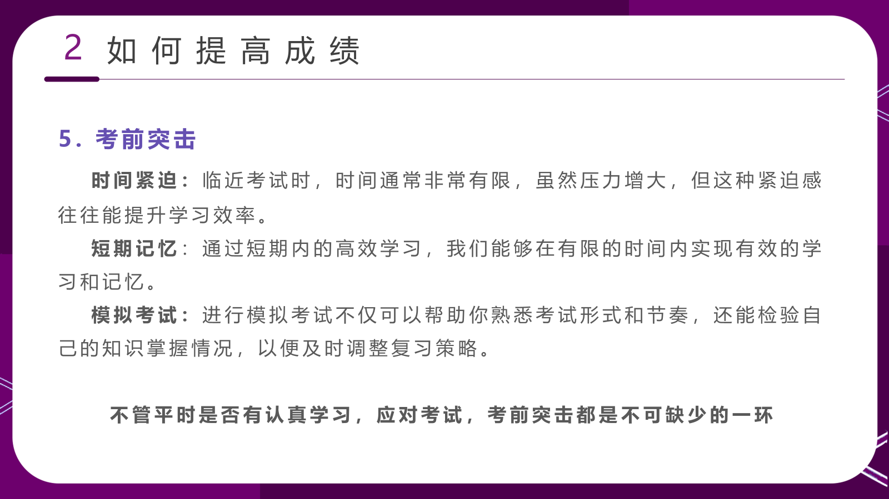
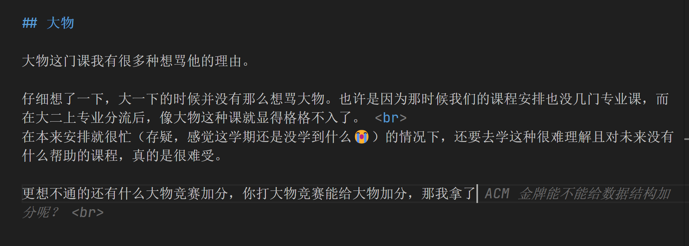

## 前言
大二上可能是整个大学生涯中最忙碌的一个学期，这个学期的课程安排得非常紧凑，每周都有很多的作业要写，很多的实验要做，还要去打 XCPC （虽然自己到最后也没发挥很大的作用，但感觉自己花费的时间还是很多的）。

我之前在给学弟开的班会提到过，在大学里想考高分功夫不在平时而在考前突击，因为上个学期我用这种方法赢的非常彻底，考前突击的电分和大物的分都比较高，然后这个学期我也想用这种方法来应对考试周，但是失败了。

之前大一下的时候，感觉电分和大物这两门课，虽然是考前复习的，但是还是觉得自己掌握的足够多的，最后考试的时候也都能写出来，不过考试嘛，总会有莫名其妙出错的地方，所以最后的分数也不是很高，比起别人还是相对高的。

但是这次考试周感觉并没有什么都会，尤其是 [近代物理](/2024/12-16-大学物理aii复习笔记/近代物理/) 部分，感觉知识又多又很难理解，到最后还是在上面栽了很多跟头😭🥺。

## 做笔记（抄书）
这次复习比起以前多了很多表面性工作，比如我连载在博客上的几篇笔记（[《概率论与数理统计》](/2024/12-12-概率论与数理统计复习笔记/)、[《大学物理AII》](/2024/12-16-大学物理aii复习笔记/)、[《数据结构与算法设计》](/2025/01-06-数据结构与算法设计复习笔记/)、[《离散数学》](/2025/01-06-离散数学复习笔记/)）。

我以前是从来不会去做笔记的，因为有什么问题直接去看 ppt 或者书就好了，但是感觉这次这几门课的知识点还是非常多的，尤其是离散和数据结构。而之前的那两门更多的只是想要学的稍微整体一点，所以也做了抄书的工作。

特别感谢[GitHub Copilot](https://copilot.github.com/)，这个工具在我写笔记的时候帮了我很多忙，因为我不太想写那么多的公式，在申请成功之后我就直接用它来写公式了，然后再稍微修改一下就好了。

## 概率论

概率论考前做的工作只有每周抄抄作业，最后一两周的时候开始做 [笔记](/2024/12-12-概率论与数理统计复习笔记/)，然后就是做做往年题，感觉还是比较公式化的。

在 12.22 也就是考概率论的那天，我感觉自己有点感冒了，所以去考试的时候都带的口罩，后两天真的就特别冷特别难受，和数据结构老师请了假，相对的也就是那两天基本没学大物了。

不过概率论考的还是相当不错的，考试也都没有不会的题，有一道递推类型的积分我前两天还在水群的时候写到过（那时大家都想用 $\Gamma$ 函数来解决，但是我用了分布积分递推，最后也用到了）。

感觉考试的计算量特别大，考虑之前别的课都是因为算错了而丢分，这次估分不是很乐观，但是最后考的还是很乐观的。

## 大物

大物这门课我有很多种想骂他的理由。

仔细想了一下，大一下的时候并没有那么想骂大物。也许是因为那时候我们的课程安排也没几门专业课，而在大二上专业分流后，像大物这种课就显得格格不入了。 
尤其是经历过[小学期](https://github.com/Ri-Nai/Portal-2D)那种实打实的能改变自己的课程后，再回到大物这种课程，感觉就像是在浪费时间一样。

在本来安排就很忙（存疑，感觉这学期还是没学到什么😭）的情况下，还要去学这种很难理解且对未来没有什么帮助的课程，真的是很难受。

更想不通的还有什么大物竞赛加分，你打大物竞赛能给大物加分，那我拿了 ICPC 金牌能不能给数据结构加分呢？那计算机学院就

一个在学生眼里除了算分数就没有别的用处的课程，我不懂为什么我要为这种课程付出那么多的时间和精力，为什么我要因为这种课程被别人区分开来。

在去 ECF 的时候，我也一直在看大物，令人感叹最后 ECF 也没打好，大物也没考好。感觉负罪感和无力感都拉满了。

最后是我再也不会peng

最后考试前两天其实感觉还行，但是到考试的时候，我比一道送分题还弱智，我看过的一个知识点也记不起来，然后最后一题也不知道扯什么。

## 数据结构

大物考完后两天速通了下 [计算理论](/2025/01-06-数据结构与算法设计复习笔记/计算理论/)的部分，然后就开始复习数据结构了。

前者虽然有些地方看不太懂，但是问过老师难的地方都不考，结果最后考试就真只死扣了概念（那题我猜的）。

其实这门课不应该很困难，如果它是完全上机考试的话。

但是他是我们中国特色的死扣概念手写代码的八股文考试。

最后的结果就是，即使你看了很多次概念，最后得到的提升也不会高，也会用中国特色扣字眼题目来击败你，如果我几乎不复习的话我肯定也能拿到 90 分，但是我复习了，最后的结果也不知道能不能到 95 分。

有些史真的是从小吃到大的，从 2019 ~ 2020 的 CSP 的初赛题，到 2021 ~ 2023 一直在学的《信息技术》，再到大学的 《C 语言设计基础》《数据结构与算法设计》，这些出题人的想法是一脉相承的，甚至我觉得 CCF 出的题还是最好的，至少不会死扣概念。  
反正教育就这么畸形了，我也很难改变什么。

它考试的时候出的一个 [B树](/2025/01-06-数据结构与算法设计复习笔记/数据结构/查找/#b-树) 的题目我完全不懂他是怎么算的。然后另一题关于 $\Theta$ 的渐进记号的题目我也不会，最后也蒙错了。

其他地方我觉得是没问题的，希望他们改卷的时候不要找我毛病。

后面手写代码的部分，我写的特别丑，因为本来就算你打代码也会修改很多啊，你妈手写代码怎么可能不会涂涂改改，而且我为链表逻辑的合理性改了很多次，最后不知道还会不会因为我丑的不行而扣分。然后别人写的好看，但是逻辑稍微有点问题的，也不知道分比我高。

## 离散数学

我以为打过算法竞赛的人应该对离散数学有一定的了解，但是我错了。

或许自己本来就不是很擅长理论味偏重的课程，到了图论章节的时候其实证明题都不大会的。

这门课其实没有什么好喷的，真的就只是菜就多练。

不过计院真的傻逼，什么课都不给往年题，一些稀少的往年题也容易过拟合。

考试一开始的时候把填空题写到写选择题的地方了，监考老师还不让换答题卷。感觉很无语啊它这个答题卷的设计，哪有人选择题划横线的。

考试的时候想过会很难，但是没想到题量这么大，一道数理逻辑大题等于往年 4 道，关键还有两道数理逻辑。每道题都要带点很难说的文字描述的，最后我好像还求了结论的逆命题了，死了算了。

群论的有道题，要证明结合律的地方我那时候脑子断片了，也没写出来，明明是课后习题。

到图论的时候只剩 20min 了，第一道一开始看成哈密顿回路了，然后就写错了，浪费了很多时间，最后也没构造出来。最后一道题我也没时间想了，我不会，感觉大家应该都不会。

## 总结

这次考试周，我感觉自己的复习还是做得比较充分的，但最终结果并不理想，这让我开始怀疑自己的学习方法。

回头想想，在大物这门课上，我并没有比别人有明显优势。是我一开始对自己期望过高了吗，还是我一直活在过去呢？ 
即便真的考得不错，又有什么意义？像大物这种课，对我未来有多大帮助？除了跟别人拼分数，我还能从中得到什么？

至于数据结构这门本来占优势的课程，成绩也没有特别突出。不过，我并不会怀疑自己，只是对教育感到些许无奈。

起起伏伏或许再正常不过。以前总劝别人别那么看重均绩，结果轮到自己时，心里还是会有些失落。

也会怀疑自己是不是不够努力，曾经的那些成绩是否真如名副其实。

我看着周围优秀的人，有的人在搞科研，有的人在搞开发，他们都有我想要的实打实的能力，可我连区域赛的牌子都是蹭的。

所以，努力的尽头是奇迹吗。
