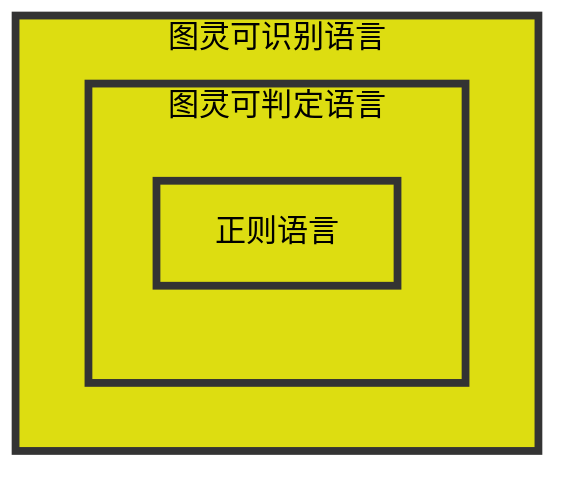

## 问题与决定性问题
### 判定性问题
只需要回答“是”或“否”的问题。

如：  
1. 一个图是否连通？
2. 一个数是否是素数？

### 功能性问题
需要给出一个解决方案的问题。
如 排序，最大流，最大团等等。

本课程只讨论判定性问题。

## 有限自动机与正则语言
有限自动机是一个五元组$(Q, \Sigma, \delta, q\_0, F)$，其中：
1. $Q$ 是有限集，称为**状态集**。
2. $\Sigma$ 是有限集，称为**字母表**。
3. $\delta$ 是**转移函数**。
4. $q\_0 \in Q$ 是**初始状态**。
5. $F \subseteq Q$ 是**接受状态**。

### 有限自动机计算的形式定义
设 $M = (Q, \Sigma, \delta, q\_0, F)$ 是一个有限自动机，$w = w\_1w\_2\cdots w\_n$ 是一个字符串，其中 $w\_i \in \Sigma$。  

若存在 $Q$ 的一个状态序列 $r\_0, r\_1, \cdots, r\_n$，使得：
1. $r\_0 = q\_0$。
2. $r\_{i+1} = \delta(r\_i, w\_{i+1})$，对 $i = 0, 1, \cdots, n-1$。
3. $r\_n \in F$。

则称 $M$ 接受字符串 $w$。
记为 $\delta(r\_0, w) \in F$。

### 识别语言
对于一个有限自动机 $M$，若 $A = \lbrace w \in \Sigma^* | \delta(q\_0, w) \in F \rbrace$，则称 $A$ 是 $M$ 的语言，记为 $L(M) = A$，也称 $M$ 识别 $A$。

$M$ 识别的语言唯一，不识别任意其他语言。

### 正则语言
若存在一个有限自动机 $M$，使得 $L(M) = A$，则称 $A$ 是一个**正则语言**。

### 等价
若两个有限自动机的语言相同，则称它们是**等价**的。

### 正则运算
1. 并：$A \cup B = \lbrace w | w \in A \text{ 或 } w \in B \rbrace$。
2. 连接：$A \circ B = \lbrace w | w = w\_1w\_2, w\_1 \in A, w\_2 \in B \rbrace$。
3. 星号：$A^* = A^0 \cup A^1 \cup A^2 \cup \cdots$，其中 $A^0 = \lbrace \varepsilon \rbrace$，$A^1 = A$，$A^2 = A \circ A$。  即 $A^*=\lbrace w\_1w\_2\cdots w\_n | n \ge 0, w\_i \in A \rbrace$。
4. 补：$A^c = \Sigma^* - A$。

正则语言对这四种运算封闭。
则相对补与对称差运算也是封闭的。
即 $A - B = A \cap B^c$，$A \oplus B = (A - B) \cup (B - A)$。

### 非确定性
当机器处于给定的状态并读入下一个输入符号时，**可以知道机器**的下一个状态是什么——它是确定的。因此，称这是**确定型计算** $\mathrm{(deterministic computation)}$。在**非确定型**$\mathrm{(nondeterministic)}$机器中，在任何一点，下一个状态可能存在若干个选择。

**确定型有限自动机**：$\mathrm{(Deterministic Finite Automaton, DFA)}$
**非确定型有限自动机**：$\mathrm{(Nondeterministic Finite Automaton, NFA)}$

非确定性是确定性的推广，因此每一台 $\mathrm{DFA}$ 自动地是一台 $\mathrm{NFA}$ 。

### 确定型有限自动机 (DFA)
$\delta: Q \times \Sigma \to Q$ 是一个函数，对于每一个 $q \in Q$ 和 $\sigma \in \Sigma$，$\delta(q, \sigma)$ 是唯一的。

### 非确定型有限自动机 (NFA)
$\delta: Q \times \Sigma\_\varepsilon \to P(Q)$ 是一个函数，对于每一个 $q \in Q$ 和 $\sigma \in \Sigma\_\varepsilon$，$\delta(q, \sigma)$ 是一个状态集合，可能进入多个状态。

转移箭头函数上的符号可以是 $\varepsilon$，表示可以不读入任何输入就转移。

#### NFA的计算方式
1. 若读到输入字符 $s$，机器把自己备份 $0$ 次或多次，然后从这些备份中选择一个状态，继续读入下一个字符。
2. 若读到 $\varepsilon$，机器将自己备份一次，然后继续读入下一个字符。
3. 读入下一个输入符号，若该符号存在于备份状态的转移函数中，则转 $1$，否则停机。
4. 机器检查是否有一个备份状态是接受状态。若**存在一个副本是接受状态**，则接受输入。

对于输入，$\mathrm{NFA}$ 计算的路径可能不唯一。

### NFA 与 DFA 等价
对于每一个 $\mathrm{NFA}$，都存在一个等价的 $\mathrm{DFA}$。

#### 子集构造法
$\mathrm{NFA}$：$\mathrm{N} = (Q, \Sigma, \delta, q\_0, F)$ 
$\mathrm{DFA}$：$\mathrm{M} = (Q', \Sigma, \delta', q\_0', F')$ 

1. $Q' = 2^Q$，即 $\mathrm{DFA}$ 的状态集是 $\mathrm{NFA}$ 的状态集的幂集。
2. $E$ 表示 $\varepsilon$ 闭包，即 $E(S) = \lbrace q \ |\  q \in S \text{ 或 } q \text{ 可以通过若干个 }\varepsilon\text{ 转移到 } S \rbrace$。
3. $q\_0' = E(\lbrace q\_0 \rbrace)$。
4. $\delta'(S, a) = E(\bigcup\_{q \in S} \delta(q, a))$，其中 $S \in Q'$，$a \in \Sigma$。
5. $F' = \lbrace S \in Q' \ |\  S \cap F \neq \varnothing \rbrace$。

### 正则表达式
若 $R$ 是一个正则表达式，则 $R$ 是
1. $a, a \in \Sigma$。
2. $\varepsilon$。
3. $\varnothing$。
4. $(R\_1 \cup R\_2)$, $R\_1$ 和 $R\_2$ 是正则表达式。
5. $(R\_1 \circ R\_2)$, $R\_1$ 和 $R\_2$ 是正则表达式。
6. $(R\_1^*)$，$R\_1$ 是正则表达式。

每个正则表达式 $R$ 表示一种正则语言 $L(R)$。
1. $L(a) = \lbrace a \rbrace$。
2. $L(\varepsilon) = \lbrace \varepsilon \rbrace$。
3. $L(\varnothing) = \varnothing$。
4. $L(R\_1 \cup R\_2) = L(R\_1) \cup L(R\_2)$。
5. $L(R\_1 \circ R\_2) = L(R\_1) \circ L(R\_2)$。
6. $L(R\_1^\*) = (L(R\_1))^\*$。

#### 正则表达式与有限自动机等价
－个语言是正则的，当且仅当可以用正则表达式描述它。

##### 由正则表达式构造有限自动机


##### 由有限自动机构造正则表达式


#### 泵引理
若 $A$ 是一个正则语言，则存在一个整数 $p$，使得对于任意 $w \in A$，若 $|w| \ge p$，则 $w$ 可以被分解为 $w = xyz$，满足：
1. 对于任意 $i \ge 0$，$xy^iz \in A$。
2. $|y| > 0$。
3. $|xy| \le p$。

## 图灵机
图灵机 $\mathrm{(Turing Machine, TM)}$ 是一个七元组 $(Q, \Sigma, \Gamma, \delta, q\_0, q\_{\text{accept}}, q\_{\text{reject}})$，其中：
1. $Q$ 是有限集，称为**状态集**。
2. $\Sigma$ 是有限集，称为**输入字母表**，不包含特殊空白符号 $\sqcup$。
3. $\Gamma$ 是有限集，称为**带子字母表**，$\Sigma \subseteq \Gamma$，且 $\sqcup \in \Gamma - \Sigma$。
4. $\delta: Q \times \Gamma \to Q \times \Gamma \times \lbrace L, R \rbrace$ 是**转移函数**。即 $\delta(q, a) = (r, b, L / R)$ 表示在状态 $q$ 读入字符 $a$ 后，将字符 $a$ 替换为字符 $b$，转移到状态 $r$，第三个参数 $L / R$ 表示下一步向左 / 向右移动。
5. $q\_0 \in Q$ 是**初始状态**。
6. $q\_{\text{accept}} \in Q$ 是**接受状态**。
7. $q\_{\text{reject}} \in Q$ 是**拒绝状态**，且 $q\_{\text{reject}} \neq q\_{\text{accept}}$。

### 图灵机的初始化
设 $M = (Q, \Sigma, \Gamma, \delta, q\_0, q\_{\text{accept}}, q\_{\text{reject}})$ 是一个图灵机，$w = w\_1w\_2\cdots w\_n$ 是一个字符串，其中 $w\_i \in \Sigma$。
1. **输入带**：将 $w$ 放在最左端，其余位置填充 $\sqcup$。
2. **状态**：初始状态为 $q\_0$。
3. **读写头**：指向第一个字符 $w\_1$。

### 图灵机的格局
对于一个图灵机 $M = (Q, \Sigma, \Gamma, \delta, q\_0, q\_{\text{accept}}, q\_{\text{reject}})$，设 $q \in Q$ ， $u, v \in \Gamma^*$， 则 **格局** $uqv$ 表示：
1. **状态**：$q$。
2. **存储带**：存储带上的内容为 $uv$，其余为空白符号 $\sqcup$。
3. **读写头**：指向 $v$ 的第一个字符。

#### 格局的分类
- **起始格局**：$q\_0w$。
- **接受格局**：$uq\_{\text{accept}}v$。
- **拒绝格局**：$uq\_{\text{reject}}v$。
- **停机格局**：$uqv$，其中 $q \in \lbrace q\_{\text{accept}}, q\_{\text{reject}} \rbrace$。

#### 格局的转移
- 如果 $\delta(q\_i, b) = (q\_j, c, L)$，则
    - $u\textcolor{yellow}{aq\_ib}v \to u\textcolor{orange}{q\_jac}v$
    - $\textcolor{yellow}{q\_ib}v \to \textcolor{orange}{q\_jc} v$
- 如果 $\delta(q\_i, b) = (q\_j, c, R)$，则
    - $u\textcolor{yellow}{aq\_ib}v \to u\textcolor{orange}{acq\_j}v$

### 图灵机的计算
设 $M = (Q, \Sigma, \Gamma, \delta, q\_0, q\_{\text{accept}}, q\_{\text{reject}})$ 是一个图灵机，$w = w\_1w\_2\cdots w\_n$ 是一个字符串，其中 $w\_i \in \Sigma$。

若存在格局序列 $C\_1, C\_2, \cdots, C\_k$，使得
1. $C\_1 = q\_0w$。
2. 对于 $i = 1, 2, \cdots, k-1$，$C\_i \to C\_{i+1}$。
3. $C\_k$ 是停机格局。

则称 $M$ **接受**字符串 $w$。

图灵机 $M$ **接受** 的所有字符串的集合称为 $M$ **接受 / 识别** 的**语言**，记为 $L(M)$。 

#### 图灵机运行的结果
- 若 $\mathrm{TM}$ 进入接受状态，则停机且接受输入。
- 若 $\mathrm{TM}$ 进入拒绝状态，则停机且拒绝输入。
- 否则，$\mathrm{TM}$ 一直运行，不停机。

若图灵机 $M$ 对**所有输入都停机**，则称 $M$ 是**判定器**。  
即对于任意输入，$M$ 要么接受，要么拒绝，**不会无限循环**。

对于可以识别某个语言的判定器 $M$，称 $M$ **判定**该语言。

#### 语言的分类
- **图灵可识别语言**：**存在**一个图灵机可以**识别**该语言。
    - 也称**递归可枚举语言**。
        - = 递归可枚举
        - = 计算可枚举
        - = 半可判定
        - = 半可计算

- **图灵可判定语言**：**存在**一个图灵机可以**判定**该语言。
    - 也称**递归语言**。
        - = 递归
        - = 可解
        - = 可行
        - = 可判定
        - = 可计算

包含关系：

### 图灵机的描述
1. 形式水平的描述：状态图或转移函数
2. 实现水平的描述：读写头的移动与读写，状态的转移
3. 高水平的描述：使用日常语言描述
例如
>$M$ = "对于输入串 $w$
>    1. 若 $w$ = $\epsilon$，则接受
>    2. 若只有一个 $0$，则接受
>    3. 若 $0$ 的个数是奇数，则拒绝
>    4. 从带左端隔一个 $0$ 删除一个 $0$，转移到步骤 $2$"

由定义，图灵机的输入总是字符串。  
有时候要输入数，图，或图灵机等对象，要将对象编码成字符串。  
记对象 `O` 的编码为 `<O>`。  

特别的，图灵机是有向带权图也可以编码为字符串。



### 非确定性图灵机
非确定性图灵机 $\mathrm{(Nondeterministic Turing Machine, NTM)}$ 是一个七元组 $(Q, \Sigma, \Gamma, \delta, q\_0, q\_{\text{accept}}, q\_{\text{reject}})$，它的转移函数是 $\delta: Q \times \Gamma \to P(Q \times \Gamma \times \lbrace L, R \rbrace)$。

如果计算的某个分支导致接受状态，则机器接受该输入。



称 $\mathrm{NTM}$ $M$接受 $x$ ， 若在 $x$ 上运行 $M$ 时有接受分支。  
称一个 $\mathrm{NTM}$ 为判定的，若它对所有输入，所有分支都停机。  

每个 $\mathrm{NTM}$ 都有等价的 $\mathrm{DTM}$  
每个判定 $\mathrm{NTM}$ 都有等价的判定 $\mathrm{DTM}$  

图灵可识别当且仅当可用非确定型图灵机识别。  
图灵可判定当且仅当可用非确定型图灵机判定。

