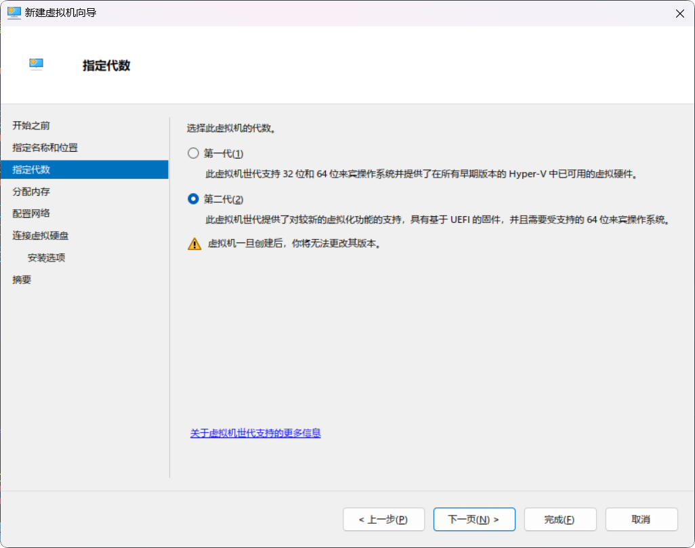
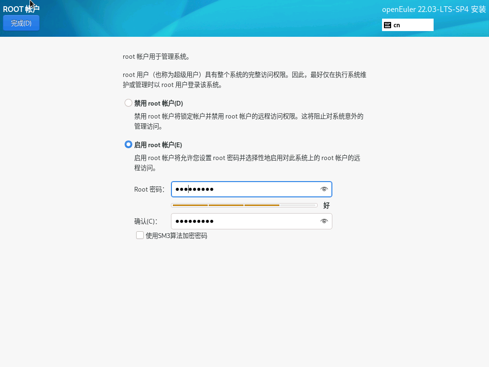

## 实验要求

### 表格内容
| 实验名             | 建立数据库                                                                                                                                                                                                                                                     |
| ------------------ | -------------------------------------------------------------------------------------------------------------------------------------------------------------------------------------------------------------------------------------------------------------- |
| 任务               | - 购买ECS服务器，安装Gauss数据库 <br> - VirtualBox安装openEuler虚拟机并连接（本实验使用 `Hyper-V` 虚拟机） <br> - 创建数据库、数据表 <br> - 建立“学籍与成绩管理系统”表格 <br> - 建立表之间的参照关系 <br> - 建立适当的索引 <br>   - 在实验三说明建立索引的原因 |
| 学籍与成绩管理系统 | 包含以下信息： <br> - 课程名称 <br> - 课程代号 <br> - 课程类型（必修、选修、任选） <br> - 学分 <br> - 任课教师姓名 <br>   - 教师编号 <br>   - 教师职称 <br>   - 教师所                                                                                         |

---

## 在虚拟机上建立数据库

个人采用的虚拟机是 `Hyper-V`，以下操作均基于 `Hyper-V` 进行。

### Hyper-V 介绍与安装

在 `Windows 10 / 11` 专业版及以上版本中，`Hyper-V` 是原生支持的虚拟化技术。具有以下优点：
- 性能较好，占用资源较少
- `Windows` 原生支持，安装简单

#### 安装 Hyper-V

| 步骤                                                                                             |
| ------------------------------------------------------------------------------------------------ |
| 1. 打开 *控制面板*                                         |
| 2. 点击 *程序*                                                     |
| 3. 点击 *程序与功能*                                   |
| 4. 点击 *启用或关闭Windows功能*  |
| 5. 勾选 *Hyper-V*                                            |
| 6. 点击 *确定*                                                                                   |
| 7. *重启* 计算机                                                                                 |

#### 配置 Hyper-V

Hyper-V 基本开箱即用，只需要配置网络部分。自带的虚拟交换机只能连接内部网络，所以需要配置外部网络。

| 步骤                                                                                                                         |
| ---------------------------------------------------------------------------------------------------------------------------- |
| 1. 打开 *Hyper-V管理器* 直接在 `Windows` 搜索栏搜索 `Hyper-V` 即可。         |
| 2. 点击 *Hyper-V管理器* 显示如下界面：                                               |
| 3. 点击 *虚拟交换机管理器* 显示如下界面，默认已经帮我们勾选好了 *外部* 网络。  |
| 4. 点击 *创建虚拟交换机*                                                                                                     |
| 5. 点击 *应用* 默认设置即可，可以给虚拟交换机改个名字。                            |

---

### 安装 openEuler

#### 下载 openEuler 镜像

选择和*参考资料*中一样的 `openEuler 22.03 LTS` 镜像。（此处是 `SP4` 版本，镜像源网址中下载的太慢了）

openEuler 下载网站：[https://openeuler.org/zh/download/](https://openeuler.org/zh/download/)  


#### 导入 openEuler 镜像

| 步骤                                                                                                                                             |
| ------------------------------------------------------------------------------------------------------------------------------------------------ |
| 1. 打开 *Hyper-V管理器* 直接在 `Windows` 搜索栏搜索 `Hyper-V` 即可。                             |
| 2. 点击 *新建*，然后点击 *虚拟机*                                                                              |
| 3. 点击 *下一页*                                                                                                       |
| 4. 输入虚拟机名称，点击 *下一页*                                                                               |
| 5. 选择 *第二代* 虚拟机，点击 *下一页*                                                             |
| 6. 设置 *内存大小*，点击 *下一页*                                                                          |
| 7. 选择我们设置好的 *外部网络*，点击 *下一页*                                                              |
| 8. 设置 *虚拟硬盘大小*，点击 *下一页*                                                                      |
| 9. 选择 *从ISO映像文件安装操作系统*，然后选择我们下载好的 `openEuler 22.03 LTS` 镜像，点击 *下一页*  |
| 10. 点击 *完成*                                                                                                            |

---

#### 基础设置

1. 点击 *设置*，然后*禁用*安全启动  
   
2. 点击 *添加硬件*，然后点击 *网络适配器*，添加 *NAT 网络*（内部网络，和*参考资料*中一样有两张网卡）  
   （需要在*虚拟交换机管理器*绑定以太网到*外部网络*或者*NAT 网络*）  
   

---

#### 安装 openEuler

| 步骤                                                                                                                                                         |
| ------------------------------------------------------------------------------------------------------------------------------------------------------------ |
| 1. 点击 *启动*，然后点击 *连接*                                                                                            |
| 2. 按照默认的 `Test this media and install openEuler` 安装                                                                             |
| 3. 选择 *简体中文*                                                                                                     |
| 4. 选择 *安装位置*，点击 *完成*                                                                                                |
| 5. 点击 *软件选择*，和 *参考资料* 中一样，选择 *虚拟化主机*，工具选择 *Linux的远程管理*、*开发工具*、*安全性工具*、*系统工具*  |
| 6. 点击 *网络和主机名*，启用我们配置的两张网卡                                                                         |
| 7. *启用 root 账户*，设置密码                                                                                          |
| 8. *创建用户*，设置密码                                                                                                        |
| 9. 点击 *完成*                                                                                                                 |
| 10. 点击 *重启*                                                                                                                |

---

#### 启动 openEuler

重启之后会看到如下界面：  
  
输入账号密码即可  
记住自己的 ip 地址，后面直接用就好了  


---

### ssh 连接 openEuler

#### PowerShell 连接 openEuler

在 `Windows` 上使用 `PowerShell` 连接 `openEuler`

```bash
ssh rinai@192.168.137.250
```

然后输入密码就好了  


在 `Windows Powershell` 下操作主要是比较方便和比较美观（快捷键 / 剪切板 / 终端主题）

---

#### VsCode / Cursor 连接 openEuler

`VsCode` 配置了一套非常强大的 `SSH` 连接功能，可以非常方便的连接到 `openEuler`，可以管理文件树和自动转发端口，开发效率非常高。  
直接增加数据源就好了，然后类型选择 `PostgreSQL`，然后输入连接信息。  
  
  
之后的所有操作都不会使用 `Hyper-V` 的连接了，都是使用 `PowerShell` 和 `VsCode` 进行 `ssh` 连接

---

### 部署数据库

#### 前期配置

##### 安装依赖

```bash
## 安装依赖(openEuler 22.03 LTS 默认安装了 libaio)
sudo yum install libaio
```

##### 关闭防火墙

```bash
## 禁用 selinux
sudo vim /etc/selinux/config
SELINUX=disabled
## 重启
sudo reboot
## 关闭防火墙
sudo systemctl disable firewalld.service
sudo systemctl stop firewalld.service
## 查看状态
systemctl status firewalld
```

##### 新增 omm 用户

omm 是 openGauss 的默认用户，用于管理数据库，在 `simpleInstall` 时会将当前操作的用户设置为数据库的管理员，所以我们用 `omm` 用户进行安装，会兼容很多教程。

切换到 `root` 用户：

```bash
su - root
```

新增 omm 用户：

```bash
sudo useradd omm
```

设置密码：

```bash
sudo passwd omm
```

添加 sudo 权限：

```bash
sudo visudo
## 在文件末尾添加
omm ALL=(ALL) ALL
```

---

#### 安装 openGauss

下载 openGauss 安装包，我安装的是极简版  
[openGauss Download](https://opengauss.org/zh/download/)

```bash
## 下载压缩包
curl -O https://opengauss.obs.cn-south-1.myhuaweicloud.com/6.0.1/openEuler22.03/x86/openGauss-Server-6.0.1-openEuler22.03-x86_64.tar.bz2
## 提前建立软件目录
sudo mkdir -p /opt/software/openGauss
## 解压到 /opt/software/openGauss
sudo tar -jxf openGauss-Server-6.0.1-openEuler22.03-x86_64.tar.bz2 -C /opt/software/openGauss
## 设置权限
sudo chmod -R 755 /opt/software/openGauss/*
## 进入安装目录
cd /opt/software/openGauss/simpleInstall
## "xxxx" 是你的密码
bash install.sh  -w "xxxx" -p 5432 &&source ~/.bashrc
```

  


---

#### 检查是否安装成功

```bash
ps ux | grep gaussdb
gs_ctl query -D /opt/software/openGauss/data/single_node
```


---

### 连接数据库

#### 虚拟机内 gsql 连接数据库

```bash
## 连接数据库
gsql -d postgres \ ## 连接数据库
     -p 5432 \ ## 端口
     -r \ ## 是否为只读
     -U omm \ ## 用户名
```

创建用户：

```sql
CREATE USER rinai WITH PASSWORD 'xxxxxx' SYSADMIN; ## 创建用户（有些连接不允许使用 omm 用户）
```


---

#### 虚拟机外连接配置

openGauss 默认只允许本地连接，所以需要修改配置文件，允许远程连接。

```bash
## 修改配置文件
sudo vim /opt/software/openGauss/data/single_node/postgresql.conf
## 修改 listen_addresses
listen_addresses = '*' ## 允许所有地址连接
## 修改 password_encryption
password_encryption_type = 1 ## Password storage type, 0 is md5 for PG, 1 is sha256 + md5, 2 is sha256 only
```

  


```bash
sudo vim /opt/software/openGauss/data/single_node/pg_hba.conf
## 在文件末尾加入
## TYPE  DATABASE        USER            ADDRESS                 METHOD
## "local" is for Unix domain socket connections only
host    all             all             <your-ip>/32            sha256
## 这里的 <your-ip> 是你的 IP 地址
## 可以在 PowerShell 里面输入 ipconfig 查看对应网卡的 IP 地址
```


注：此时需要重新修改用户密码才能外部连接，因为需要储存新的加密方式。

```sql
ALTER USER rinai WITH PASSWORD 'xxxxxx';
```

```bash
## 重启数据库
gs_ctl restart -D /opt/software/openGauss/data/single_node -Z single_node
```

---

#### 虚拟机外连接数据库

##### psql

```bash
psql -h 192.168.137.250 -p 5432 -U rinai -d postgres
```

由于 openGauss 基于 `PostgreSQL`，所以可以使用 `psql` 连接数据库。  


---

##### DataGrip

`DataGrip` 是 `JetBrains` 出品的一款数据库管理工具，支持多种数据库。  
兼容性非常好，而且功能十分强大，界面也很美观现代。  
直接增加数据源就好了，然后类型选择 `PostgreSQL`，然后输入连接信息。  
  


---

## 在弹性云 ECS 服务器上部署 openGauss

### 购买弹性云 ECS 服务器

在 [华为云弹性云服务器购买地址](https://www.huaweicloud.com/product/ecs.html) 上购买一台弹性云 ECS 服务器，然后登录到服务器上。  


参数如下：

| 参数     | 配置                                            |
| -------- | ----------------------------------------------- |
| 区域     | 华北-北京四                                     |
| 计费模式 | 按需计费                                        |
| CPU架构  | 鲲鹏计算                                        |
| 规格     | 最新系列 2vCPUs \| 4GiB                         |
| 镜像     | 公共镜像： openEuler 20.03 64bit with ARM(40GB) |

  
  


---

### 连接弹性云 ECS 服务器

#### CloudShell 连接

华为云提供了一个非常方便的连接工具，叫做 `CloudShell`，可以非常方便的连接到弹性云 ECS 服务器。  
  
  


---

#### SSH 连接

可以通过 `ssh` 连接到弹性云 ECS 服务器。  
在服务器上查看公网 IP 地址，然后输入 `ssh` 命令就好了。

```bash
ssh root@<your-ip>
```


---

#### VSCode 连接

和 [VsCode连接openEuler](#VsCode%20/%20Cursor%20连接%20openEuler) 一样，使用 `ssh` 连接到弹性云 ECS 服务器。  
这里不再演示。

---

#### 建立数据库

和 [虚拟机部署数据库](#部署数据库) 一样（因为都是崭新的服务器部署数据库）。几个需要注意的点：
1. 需要安装对应系统架构的 openGauss 版本，例如我的系统版本是 `openEuler 20.03 64bit with ARM`，所以需要安装 `aarch64` 版本的 openGauss。
2. 在华为云服务器控制台，需要设置安全组规则，开放 `5432` 端口。  
然后就差不多了。  
这里不再赘述。

---

## 创建数据库

之后我们直接在 `DataGrip` 中创建数据库，然后创建数据表。  
右键数据库，可以打开一个查询控制台，我们可以在里面输入 `sql` 命令。

```sql
create database school_management;
```

---

### 创建数据表

```sql
-- 学院表 (xyb)
CREATE TABLE xyb
(
    ydh CHAR(2) PRIMARY KEY, -- 主键：院代号
    ymc VARCHAR(30) NOT NULL -- 属性：院名称
);
-- 学生表 (xs)
CREATE TABLE xs
(
    xm   VARCHAR(8) NOT NULL,              -- 属性：姓名
    xh   CHAR(10) PRIMARY KEY,             -- 主键：学号
    ydh  CHAR(2),                          -- 外键：院代号
    bj   VARCHAR(8),                       -- 属性：班级
    chrq DATE       NOT NULL,              -- 属性：出生日期
    xb   CHAR(6),                          -- 属性：性别
    FOREIGN KEY (ydh) REFERENCES xyb (ydh) -- 外键：学院表 -> 院代号
);
-- 课程表 (kc)
CREATE TABLE kc
(
    kcbh CHAR(3) PRIMARY KEY,  -- 主键：课程编号
    kc   VARCHAR(30) NOT NULL, -- 属性：课程名称
    lx   VARCHAR(10),          -- 属性：类型
    xf   NUMERIC(5, 1)         -- 属性：学分
);
-- 教师表 (js)
CREATE TABLE js
(
    xm   VARCHAR(8) NOT NULL,              -- 属性：姓名
    jsbh CHAR(10) PRIMARY KEY,             -- 主键：教师编号
    zc   VARCHAR(6),                       -- 属性：职称
    ydh  CHAR(2),                          -- 外键：院代号
    FOREIGN KEY (ydh) REFERENCES xyb (ydh) -- 外键：学院表 -> 院代号
);
-- 授课表 (sk)
CREATE TABLE sk
(
    kcbh CHAR(3),                            -- 主键：课程编号
    bh   CHAR(10),                           -- 主键：教师编号
    PRIMARY KEY (kcbh, bh),                  -- 主键：课程编号 + 教师编号
    FOREIGN KEY (kcbh) REFERENCES kc (kcbh), -- 外键：课程表 -> 课程编号
    FOREIGN KEY (bh) REFERENCES js (jsbh)    -- 外键：教师表 -> 教师编号
);
-- 学生选课表 (xk)
CREATE TABLE xk
(
    xh   CHAR(10),                          -- 主键：学号
    kcbh CHAR(3),                           -- 主键：课程编号
    cj   NUMERIC(5, 1),                     -- 属性：成绩
    PRIMARY KEY (xh, kcbh),                 -- 主键：学号 + 课程编号
    FOREIGN KEY (xh) REFERENCES xs (xh),    -- 外键：学生表 -> 学号
    FOREIGN KEY (kcbh) REFERENCES kc (kcbh) -- 外键：课程表 -> 课程编号
);
```

运行查询控制台命令：  
  

可以看到我们的 `public schema` 下已经创建了这些表。  


sql 解释：
1. 在学院表 / 学生表 / 教师表中，定义了外键约束，用于保证数据的一致性。
2. 在授课表中，定义了主键，用于唯一标识每一门课程和每一位教师。
3. 在学生选课表中，定义了主键，用于唯一标识每一位学生和每一门课程。

和实验参考文档修改的地方：
1. 性别：设置成 `VARCHAR(6)`，因为 `CHAR(2)` 没法存下一个中文字符
2. 课程名称：设置成 `VARCHAR(30)`，因为 `VARCHAR(20)` 可能太短了（例如《数据库设计与开发》）

---

### 创建索引

```sql
CREATE INDEX idx_xs_ydh ON xs(ydh);   -- 学生表 -> 院代号
CREATE INDEX idx_kc_lx ON kc(lx);     -- 课程表 -> 类型
CREATE INDEX idx_js_ydh ON js(ydh);   -- 教师表 -> 院代号
CREATE INDEX idx_sk_bh ON sk(bh);     -- 授课表 -> 教师编号
CREATE INDEX idx_xk_cj ON xk(cj);     -- 学生选课表 -> 成绩
```

同样在 `public schema` 下创建了这些索引。  
  
可以看到表里面已经创建了这些索引。  


至此，实验一完成。
