任务：
- 创建数据分区表
- 体会主键、外键约束
  - 练习更新、删除主表数据
    - 针对主键属性且子表中可能有参照外键数据
    - 针对非主键属性
  - 练习先删除子表数据，再删除主表数据
  - 使用子查询方式更新、删除数据
- 体会索引
  - 查询计划
- 权限管理
  - 以不同身份用户登录数据库建立表–表名一样
  - 以不同身份用户查询自己与其他用户建立的表
  - 定义授权方案并进行验证


## 创建和管理分区表

### 准备工作

#### 创建 Schema
首先创建一个新的 schema 用于本次实验：

```sql
CREATE SCHEMA tpcds;
```

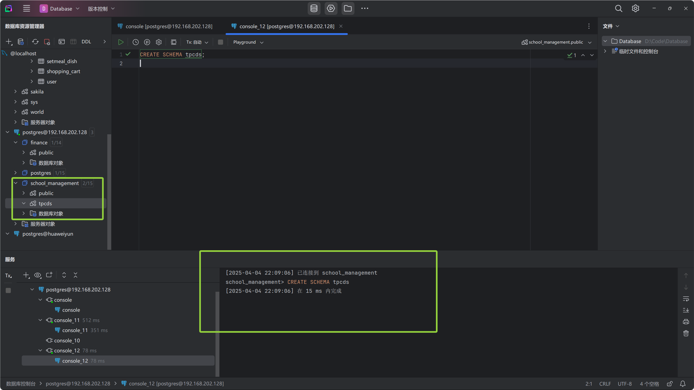

输入这个命令之后可以看到创建了 `tpcds` 这个 schema。

#### 创建表空间
创建用于存储分区表数据的表空间：

```sql
CREATE TABLESPACE example1 RELATIVE LOCATION 'tablespace1/tablespace_1';
CREATE TABLESPACE example2 RELATIVE LOCATION 'tablespace2/tablespace_2';
CREATE TABLESPACE example3 RELATIVE LOCATION 'tablespace3/tablespace_3';
CREATE TABLESPACE example4 RELATIVE LOCATION 'tablespace4/tablespace_4';
```

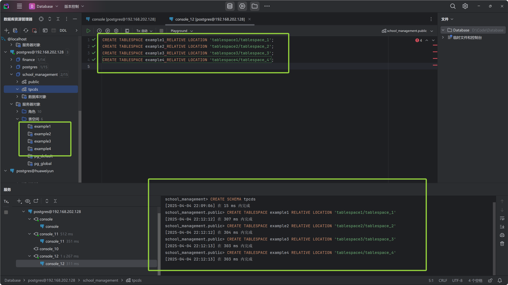

可以看到创建了四个表空间。

#### 创建分区表
我们将创建一个商品销售记录分区表，按照销售日期范围进行分区：

```sql
CREATE TABLE tpcds.sales_records
(
    sale_id     INTEGER        NOT NULL,
    product_id  INTEGER        NOT NULL,
    sale_date   DATE           NOT NULL,
    customer_id INTEGER        NOT NULL,
    quantity    INTEGER        NOT NULL,
    total_price DECIMAL(10, 2) NOT NULL,
    region_id   INTEGER        NOT NULL
)
TABLESPACE example1
PARTITION BY RANGE (sale_date)(
    PARTITION p1_2023 VALUES LESS THAN ('2024-01-01'),
    PARTITION p2_2024q1 VALUES LESS THAN ('2024-04-01'),
    PARTITION p3_2024q2 VALUES LESS THAN ('2024-07-01'),
    PARTITION p4_2024q3 VALUES LESS THAN ('2024-10-01'),
    PARTITION p5_2024q4 VALUES LESS THAN ('2025-01-01'),
    PARTITION p6_future VALUES LESS THAN (MAXVALUE) TABLESPACE example2
)
ENABLE ROW MOVEMENT;
```

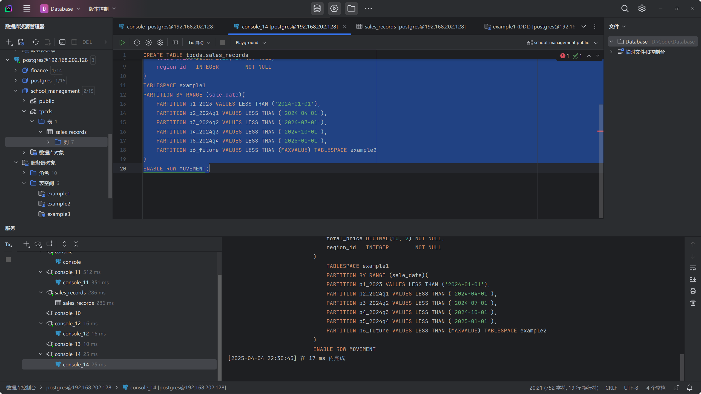


目前没法看到分区表的结构，需要使用 `\d+ tpcds.sales_records` 命令查看。

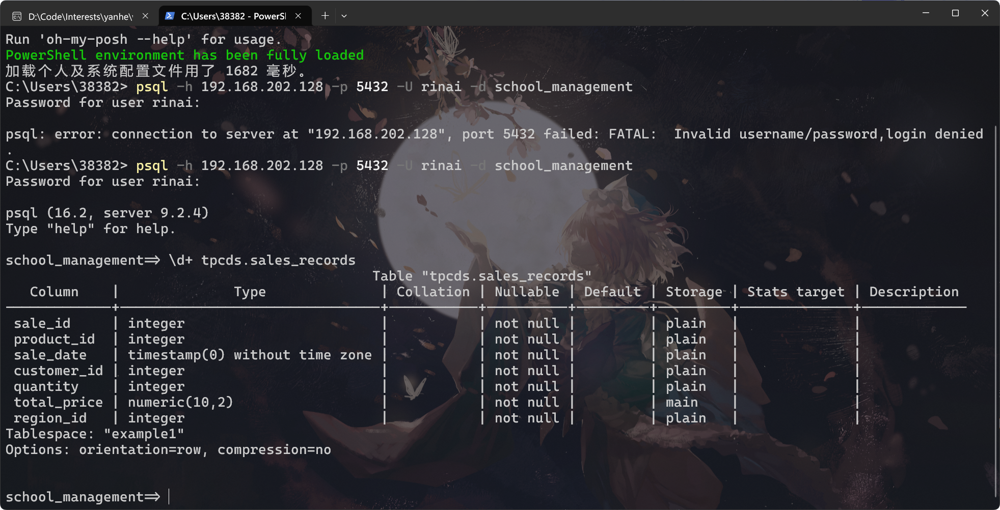

得到如下结果：
```
                                            Table "tpcds.sales_records"
    Column    |              Type              | Collation | Nullable | Default | Storage | Stats target | Description
-------------+--------------------------------+-----------+----------+---------+---------+--------------+-------------
sale_id     | integer                        |           | not null |         | plain   |              |
product_id  | integer                        |           | not null |         | plain   |              |
sale_date   | timestamp(0) without time zone |           | not null |         | plain   |              |
customer_id | integer                        |           | not null |         | plain   |              |
quantity    | integer                        |           | not null |         | plain   |              |
total_price | numeric(10,2)                  |           | not null |         | main    |              |
region_id   | integer                        |           | not null |         | plain   |              |
Tablespace: "example1"
Options: orientation=row, compression=no
```

表示分区表的表空间是 `example1`。


#### 插入测试数据

```sql
INSERT INTO tpcds.sales_records
VALUES (1001, 101, '2023-12-15', 1, 2, 199.98, 1),
       (1002, 102, '2024-01-20', 2, 1, 299.99, 1),
       (1003, 103, '2024-02-28', 3, 3, 449.97, 2),
       (1004, 104, '2024-03-15', 4, 1, 99.99, 2),
       (1005, 105, '2024-04-01', 5, 2, 159.98, 3);
```

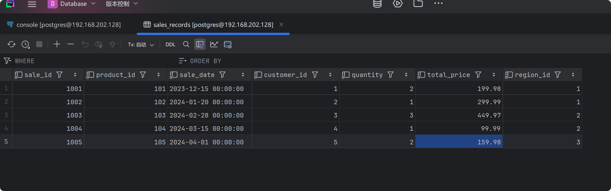


### 查询分区数据 
```sql
SELECT * FROM tpcds.sales_records PARTITION (p2_2024q1);
```

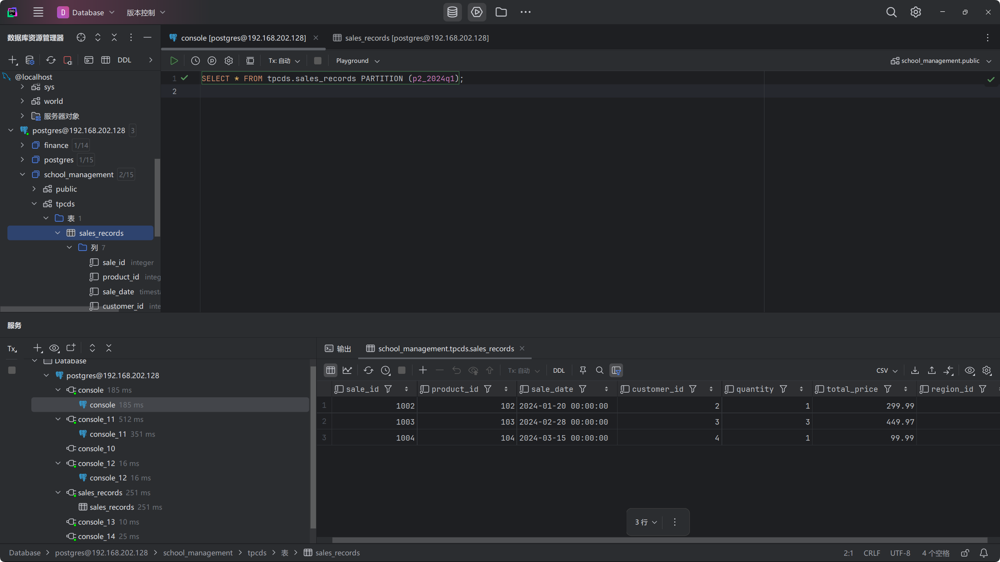

可以看到只有 `p2_2024q1` 分区的数据。


### 清理实验环境

```sql
-- 删除分区表
DROP TABLE tpcds.sales_records;

-- 删除表空间
DROP TABLESPACE example1;
DROP TABLESPACE example2;
DROP TABLESPACE example3;
DROP TABLESPACE example4;

-- 删除 schema
DROP SCHEMA tpcds;
```

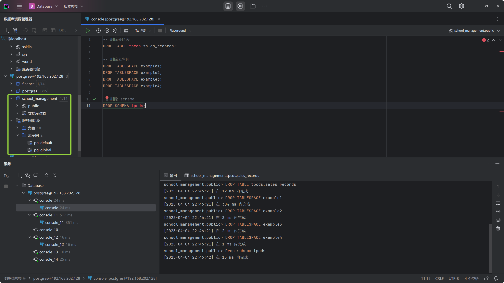

可以看到已经删除了所有创建的表空间和 schema。


## 测试主键、外键约束

### 备份数据库

因为后面我们会对数据库进行修改，所以先备份一下。

```bash
gs_dump --clean -f ~/school_management.sql school_management
```

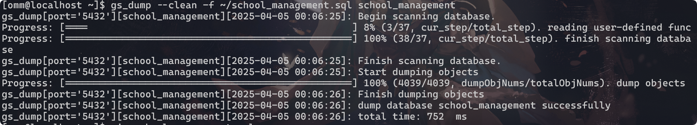

这样会把你的备份文件导出到 `~` 目录下，文件名是 `school_management.sql`。

后面只需要执行这个文件就可以恢复数据库了。

```bash
gsql -U omm -d school_management -f ~/school_management.sql
```


### 练习更新、删除主表数据

#### 针对主键属性且子表中可能有参照外键数据

##### 尝试更新院系表的主键（ydh）

尝试更新院系表的主键（ydh）
```sql
UPDATE xyb SET ydh = '08' WHERE ydh = '01';
```
会失败，因为存在外键引用
```
ERROR: update or delete on table "xyb" violates foreign key constraint "xs_ydh_fkey" on table "xs"
```

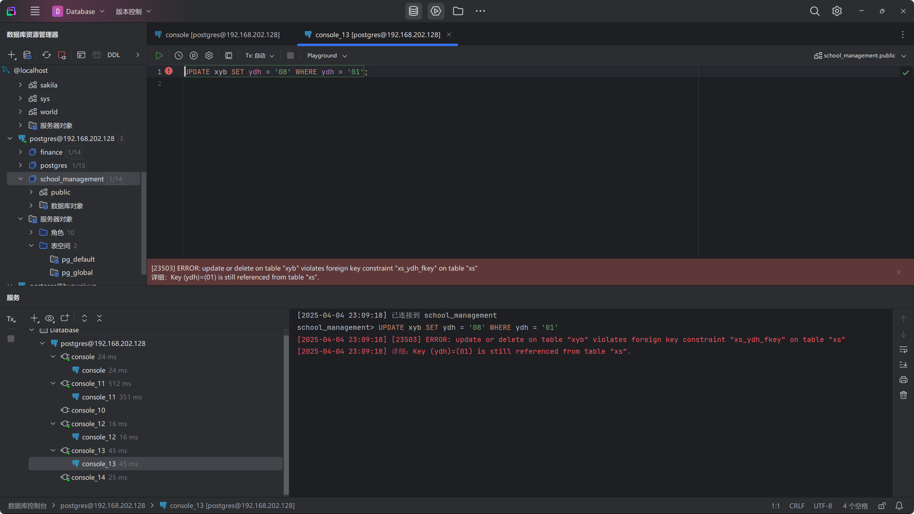

##### 尝试删除院系表中的记录（删除主表数据）

```sql
DELETE FROM xyb WHERE ydh = '01';
```

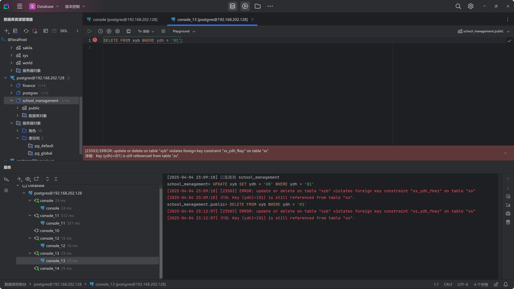

会失败，因为存在外键引用

```
update or delete on table "xyb" violates foreign key constraint "xs_ydh_fkey" on table "xs"
```

#### 使用级联删除

首先更改外键约束，添加级联删除。
```sql
-- 修改 xs 表的 ydh 外键为级联更新
ALTER TABLE xs
    DROP CONSTRAINT IF EXISTS xs_ydh_fkey;
ALTER TABLE xs
    ADD CONSTRAINT xs_ydh_fkey
        FOREIGN KEY (ydh)
            REFERENCES xyb (ydh)
            ON UPDATE CASCADE ON
            DELETE CASCADE;

-- 修改 js 表的 ydh 外键为级联更新
ALTER TABLE js
    DROP CONSTRAINT IF EXISTS js_ydh_fkey;
ALTER TABLE js
    ADD CONSTRAINT js_ydh_fkey
        FOREIGN KEY (ydh)
            REFERENCES xyb (ydh)
            ON UPDATE CASCADE
            ON DELETE CASCADE;

-- 修改 sk 表的 kcbh 和 bh 外键为级联更新
ALTER TABLE sk
    DROP CONSTRAINT IF EXISTS sk_kcbh_fkey;
ALTER TABLE sk
    ADD CONSTRAINT sk_kcbh_fkey
        FOREIGN KEY (kcbh)
            REFERENCES kc (kcbh)
            ON UPDATE CASCADE
            ON DELETE CASCADE;

ALTER TABLE sk
    DROP CONSTRAINT IF EXISTS sk_bh_fkey;
ALTER TABLE sk
    ADD CONSTRAINT sk_bh_fkey
        FOREIGN KEY (bh)
            REFERENCES js (jsbh)
            ON UPDATE CASCADE
            ON DELETE CASCADE;

-- 修改 xk 表的 xh 和 kcbh 外键为级联更新
ALTER TABLE xk
    DROP CONSTRAINT IF EXISTS xk_xh_fkey;
ALTER TABLE xk
    ADD CONSTRAINT xk_xh_fkey
        FOREIGN KEY (xh)
            REFERENCES xs (xh)
            ON UPDATE CASCADE
            ON DELETE CASCADE;

ALTER TABLE xk
    DROP CONSTRAINT IF EXISTS xk_kcbh_fkey;
ALTER TABLE xk
    ADD CONSTRAINT xk_kcbh_fkey
        FOREIGN KEY (kcbh)
            REFERENCES kc (kcbh)
            ON UPDATE CASCADE
            ON DELETE CASCADE;
```

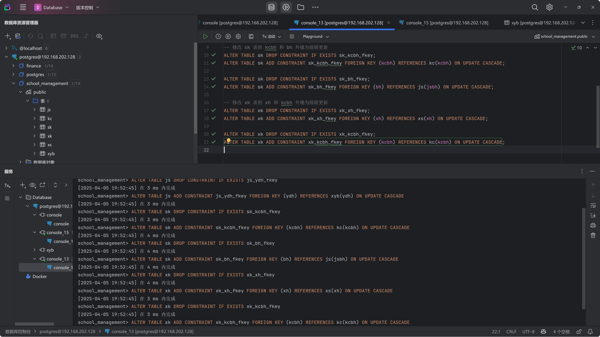


```sql
DELETE FROM xyb WHERE ydh = '01';
```

```sql
SELECT * FROM xs WHERE ydh = '01';
SELECT * FROM js WHERE ydh = '01';
SELECT * FROM xk WHERE ydh = '01';
```

可以发现，所有相关记录都被删除了。

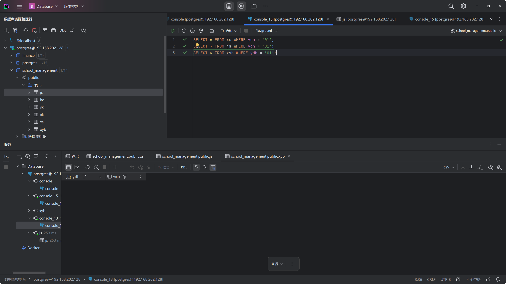

让我们恢复一下数据库。

```bash
gsql -U omm -d school_management -f ~/school_management.sql
```

#### 针对非主键属性

测试更新院系表中的非主键属性：

```sql
UPDATE xyb SET ymc = '计算机学院' WHERE ydh = '03';
```

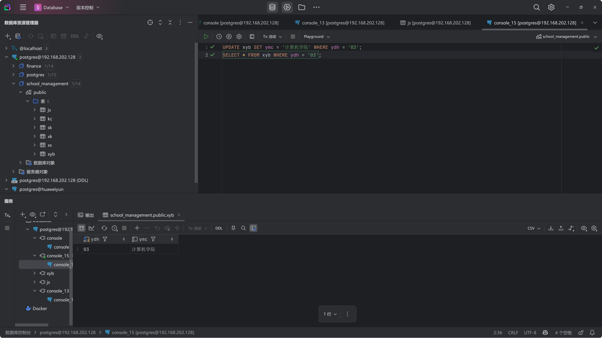

可以看到名称已经更新为“计算机学院”。

### 练习先删除子表数据，再删除主表数据

正确的做法是先删除子表中的相关记录

```sql
-- 删除学生记录
-- 因为 xs 表中存在外键约束，所以不能直接删除
DELETE FROM xk WHERE xh IN (
    SELECT xh FROM xs WHERE ydh = '01'
);
DELETE FROM xs WHERE ydh = '01';
-- 删除教师记录
-- 因为 js 表中存在外键约束，所以不能直接删除
DELETE FROM sk WHERE bh IN (
    SELECT jsbh FROM js WHERE ydh = '01'
);
DELETE FROM js WHERE ydh = '01';
-- 删除院系记录
DELETE FROM xyb WHERE ydh = '01';
```

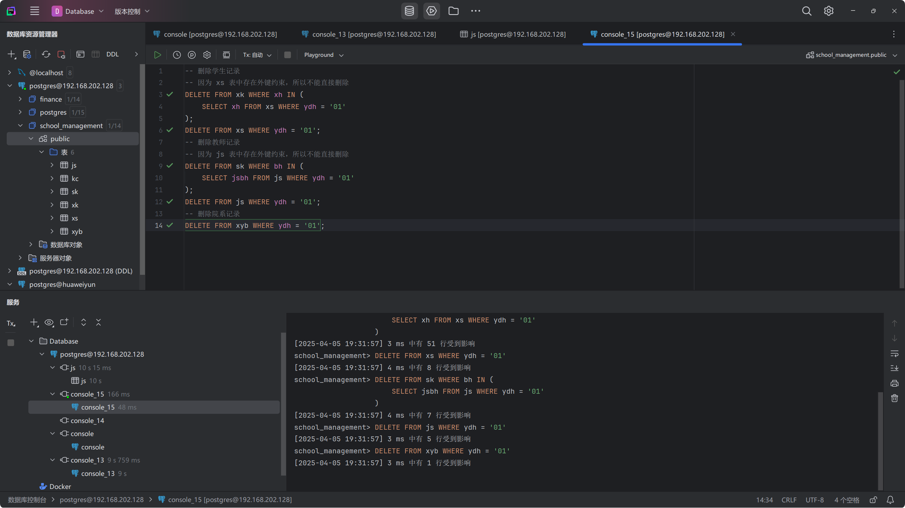


使用 `SELECT` 语句查询三个表中的记录，发现已经删除。

```sql
SELECT * FROM xs WHERE ydh = '01';
SELECT * FROM js WHERE ydh = '01';
SELECT * FROM xyb WHERE ydh = '01';
```

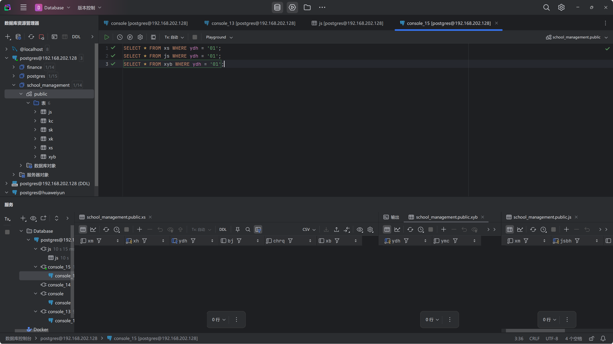

### 使用子查询方式更新、删除数据

演示使用子查询进行数据操作：

#### 更新某院系所有学生的班级信息

```sql
UPDATE xs
SET bj = '07012301'
WHERE ydh IN (SELECT ydh
             FROM xyb
             WHERE ymc = '计算机学院');
```

可以发现，所有相关记录都被更新为 `07012301`。

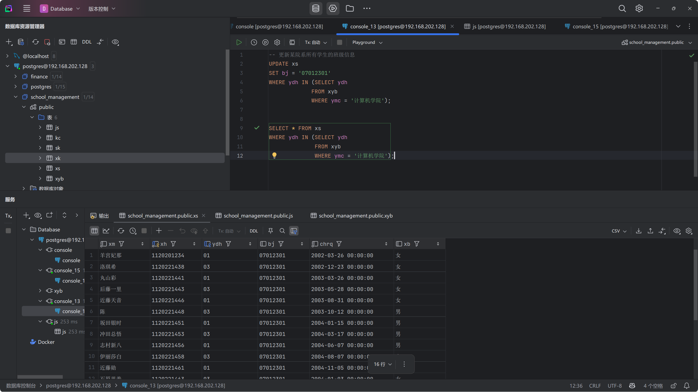

#### 删除某教师所教授课程的所有选课记录

```sql
DELETE
FROM xk
WHERE kcbh IN (SELECT kcbh
               FROM sk
               WHERE bh = (SELECT jsbh FROM js WHERE xm = '张三'));
```

可以发现，所有相关记录都被删除了。

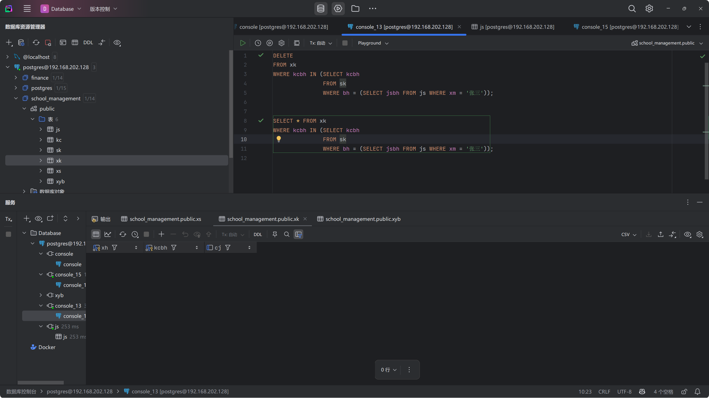


## 测试索引

### 创建索引

在 实验一 中，我们已经创建了索引。

```sql
-- 这行不需要，因为主键本身就是索引
-- CREATE INDEX idx_xyb_ydh ON xyb(ydh); -- 学院表 -> 院代号
CREATE INDEX idx_xs_ydh ON xs (ydh);     -- 学生表 -> 院代号
CREATE INDEX idx_kc_lx ON kc (lx);       -- 课程表 -> 类型
CREATE INDEX idx_js_ydh ON js (ydh);     -- 教师表 -> 院代号
-- 这行不需要，因为复合主键也会自动创建索引
-- CREATE INDEX idx_sk_bh ON sk(bh);     -- 授课表 -> 教师编号
CREATE INDEX idx_xk_cj ON xk (cj);       -- 学生选课表 -> 成绩
```

创建每个索引的原因：

1. `CREATE INDEX idx_xs_ydh ON xs (ydh);`
  查询或统计某个学院的学生信息时，通常会基于 `ydh` 进行过滤（如 ```sql WHERE ydh = '01'```）。<br>
  创建索引可以加速这类查询，避免全表扫描。<br>
  外键列通常需要索引，以提高外键约束检查和 JOIN 操作的效率。
2. `CREATE INDEX idx_kc_lx ON kc (lx);`
  查询特定类型的课程时，通常会基于 `lx` 列进行过滤（如 ```sql WHERE lx = '必修'```）。<br>
  如果没有索引，数据库需要扫描整个表来找到符合条件的记录，导致性能下降。<br>
  索引可以显著提高基于 `lx` 列的查询效率。
3. `CREATE INDEX idx_js_ydh ON js (ydh);`
  查询某个学院的教师信息时，通常会基于 `ydh` 列进行过滤（如 ```sql WHERE ydh = '02'```）。<br>
  外键列通常需要索引，以提高外键约束检查和 JOIN 操作的效率。<br>
  索引可以加速基于学院代号的查询操作。
4. `CREATE INDEX idx_xk_cj ON xk (cj);`
  查询学生成绩时，通常会基于成绩范围进行过滤（如 ```sql WHERE cj >= 60 AND cj < 90```）。<br>
  统计平均成绩、最高分、最低分等操作也需要对 `cj` 列进行排序或分组。<br>
  创建索引可以加速基于成绩的查询和排序操作。
5. `-- CREATE INDEX idx_xyb_ydh ON xyb(ydh);`
  `ydh` 是 `xyb` 表的主键，而主键本身会自动创建唯一索引。<br>
  因此，手动再创建索引是多余的，不会带来额外的性能提升。<br>
6. `-- CREATE INDEX idx_sk_bh ON sk(bh);`
  `sk` 表的主键是复合主键 `(kcbh, bh)`，而复合主键会自动为两列组合创建唯一索引。<br>
  单独为 `bh` 列创建索引是多余的，除非有单独基于 `bh` 的高频查询需求（但当前场景未体现这种需求）。<br>

### 查询计划

```sql
EXPLAIN ANALYZE
SELECT * FROM xs WHERE ydh = '01';
```

解释：
1. `EXPLAIN ANALYZE` 会显示查询的执行计划，包括查询的类型、使用的索引、扫描的行数等。

2. `SELECT * FROM xs WHERE ydh = '01';` 会扫描 `xs` 表中的所有行，并返回所有符合条件的记录。


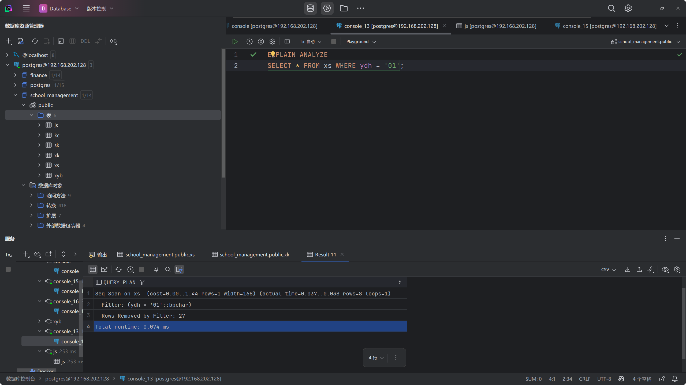

可以看到，查询计划显示了 `Seq Scan` 操作，表示全表扫描。


下面我们执行一个比较复杂的查询计划，来观测索引的效果。


```sql
EXPLAIN ANALYZE
SELECT
    xyb.ymc AS 学院名称,
    COUNT(DISTINCT xs.xh) AS 学生人数
FROM
    xk
        JOIN
    xs ON xk.xh = xs.xh
        JOIN
    kc ON xk.kcbh = kc.kcbh
        JOIN
    xyb ON xs.ydh = xyb.ydh
WHERE
    kc.lx = '必修'
GROUP BY
    xyb.ymc
ORDER BY
    学生人数 DESC;
```


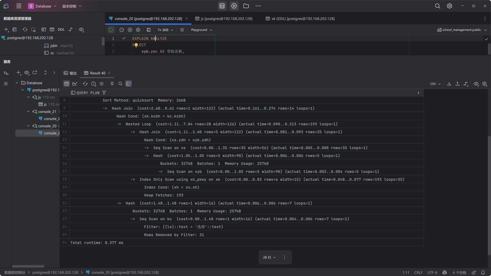

`Total runtime: 0.377 ms` 表示查询总共花费了 0.377 毫秒。


我们尝试删除索引，看看查询计划的变化。

```sql
DROP INDEX idx_xk_cj;
DROP INDEX idx_js_ydh;
DROP INDEX idx_kc_lx;
DROP INDEX idx_xs_ydh;
```


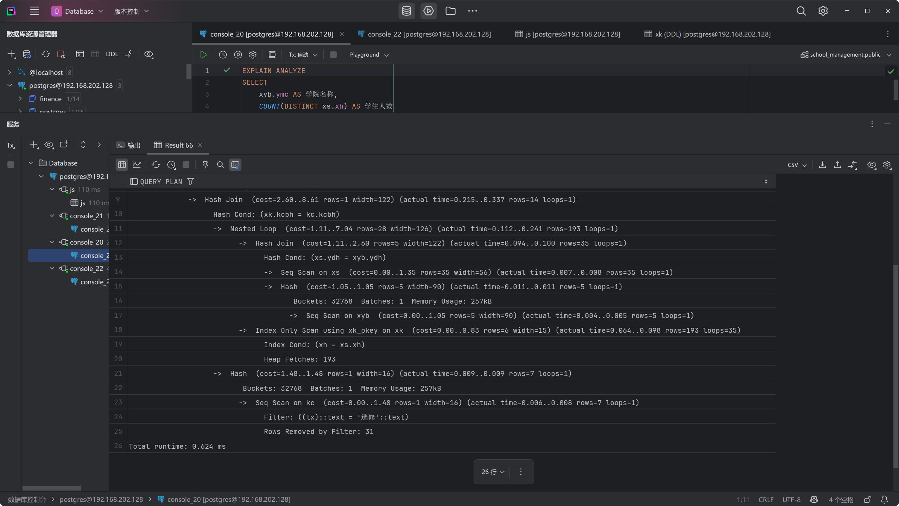

`Total runtime: 0.624 ms` 表示查询总共花费了 0.624 毫秒。

可以看到，效率提升了很多。

### 索引效率比较

这里给一个比较明显的例子，来比较索引的效率。

```sql
create schema tmp;

-- 创建一个测试表
CREATE TABLE tmp.test_table
(
    id   SERIAL PRIMARY KEY,
    name VARCHAR(100),
    age  INT
);

-- 插入1000000条数据
INSERT INTO tmp.test_table (name, age)
SELECT 'User_' || i, (random() * 100)::INT
FROM generate_series(1, 1000000) AS i;

```

#### 不使用索引

```sql
EXPLAIN ANALYZE
SELECT * FROM tmp.test_table WHERE age = 42;
```

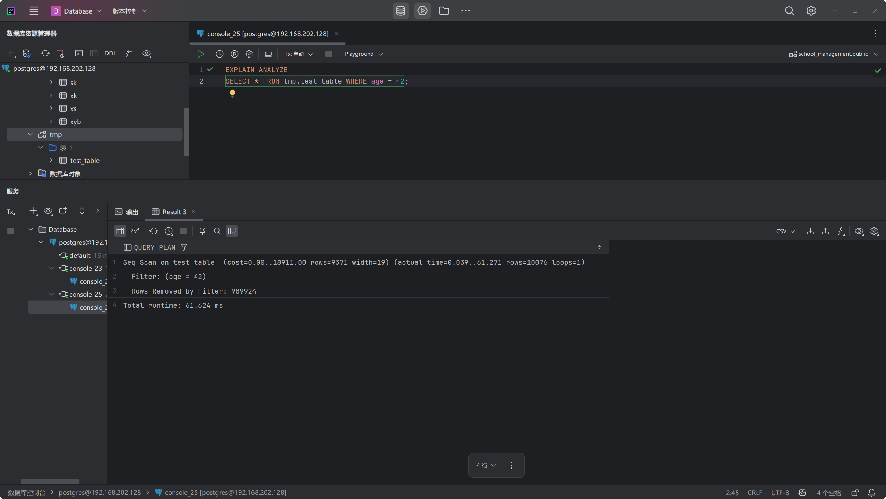

可以看到，查询计划显示了 `Seq Scan` 操作，表示全表扫描。

`Total runtime: 61.624 ms` 表示查询总共花费了 61.624 毫秒。


#### 使用索引

```sql
CREATE INDEX idx_test_table_age ON tmp.test_table (age);
```

```sql
EXPLAIN ANALYZE
SELECT * FROM tmp.test_table WHERE age = 42;
```

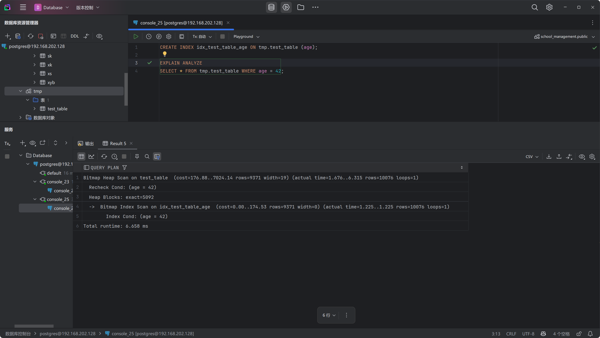

可以看到，查询计划显示了 `Bitmap Index Scan` 操作，表示使用位图索引扫描。

`Total runtime: 6.658 ms` 表示查询总共花费了 6.658 毫秒。

在数据量较大的情况下，索引的效率提升非常明显。

## 权限管理

### 普通用户

目前我们用的 `omm` 和 `rinai` 都是 `SYSADMIN` 用户，拥有最高权限。

```sql
CREATE USER reina WITH PASSWORD 'password';
```

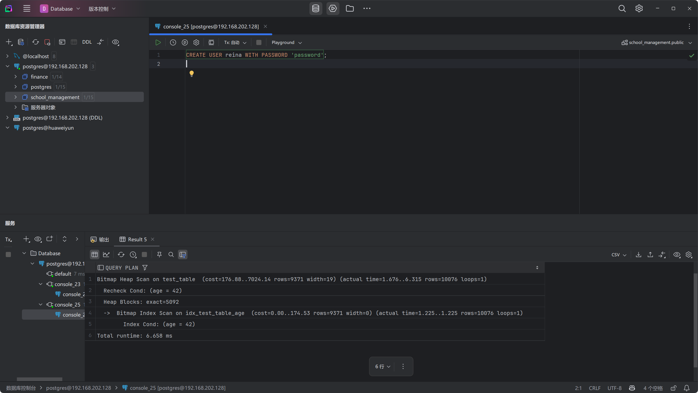

我们用 `reina` 用户登录数据库。

```bash
psql -h 192.168.202.128 -p 5432 -U reina -d postgres
```

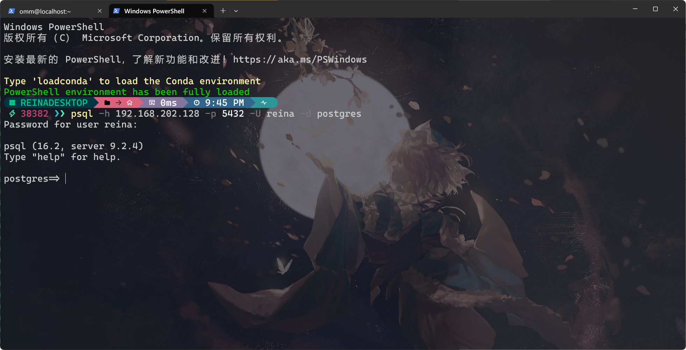


#### 创建一样的表
切换到 `school_management` 数据库。

```sql
\c school_management
```

```sql
create schema tmp;
CREATE TABLE tmp.test_table (
    id SERIAL PRIMARY KEY,
    name VARCHAR(100),
    age INT
);
```

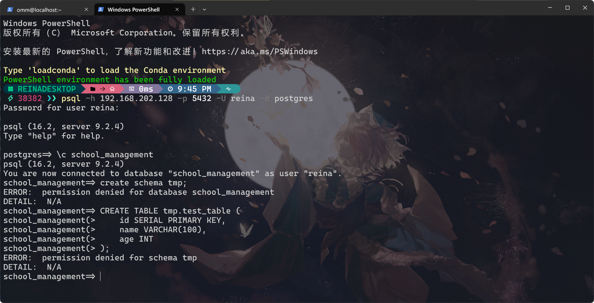

发现 `reina` 用户没有权限创建表和 `schema`。

#### 创建别的数据库

```sql
CREATE DATABASE test;
```
发现也是
```
ERROR:  permission denied to create database
```
即没有权限创建数据库。

#### 创建别的表

```sql
CREATE TABLE test_table (
    id SERIAL PRIMARY KEY,
    name VARCHAR(100),
    age INT
);
```

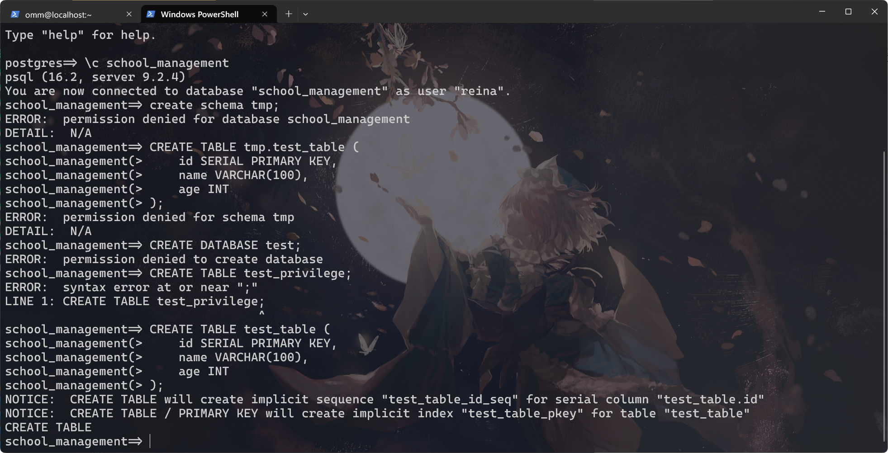

成功创建表。

#### 在表中插入数据

##### 自建表

```sql
INSERT INTO test_table (name, age) VALUES ('Alice', 20);
```

##### 他人建的表

```sql
INSERT INTO xyb VALUES ('06', '马克思学院');
```


可以看到 `reina` 用户无法在 `xyb` 表中插入数据。但是在自己建的表中可以插入数据。


#### 在表中查询数据

##### 自建表

```sql
SELECT * FROM test_table;
```

##### 他人建的表

```sql
SELECT * FROM xyb;
```

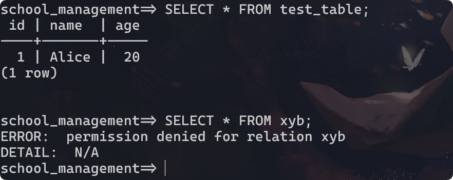

可以看到 `reina` 用户没法查询 `xyb` 表。

### 管理员用户

直接使用 `rinai` 用户登录数据库。

```bash
psql -h 192.168.202.128 -p 5432 -U rinai -d school_management
```

#### 查询数据

```sql
SELECT * FROM test_table;
```


发现不存在 `test_table` 表。

我们使用 `\dn+` 查看当前数据库中的所有 `schema`。


发现存在一个 `schema` 叫 `reina`，由 `reina` 用户创建。

所以 `reina` 用户在创建表时，默认创建在 `reina` 这个 `schema` 下。

尝试 
```sql
SELECT * FROM reina.test_table;
```

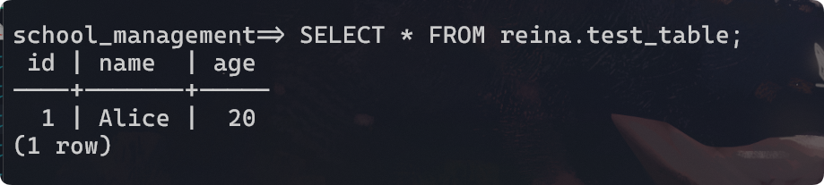

可以正确的查询到 `test_table` 表。

#### 插入数据

```sql
INSERT INTO reina.test_table (name, age) VALUES ('Bob', 18);
```

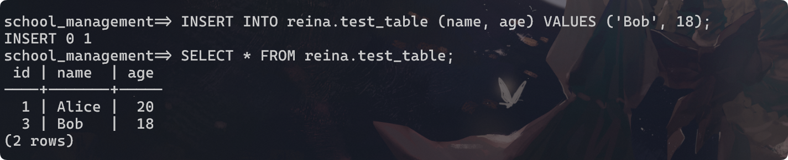

可以正确的插入数据。

#### 创建同名表

```sql
CREATE TABLE reina.test_table (
    id SERIAL PRIMARY KEY,
    name VARCHAR(100),
    age INT
);
```

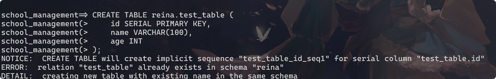

没有权限问题，但是会报错（因为不能重复创建同名表）。

### 权限问题总结

以上实验证实了普通用户 `reina` 可以查询和插入自己创建的表，但是无法查询和插入他人创建的表。更无法创建和他人一样的表。

`reina` 用户创建的表默认在 `reina` 这个 `schema` 下。

而 `SYSADMIN` 用户可以查询和插入任意 `schema` 下的表。


### 授权方案

为了实现更细粒度的权限管理，我们需要为普通用户和管理员用户定义不同的授权方案。以下是具体的授权方案设计：

#### 普通用户的授权方案
1. **表级权限**：
   - 普通用户只能对自己的表进行操作（如插入、查询、更新、删除）。
   - 普通用户不能对他人创建的表进行任何操作，除非被显式授权。
2. **Schema 级权限**：
   - 每个普通用户在创建表时，默认使用自己的 `schema`（与用户名相同）。
   - 普通用户不能创建新的 `schema`，也不能修改或删除其他用户的 `schema`。
3. **数据库级权限**：
   - 普通用户不能创建新的数据库。
4. **跨用户访问**：
   - 如果需要让普通用户访问其他用户的表，可以通过 `GRANT` 语句显式授权。

#### 管理员用户的授权方案
1. **全局权限**：
   - 管理员用户可以访问和操作任意 `schema` 下的表。
   - 管理员用户可以创建、修改和删除任意 `schema`。
2. **数据库管理权限**：
   - 管理员用户可以创建和删除数据库。
3. **用户管理权限**：
   - 管理员用户可以创建、修改和删除普通用户。
   - 管理员用户可以为普通用户分配权限。

#### 实施授权方案

##### 普通用户初始权限

```sql
-- 为普通用户分配连接数据库的权限
GRANT CONNECT ON DATABASE school_management TO reina;

-- 为普通用户分配创建表的权限
GRANT CREATE ON SCHEMA public TO reina;

-- 为普通用户分配对其自己 schema 的所有权限
ALTER DEFAULT PRIVILEGES IN SCHEMA reina GRANT ALL PRIVILEGES ON TABLES TO reina;
```


##### 管理员用户权限

```sql
-- 为管理员用户分配 SYSADMIN 权限
ALTER USER rinai WITH SYSADMIN;
```
以上命令在很久之前就已经执行过了。

##### 显式授权普通用户访问他人表

假设管理员用户希望让普通用户 `reina` 访问 `xyb` 表，可以执行以下授权操作：

```sql
-- 授予普通用户对特定表的查询权限
GRANT SELECT ON TABLE xyb TO reina;

-- 授予普通用户对特定表的插入权限
GRANT INSERT ON TABLE xyb TO reina;

-- 授予普通用户对特定表的更新权限
GRANT UPDATE ON TABLE xyb TO reina;

-- 授予普通用户对特定表的删除权限
GRANT DELETE ON TABLE xyb TO reina;
```

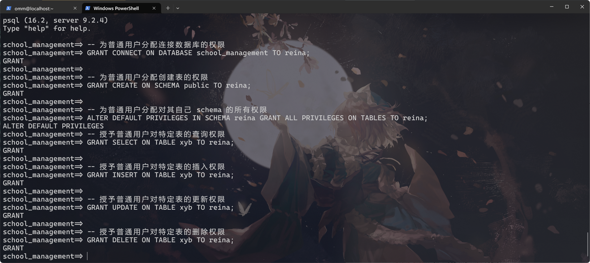

##### 撤销权限

如果需要撤销普通用户对某些表的权限，可以使用 `REVOKE` 语句。例如，撤销 `reina` 用户对 `xyb` 表的插入权限：

```sql
REVOKE INSERT ON TABLE xyb FROM reina;
```

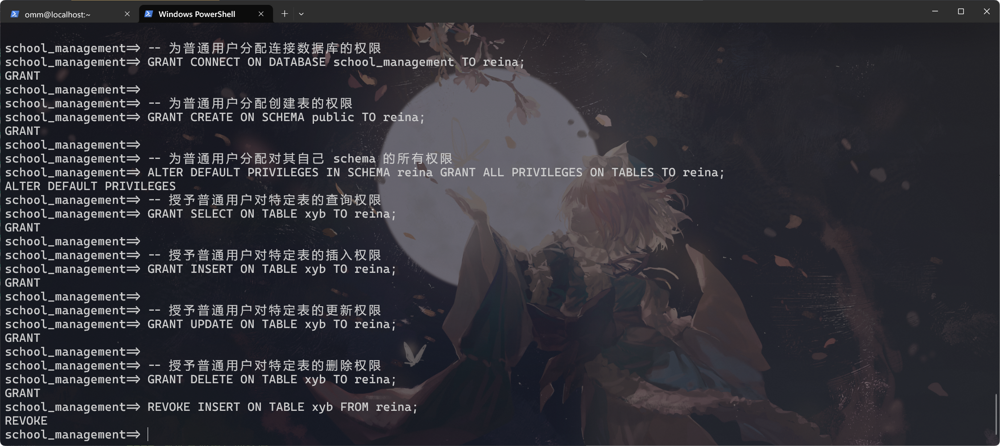


#### 验证授权方案

##### 验证普通用户的权限

###### 普通用户对自己表的操作

```sql
-- 切换到普通用户 reina
\c school_management reina

-- 创建表
CREATE TABLE test_table (
    id SERIAL PRIMARY KEY,
    name VARCHAR(100),
    age INT
);

-- 插入数据
INSERT INTO test_table (name, age) VALUES ('Alice', 20);

-- 查询数据
SELECT * FROM test_table;
```

**预期结果**：普通用户可以成功创建表、插入数据并查询数据。

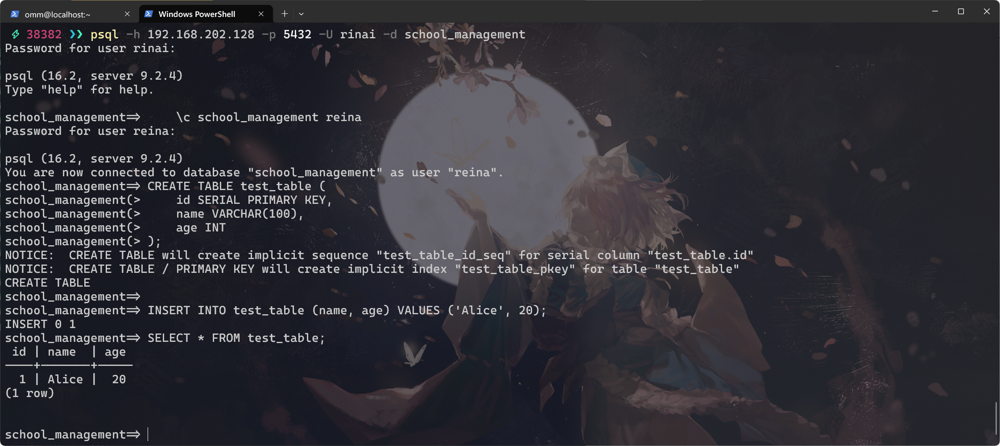

###### 普通用户对他人表的操作（未授权）

```sql
-- 尝试插入数据到他人表
INSERT INTO xyb VALUES ('06', '马克思学院');

-- 尝试查询他人表
SELECT * FROM xyb;
```

**预期结果**：普通用户无法插入数据，提示权限不足，但是有权限查询。


###### 普通用户对他人表的操作（已授权）

管理员用户执行以下授权操作后：

```sql
GRANT INSERT ON TABLE xyb TO reina;
```

普通用户再次尝试：

```sql
-- 插入数据
INSERT INTO xyb VALUES ('06', '马克思学院');
```

**预期结果**：普通用户可以成功插入数据并查询他人表。

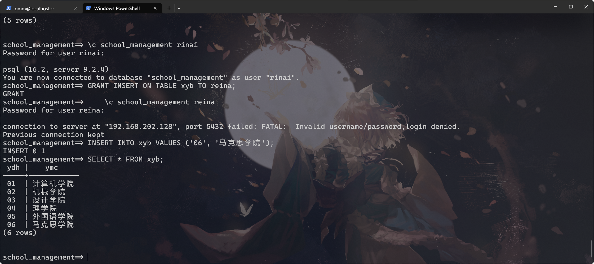

##### 验证管理员用户的权限

###### 管理员用户对任意表的操作

```sql
-- 切换到管理员用户 rinai
\c school_management rinai

-- 查询普通用户创建的表
SELECT * FROM test_table;

-- 插入数据到普通用户创建的表
INSERT INTO test_table (name, age) VALUES ('Bob', 18);
```
注意：这里创建的 `test_table` 表在 `public` 这个 `schema` 下。因为我们在普通用户初始权限中，授予了普通用户创建表的权限。

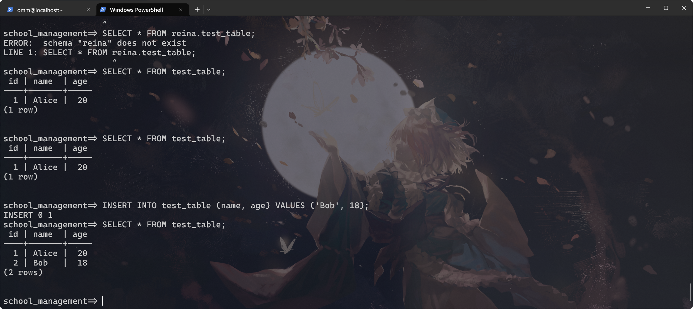

**预期结果**：管理员用户可以成功查询和插入普通用户创建的表。

###### 管理员用户创建新数据库

```sql
-- 创建新数据库
CREATE DATABASE test_db;

-- 切换到新数据库
\c test_db
```

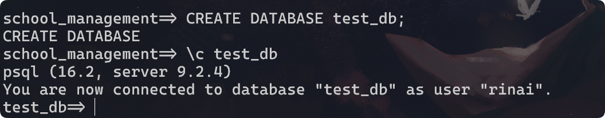

**预期结果**：管理员用户可以成功创建并切换到新数据库。


### 总结

通过以上实验，我们验证了授权方案的有效性：

1. 普通用户只能操作自己创建的表，无法访问他人表，除非被显式授权。
2. 管理员用户拥有全局权限，可以访问和操作任意表，同时可以创建和管理数据库。
3. 使用 `GRANT` 和 `REVOKE` 语句可以灵活地控制权限分配。

这种授权方案能够满足大多数场景下的权限管理需求，确保数据的安全性和可操作性。

至此，实验三完成。

## 实验总结

本次实验主要完成了以下内容：

1. **数据分区表管理**
   - 创建了专用的表空间和 Schema
   - 实现了基于日期范围的分区表创建
   - 完成了分区表的数据插入和查询操作
   - 学习了分区表的管理和维护方法
2. **主键和外键约束实践**
   - 验证了主键约束对数据唯一性的保证
   - 测试了外键约束在数据完整性方面的作用
   - 实践了主表和子表数据的删除顺序要求
   - 掌握了使用子查询进行数据更新和删除的方法
3. **索引优化与查询计划**
   - 创建并测试了多种类型的索引
   - 分析了不同查询场景下索引的效果
   - 使用 EXPLAIN ANALYZE 研究查询执行计划
   - 对比了有索引和无索引情况下的查询性能
   - 实践证明了在大数据量场景下索引的重要性
4. **数据库权限管理**
   - 创建和管理普通用户账户
   - 测试不同用户对数据库对象的访问权限
   - 实践了用户 Schema 的自动创建和使用
   - 验证了不同权限级别用户的操作限制
   - 学习了权限授予和回收的管理方法
5. **技术要点与优化**
   - 掌握了数据库物理设计的基本原则
   - 理解了索引对查询性能的影响机制
   - 学会了通过查询计划分析性能瓶颈
   - 掌握了数据库安全管理的基本方法

通过本次实验，我们深入理解了数据库物理设计的重要性，掌握了数据库性能优化和安全管理的基本技能。特别是在索引优化和权限管理方面的实践，为后续的数据库应用开发和管理工作打下了坚实的基础。实验中的分区表管理和查询优化经验，对提高大规模数据库系统的运维能力具有重要意义。 
