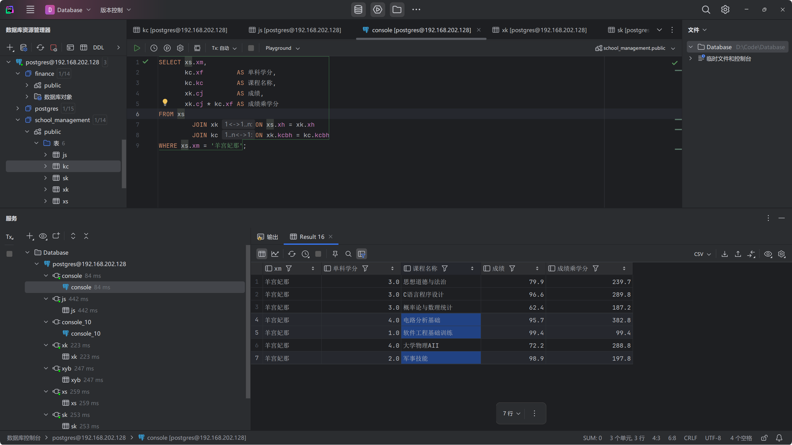

## 实验要求

实验名：数据库查询
任务：
- 连接数据库
  - 使用 `putty` 和 `DataStudio` 连接 `Gauss` 数据库
  - 通过连接工具使用 `SQL` 建立数据库
  - 使用 `psql` 命令远程连接 `Gauss` 数据库
  - 使用 `DataGrip` 图形化工具连接 `Gauss` 数据库
- 数据库操作
  - 使用“INSERT”语句向主表插入至少5行数据，向子表插入至少30行数据；
  - 在子表中输入含有不存在外键值的数据, 观察数据库系统的反应
  - 使用SELECT \* FROM ……观察数据；
  - 使用所有学习的查询语句对表格的进行查询（自拟题目）；
    - 查询`羊宫妃那`的总学分和加权平均分
    - 查询没有授课的教师姓名和教师编号
    - 按学生修得选修课的总学分降序排序
    - 查询被`皮卡丘`老师教授的学生姓名和学号
    - 查询所有课程成绩加权平均分大于80分的同学的姓名和成绩
    - 查询加权平均分最高的10名同学的姓名和加权平均分
  - 更新部分学生的学籍情况、成绩；
  - 删除部分同学的学籍信息；

## 连接数据库

如实验一所述，连接数据库的步骤如下：


### ssh 连接 openEuler

#### PowerShell 连接 openEuler

`Windows Terminal` 目前已经做的非常好了，可以直接使用 `PowerShell` 连接 `openEuler`，比较方便和比较美观（快捷键 / 剪切板 / 终端主题）

```bash
ssh rinai@192.168.137.250
```

然后输入密码就好了


#### VsCode / Cursor 连接 openEuler
`VsCode` 配置了一套非常强大的 `SSH` 连接功能，可以非常方便的连接到 `openEuler`，可以管理文件树和自动转发端口，开发效率非常高。


直接增加数据源就好了，然后类型选择 `PostgreSQL`，然后输入连接信息。


### 使用 `psql` 连接数据库

由于 openGauss 基于 `PostgreSQL`，所以可以使用 `psql` 连接数据库。

`psql` 工具在安装 `PostgreSQL` 时会自动安装，在 `bin` 目录下（会安装到 PATH 环境变量中）

```bash
psql  -h 192.168.137.250 \ # 连接地址
      -p 5432  \ # 连接端口
      -U rinai \ # 连接用户
      -d postgres \ # 连接数据库
```

即可连接到 `openEuler` 虚拟机上的 `openGauss` `postgres` 数据库。


### 使用 `DataGrip` 连接数据库


`DataGrip` 是 `JetBrains` 出品的一款数据库管理工具，支持多种数据库。

兼容性非常好，而且功能十分强大，界面也很美观现代。


直接增加数据源就好了，然后类型选择 `PostgreSQL`，然后输入连接信息。


## 数据库操作

### 数据库构成

在实验一中已经建立了数据库，实验二中需要向数据库中插入数据。

这是目前数据库的结构：
```sql
-- 由 DataGrip 自动生成
create table xyb
(
    ydh char(2)     not null    -- 主键：院代号
        primary key,
    ymc varchar(30) not null    -- 属性：院名称
)

create table xs
(
    xm   varchar(12)   not null,   -- 属性：姓名
    xh   char(10)     not null,    -- 主键：学号
        primary key,
    ydh  char(2)
        references xyb,
    bj   varchar(8),             -- 属性：班级
    chrq timestamp(0) not null,  -- 属性：出生日期
    xb   char(6)                 -- 属性：性别
)

create index idx_xs_ydh          -- 索引：学生表 -> 院代号
    on xs (ydh);

create table kc
(
    kcbh char(3)     not null,    -- 主键：课程编号
        primary key,
    kc   varchar(30) not null,    -- 属性：课程名称
    lx   varchar(10),             -- 属性：类型
    xf   numeric(5, 1)            -- 属性：学分
)

create index idx_kc_lx          -- 索引：课程表 -> 类型
    on kc (lx);

create table js
(
    xm   varchar(12) not null,    -- 属性：姓名
    jsbh char(10)   not null,    -- 主键：教师编号
        primary key,
    zc   varchar(12),             -- 属性：职称
    ydh  char(2)
        references xyb           -- 外键：院代号
)

create index idx_js_ydh          -- 索引：教师表 -> 院代号
    on js (ydh);

create table sk
(
    kcbh char(3)  not null,    -- 主键：课程编号
        references kc,
    bh   char(10) not null,    -- 主键：教师编号
        references js,
    primary key (kcbh, bh)
)

create index idx_sk_bh         -- 索引：授课表 -> 教师编号
    on sk (bh);

create table xk
(
    xh   char(10) not null    -- 主键：学号
        references xs,
    kcbh char(3)  not null    -- 主键：课程编号
        references kc,
    cj   numeric(5, 1),       -- 属性：成绩
    primary key (xh, kcbh)
)

```

### 插入数据

#### 插入学院数据（主表）
向 `xyb` 表插入学院数据，确保每个学院的 `ydh` 是唯一的。

```sql
INSERT INTO xyb (ydh, ymc)
VALUES ('01', '计算机学院'),
       ('02', '机械学院'),
       ('03', '设计学院'),
       ('04', '理学院'),
       ('05', '外国语学院');
```


#### 插入学生数据（子表）
向 `xs` 表插入学生数据，确保每个学生的 `ydh` 是 `xyb` 表中存在的值。

一共 35 行数据
```sql

INSERT INTO xs (xm, xh, ydh, bj, chrq, xb)
VALUES ('羊宫妃那', '1120201234', '01', '08012301', '2002-03-26', '女'),
       ('高松灯', '1120221437', '02', '02012302', '2002-11-22', '女'),
       ('洛琪希', '1120221438', '03', '03012303', '2002-12-23', '女'),
       ('鲁迪乌斯', '1120221439', '04', '04012304', '2003-01-24', '男'),
       ('七海千秋', '1120221440', '05', '05012305', '2003-02-25', '女'),
       ('丸山彩', '1120221441', '01', '01012301', '2003-03-26', '女'),
       ('芝麻凛', '1120221442', '02', '02012302', '2003-04-27', '女'),
       ('后藤一里', '1120221443', '03', '03012303', '2003-05-28', '女'),
       ('马西洛', '1120221444', '04', '04012304', '2003-06-29', '男'),
       ('仓田真白', '1120221445', '05', '05012305', '2003-07-30', '女'),
       ('近藤天音', '1120221446', '01', '01012301', '2003-08-31', '女'),
       ('反田叶月', '1120221447', '02', '02012302', '2003-09-11', '女'),
       ('陈', '1120221448', '03', '03012303', '2003-10-12', '男'),
       ('Skadi', '1120221449', '04', '04012304', '2003-11-13', '女'),
       ('松前绪花', '1120221450', '05', '05012305', '2003-12-14', '女'),
       ('坂田银时', '1120221451', '01', '01012301', '2004-01-15', '男'),
       ('神楽', '1120221452', '02', '02012302', '2004-02-16', '女'),
       ('冲田总悟', '1120221453', '03', '03012303', '2004-03-17', '男'),
       ('桂小太郎', '1120221454', '04', '04012304', '2004-04-18', '男'),
       ('志村妙', '1120221455', '05', '05012305', '2004-05-19', '女'),
       ('志村新八', '1120221456', '01', '01012301', '2004-06-07', '男'),
       ('Saki', '1120221475', '05', '05012305', '2004-05-08', '女'),
       ('定春', '1120221457', '02', '02012302', '2004-07-09', '男'),
       ('伊丽莎白', '1120221458', '03', '03012303', '2004-08-07', '女'),
       ('高杉晋助', '1120221460', '05', '05012305', '2004-10-06', '男'),
       ('近藤勋', '1120221461', '01', '01012301', '2004-11-05', '男'),
       ('三澄美琴', '1120221462', '02', '02012302', '2004-12-04', '女'),
       ('石原里美', '1120221463', '03', '03012303', '2004-01-03', '女'),
       ('小池荣子', '1120221464', '04', '04012304', '2004-04-02', '女'),
       ('松本润', '1120221465', '05', '05012305', '2004-05-01', '男'),
       ('冈田准一', '1120221466', '01', '01012301', '2004-06-01', '男'),
       ('小栗旬', '1120221467', '02', '02012302', '2004-07-02', '男'),
       ('高坂丽奈', '1120221468', '03', '03012303', '2004-08-01', '女'),
       ('桥本环奈', '1120221470', '05', '05012305', '2004-10-03', '女'),
       ('Reina', '1120221471', '01', '01012301', '2004-11-02', '女');
```


#### 插入课程数据（主表）
向 `kc` 表插入课程数据，确保每个课程的 `kcbh` 是唯一的。

共 38 行数据

```sql
INSERT INTO kc (kcbh, kc, lx, xf)
VALUES ('001', '工程制图C', '必修', 2),
       ('002', '大学计算机', '必修', 2),
       ('003', '线性代数B', '必修', 3),
       ('004', '工科数学分析I', '必修', 6),
       ('005', '知识产权法基础', '必修', 1),
       ('006', '学术用途英语一级', '必修', 3),
       ('007', '形势与政策I', '必修', 0.25),
       ('008', '思想道德与法治', '必修', 3),
       ('009', '体育/身体综合训练', '选修', 0.5),
       ('010', '国家安全概论', '必修', 1),
       ('011', '大学生心理素质发展', '必修', 0),
       ('012', '军事理论', '必修', 2),
       ('013', '军事技能', '必修', 2),
       ('014', '电路分析基础', '必修', 4),
       ('015', 'C语言程序设计', '必修', 3),
       ('016', '工科数学分析II', '必修', 6),
       ('017', '大学物理AI', '必修', 4),
       ('018', '物理实验BI', '必修', 1),
       ('019', '学术用途英语二级', '必修', 3),
       ('020', '中国近现代史纲要', '必修', 3),
       ('021', '形势与政策II', '必修', 0.25),
       ('022', '习近平思想概论', '必修', 3),
       ('023', '体育/拳击', '选修', 0.5),
       ('024', '数据结构与算法设计', '必修', 5),
       ('025', '离散数学', '必修', 4),
       ('026', '程序设计方法实践', '必修', 2),
       ('027', '互联网应用开发基础训练', '必修', 1),
       ('028', '软件工程基础训练', '必修', 1),
       ('029', '交互式计算机图形学', '选修', 2),
       ('030', '概率论与数理统计', '必修', 3),
       ('031', '大学物理AII', '必修', 4),
       ('032', '物理实验BII', '必修', 1),
       ('033', '形势与政策III', '必修', 0.25),
       ('034', '马克思主义基本原理', '必修', 3),
       ('035', '体育/柔道', '选修', 0.5),
       ('036', '视听练耳', '选修', 2),
       ('037', '专利信息与科技创新', '选修', 2),
       ('038', '中共党史', '选修', 1);
```


#### 插入教师数据（子表）
向 `js` 表插入教师数据，确保每个教师的 `ydh` 是 `xyb` 表中存在的值。

一共 30 行数据

```sql
INSERT INTO js (xm, jsbh, zc, ydh)
VALUES ('妙蛙种子', 'CA0001', '草+毒', '01'),
       ('妙蛙草', 'CA0002', '草+毒', '01'),
       ('妙蛙花', 'CA0003', '草+毒', '01'),
       ('小火龙', 'HU0001', '火', '02'),
       ('火恐龙', 'HU0002', '火', '02'),
       ('喷火龙', 'HU0003', '火+飞', '02'),
       ('杰尼龟', 'SH0001', '水', '03'),
       ('卡咪龟', 'SH0002', '水', '03'),
       ('水箭龟', 'SH0003', '水', '03'),
       ('绿毛虫', 'CH0001', '虫', '04'),
       ('铁甲蛹', 'CH0002', '虫', '04'),
       ('巴大蝶', 'CH0003', '虫+飞', '04'),
       ('独角虫', 'CH0004', '虫+毒', '04'),
       ('铁壳蛹', 'CH0005', '虫+毒', '04'),
       ('大针蜂', 'CH0006', '虫+毒', '04'),
       ('波波', 'PU0001', '普+飞', '05'),
       ('比比鸟', 'PU0002', '普+飞', '05'),
       ('大比鸟', 'PU0003', '普+飞', '05'),
       ('小拉达', 'PU0004', '普', '05'),
       ('拉达', 'PU0005', '普', '05'),
       ('烈雀', 'PU0006', '普+飞', '05'),
       ('大嘴雀', 'PU0007', '普+飞', '05'),
       ('阿柏蛇', 'PO0001', '毒', '01'),
       ('阿柏怪', 'PO0002', '毒', '01'),
       ('皮卡丘', 'EL0001', '电', '02'),
       ('雷丘', 'EL0002', '电', '02'),
       ('穿山鼠', 'SA0001', '地', '03'),
       ('穿山王', 'SA0002', '地', '03'),
       ('尼多兰', 'NI0001', '毒', '04'),
       ('尼多娜', 'NI0002', '毒', '04');
```


#### 插入授课数据（子表）
向 `sk` 表插入授课数据，确保每个授课的 `kcbh` 和 `bh` 是 `kc` 和 `js` 表中存在的值。

一共 33 行数据

```sql
INSERT INTO sk (kcbh, bh)
VALUES ('001', 'CA0001'),
       ('002', 'HU0003'),
       ('003', 'SH0001'),
       ('004', 'CH0001'),
       ('005', 'PU0002'),
       ('006', 'PO0001'),
       ('007', 'EL0001'),
       ('008', 'SA0001'),
       ('009', 'NI0001'),
       ('010', 'PU0003'),
       ('011', 'PO0001'),
       ('012', 'EL0001'),
       ('013', 'SA0001'),
       ('014', 'NI0002'),
       ('015', 'PU0001'),
       ('016', 'PO0001'),
       ('017', 'EL0001'),
       ('018', 'SA0001'),
       ('019', 'NI0002'),
       ('020', 'PU0001'),
       ('021', 'PO0001'),
       ('022', 'EL0001'),
       ('023', 'SA0001'),
       ('024', 'NI0001'),
       ('025', 'PU0001'),
       ('026', 'PO0001'),
       ('027', 'EL0001'),
       ('028', 'SA0001'),
       ('029', 'NI0001'),
       ('030', 'PU0001'),
       ('031', 'PO0001'),
       ('032', 'EL0001'),
       ('033', 'SA0001');

```


#### 插入学生选课数据（子表）
向 `xk` 表插入学生选课数据，确保每个学生的 `xh` 和 `kcbh` 是 `xs` 和 `kc` 表中存在的值。

一共 200 行数据

```sql
INSERT INTO xk (xh, kcbh, cj)
VALUES ('1120221466', '032', 89.5),
       ('1120221446', '002', 69.8),
       ('1120221464', '020', 88.0),
       ('1120221447', '025', 65.5),
        ...
       ('1120221465', '014', 90.7),
       ('1120221448', '022', 65.2);

```


### 外键约束测试

#### 测试
在子表中输入含有不存在外键值的数据；


```sql
INSERT INTO xs (xm, xb, xh, ydh, bj, chrq)
VALUES ('Roxy', '女', '19198101', NULL, '08012303', '2003-03-26');

INSERT INTO xs (xm, xb, xh, ydh, bj, chrq)
VALUES ('Ereina', '女', '19198102', "cb", '08012303', '2003-03-26');

INSERT INTO js (xm, jsbh, zc, ydh)
VALUES ('甲贺忍蛙', 'JH0001', '水+恶', NULL);

INSERT INTO js (xm, jsbh, zc, ydh)
VALUES ('喷火龙X', 'PH0001', '火+龙', "cb");

INSERT INTO xk (xh, kcbh, cj)
VALUES ('19198101', 'qwq', 99.9);
```

#### 日志信息


可以看到
```sql
INSERT INTO xs (xm, xb, xh, ydh, bj, chrq)
VALUES ('Roxy', '女', '19198101', NULL, '08012303', '2003-03-26');

INSERT INTO js (xm, jsbh, zc, ydh)
VALUES ('甲贺忍蛙', 'JH0001', '水+恶', NULL);
```
不会报错，而另外三条语句会报错。

#### 结论
因此可以得出结论：

1. 外键字段为 `NULL` 时：
  - 外键字段允许为 `NULL`，表示“未引用任何值”。
  - 当外键字段为 `NULL` 时，外键约束不会被触发。
2. 外键字段为非 `NULL` 值时：
  - 外键字段的值必须存在于被引用表的主键或唯一键中。
  - 如果值不存在，则会违反外键约束。

### 使用 `SQL` 语句查询

#### `SELECT * FROM ...`

`SELECT * FROM ...` 这条语句是查询所有列的语句，可以在这条语句后面添加 `WHERE` 子句来查询符合条件的数据。

如果需要查询指定列，可以在 `SELECT` 后面添加列名，用逗号隔开。

#### 查询所有列

```sql
SELECT * FROM xs;
```


可以看到查询结果为所有列。


#### 查询特定行条件的所有列

查询性别为男的学生信息

```sql
SELECT * FROM xs WHERE xb = '男';
```


#### 查询指定列

查询学生姓名和学号

```sql
SELECT xm, xh FROM xs WHERE xb = '男';
```


可以看到查询结果为学生姓名和学号。


#### 自拟查询

##### 查询 `羊宫妃那` 的总学分和加权平均分


首先查询 `羊宫妃那` 的所有课程条目
```sql
SELECT xs.xm,
       kc.xf         AS 单科学分,
       kc.kc         AS 课程名称,
       xk.cj         AS 成绩,
       xk.cj * kc.xf AS 成绩乘学分
FROM xs
         JOIN xk ON xs.xh = xk.xh
         JOIN kc ON xk.kcbh = kc.kcbh
WHERE xs.xm = '羊宫妃那';
```



解释：
+ `JOIN xk ON xs.xh = xk.xh` - 通过学号(`xh`)连接学生表和选课表，建立一对多关系(一个学生可以选多门课)
+ `JOIN kc ON xk.kcbh = kc.kcbh` - 通过课程编号(kcbh)连接选课表和课程表，建立多对一关系(多门选课记录对应同一门课程)
+ `WHERE xs.xm = '羊宫妃那'` - 筛选条件，只查询姓名为"羊宫妃那"的学生记录


查询 `羊宫妃那` 的总学分和加权平均分

```sql
SELECT SUM(kc.xf)                      AS 总学分,
       SUM(xk.cj * kc.xf) / SUM(kc.xf) AS 加权平均分
FROM xs
         JOIN xk ON xs.xh = xk.xh
         JOIN kc ON xk.kcbh = kc.kcbh
WHERE xs.xm = '羊宫妃那';
```


解释：
1. 使用相同的表连接方式获取"羊宫妃那"的选课和课程信息
2. `SUM(kc.xf)` - 计算所有课程学分的总和，即总学分
3. `SUM(xk.cj * kc.xf) / SUM(kc.xf)` - 计算加权平均分：
  - 分子：每门课程的成绩乘以该课程的学分，然后求和
  - 分母：所有课程的学分总和

查得 `羊宫妃那` 的总学分是 `20` 分，加权平均分是 `84.275` 分。

与上面查询结果一致。

##### 查询没有授课的教师姓名和教师编号

简单版：
```sql
SELECT js.xm, js.jsbh
FROM js
WHERE js.jsbh NOT IN (SELECT bh FROM sk);
```


解释：
1. 使用 `NOT IN` 子句查询没有授课的教师
2. `js.jsbh NOT IN (SELECT bh FROM sk)` 表示教师编号不在授课表中

复杂版：
```sql
SELECT js.xm   AS 教师姓名,
       js.jsbh AS 教师编号
FROM js
         LEFT JOIN sk ON js.jsbh = sk.bh
WHERE sk.bh IS NULL;
```


解释：
1. 使用 `LEFT JOIN` 连接教师表和授课表
  - `LEFT JOIN` 会返回所有教师记录，即使授课表中没有授课记录，在授课表中对应的列会显示为 `NULL`
2. `WHERE sk.bh IS NULL` 表示只查询授课表中没有授课的教师

总体来说，第二种虽然更复杂，但是更符合实际需求，且性能更好。

##### 按学生修得选修课的总学分降序排序

```sql
SELECT xs.xm                   AS 姓名,
       xs.xh                   AS 学号,
       COALESCE(SUM(kc.xf), 0) AS 总学分
FROM xs
         LEFT JOIN xk ON xs.xh = xk.xh
         LEFT JOIN kc ON xk.kcbh = kc.kcbh AND kc.lx = '选修'
GROUP BY xs.xm, xs.xh
ORDER BY 总学分 DESC;
```


解释：
1. 使用 `LEFT JOIN` 连接学生表和选课表、选课表和课程表，保留那些没有选课的学生
2. 使用 `GROUP BY` 按照学生姓名和学号分组
3. 使用 `ORDER BY` 按照总学分降序排序
4. 使用 `COALESCE` 处理 `NULL` 值，如果学生没有选课，则总学分为 `0`

##### 查询被`皮卡丘`老师教授的学生姓名和学号

```sql
SELECT DISTINCT xs.xm AS 学生姓名,
                xs.xh AS 学号
FROM xs
         JOIN xk ON xs.xh = xk.xh
         JOIN sk ON xk.kcbh = sk.kcbh
         JOIN js ON sk.bh = js.jsbh
WHERE js.xm = '皮卡丘';
```


解释：
1. 使用 `DISTINCT` 去重
2. 使用 `JOIN` 连接学生表、选课表、授课表和教师表
3. 使用 `WHERE` 筛选条件，只查询被`皮卡丘`老师教授的学生

##### 查询所有课程成绩加权平均分大于80分的同学的姓名和成绩

```sql
SELECT xs.xm                           AS 姓名,
       SUM(xk.cj * kc.xf) / SUM(kc.xf) AS 加权平均分
FROM xs
         JOIN xk ON xs.xh = xk.xh
         JOIN kc ON xk.kcbh = kc.kcbh
GROUP BY xs.xm
HAVING 加权平均分 > 80;
```


解释：
1. 使用 `GROUP BY` 按照学生姓名分组
2. 使用 `HAVING` 筛选条件，只查询加权平均分大于80分的同学
  - `WHERE` 适用于在分组前筛选，`HAVING` 适用于在分组后筛选
3. 使用 `SUM` 计算总学分和加权平均分


##### 查询加权平均分最高的10名同学的姓名和加权平均分

```sql
SELECT xs.xm                                     AS 姓名,
       SUM(xk.cj * kc.xf) / SUM(kc.xf) AS 加权平均分
FROM xs
         JOIN xk ON xs.xh = xk.xh
         JOIN kc ON xk.kcbh = kc.kcbh
GROUP BY xs.xm, xs.xh
ORDER BY 加权平均分 DESC
LIMIT 10;
```


解释：
1. 使用 `LIMIT` 限制查询结果为10条


不太美观，可以考虑使用 `ROUND` 函数将加权平均分保留两位小数。

即，将
```sql
SUM(xk.cj * kc.xf) / SUM(kc.xf)
```
改为
```sql
ROUND(SUM(xk.cj * kc.xf) / SUM(kc.xf), 2)
```

##### 更新部分学生的学籍情况、成绩

###### 更改学生的院代号

之前插入的错误信息 `Roxy` 的院代号不存在，我们尝试为她更改院代号。


```sql
UPDATE xs
SET ydh = '03'
WHERE xm = 'Roxy';
```


###### 更改学生的成绩

比如说我们想把 `Saki` 的 `线性代数B` 的成绩改为 `94` 分。


```sql
UPDATE xk
SET cj = 94
WHERE xh = (SELECT xh
            FROM xs
            WHERE xm = 'Saki')
  AND kcbh = (SELECT kcbh
              FROM kc
              WHERE kc = '线性代数B');
```


#### 删除部分同学的学籍信息

比如说我们想要删除 `Saki` 的学籍信息。

```sql
DO
$$
    DECLARE
        saki_xh CHAR(10); -- 定义变量存储 Saki 的学号
    BEGIN
        -- 获取 Saki 的学号并赋值给变量
        SELECT xh
        INTO saki_xh
        FROM xs
        WHERE xm = 'Saki';

        -- 检查是否找到学号
        IF NOT FOUND THEN
            RAISE NOTICE '学生 Saki 不存在！';
        ELSE
            -- 展示 Saki 的学号
            RAISE NOTICE 'Saki 的学号是: %', saki_xh;

            -- 删除表 xk 中的相关记录
            DELETE
            FROM xk
            WHERE xh = saki_xh;

            -- 删除表 xs 中的学生记录
            DELETE
            FROM xs
            WHERE xh = saki_xh;

            RAISE NOTICE '学生 Saki 及其相关记录已成功删除！';

            SELECT * FROM xs WHERE xh = saki_xh;
            SELECT * FROM xk WHERE xh = saki_xh;
        END IF;
    END
$$;
```

我们需要首先删除 `Saki` 的选课记录，然后才能删除 `Saki` 的学籍信息。


可以看到 `Saki` 的选课记录和学籍记录已经被删除。

解释：
1. 使用 `DO` 块来执行一个匿名代码块
2. 使用 `DECLARE` 声明一个变量 `saki_xh` 来存储 `Saki` 的学号
3. 使用 `SELECT` 语句获取 `Saki` 的学号并赋值给变量 `saki_xh`
4. 使用 `IF NOT FOUND THEN` 检查是否找到学号
5. 使用 `DELETE` 语句删除 `Saki` 的选课记录和学籍记录
6. 使用 `RAISE NOTICE` 展示删除结果
7. 使用 `SELECT` 语句展示删除结果

至此，实验二的所有要求已经完成。


## 实验总结

本次实验主要完成了以下内容：

1. *数据库连接*
   - 使用 `Windows Terminal` 通过 `SSH` 成功连接 `openEuler` 虚拟机
   - 配置并使用 `VsCode/Cursor` 的 `SSH` 远程开发功能
   - 使用 `psql` 命令行工具连接 `openGauss` 数据库
   - 配置 `DataGrip` 图形化工具实现数据库可视化管理

2. *数据库操作*
   - 向主表（`xyb`、`kc`）插入基础数据
   - 向子表（`xs`、`sk`、`xk`）插入大量关联数据
   - 验证了外键约束的作用，确保数据完整性
   - 实践了各类 SQL 查询语句，包括：
     - 基础的 SELECT 查询
     - 复杂的多表联合查询
     - 聚合函数的使用
     - 排序和分组操作

3. *实验收获*
   - 掌握了多种数据库连接和管理工具的使用方法
   - 深入理解了数据库外键约束的重要性
   - 提高了 SQL 查询语句的编写能力
   - 学会了如何通过图形化工具提高数据库操作效率

4. *技术要点*
   - 数据库工具链的搭建和使用
   - SQL 语句的规范编写
   - 数据完整性约束的实践应用
   - 数据库查询优化的基本方法

通过本次实验，我们不仅掌握了数据库的基本操作技能，还深入理解了数据库管理系统的工作原理。实验中使用的多种工具和方法为后续的数据库开发工作打下了坚实的基础。特别是在数据完整性和查询优化方面的实践，对提高数据库应用开发能力具有重要意义。 
